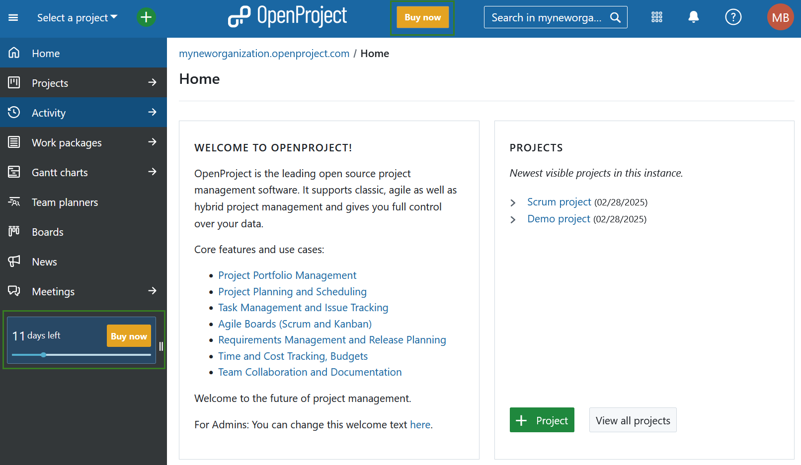
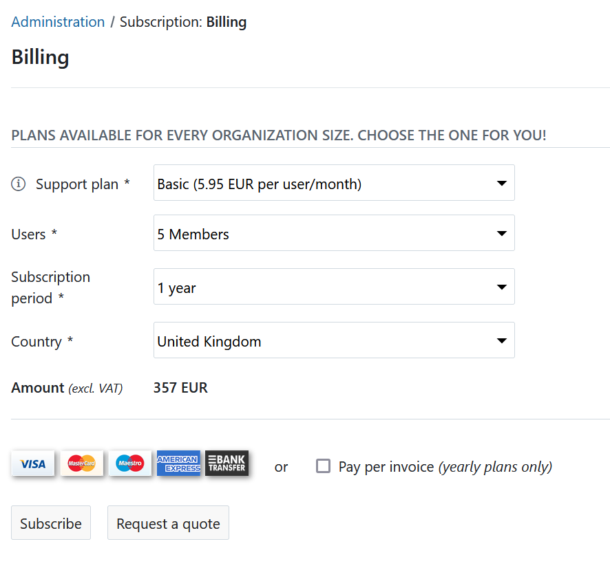

---
sidebar_navigation:
  title: Create quote
  priority: 990
description: Request a quote within your OpenProject Enterprise cloud
keywords: quote, request, offer, tender, bid
---

# Creating a quote in the OpenProject Enterprise cloud

If you would like to request a quote for OpenProject Enterprise cloud you can do so in your trial instance. Alternatively, you can refer to our website for the Enterprise cloud edition [pricing](https://www.openproject.org/pricing/).

To create a quote please, click the **Buy now** button in the application header or or in the project menu.

You will be directed to -> *Administration* -> *Subscription*.

First, choose between the professional and basic **support plan**. 

Next, select the **amount of users** from the drop-down list. The number of users can only be selected in steps of five, the minimum is five users.

Specify your **subscription period** and select your **country** from the drop-down list.

The **total amount** (excluding VAT) will be displayed based on the information you enter.

Finally click on **Request a quote** button. 

You will then be asked to provide your address details. After populating the respective fields please click the **Request a quote** button.

After that you will receive an **email with the quote**. The email includes a link to accept the quote. Your subscription will be updated once you accept the quote.
