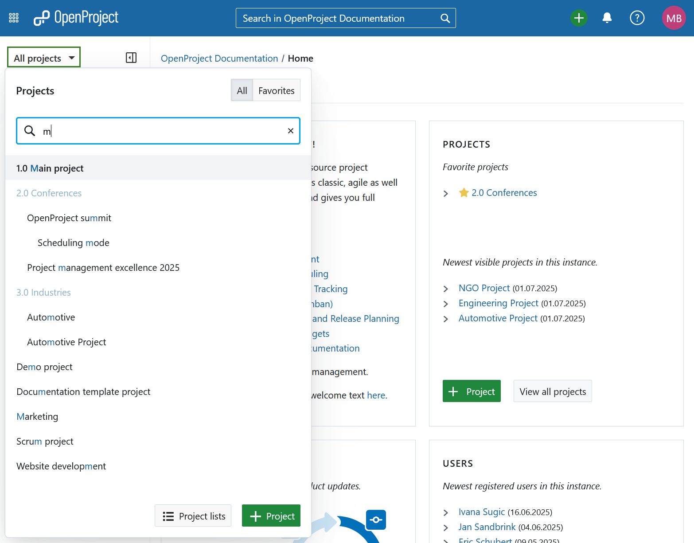
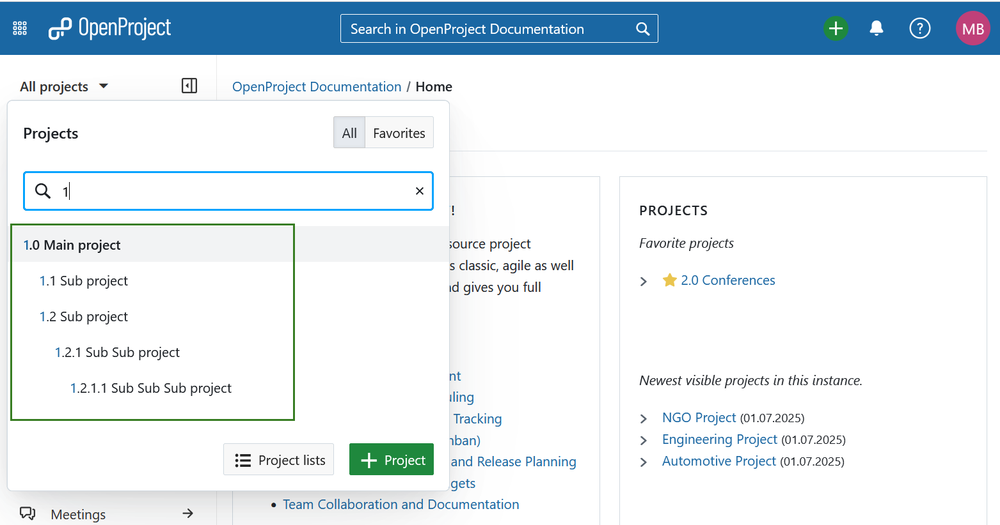
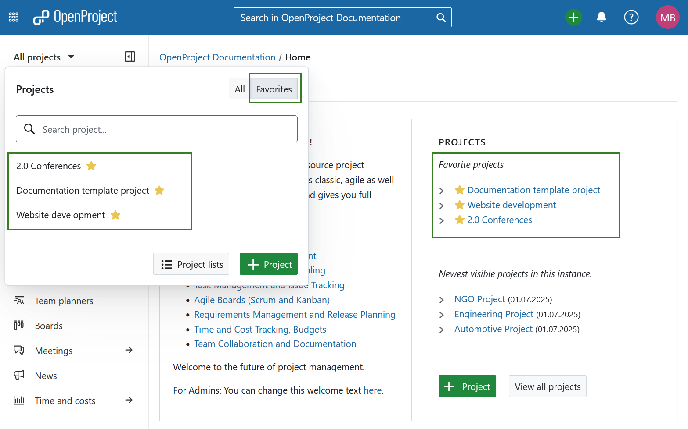
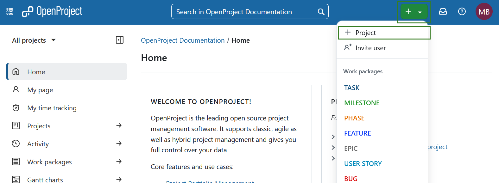
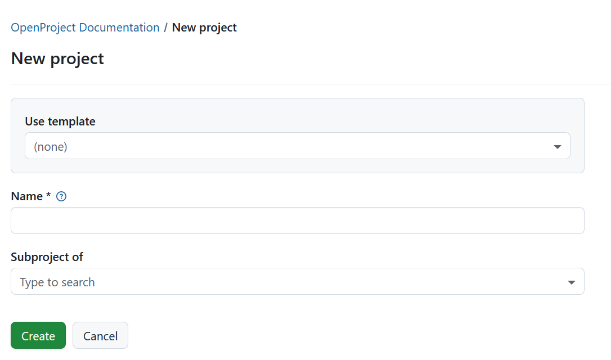
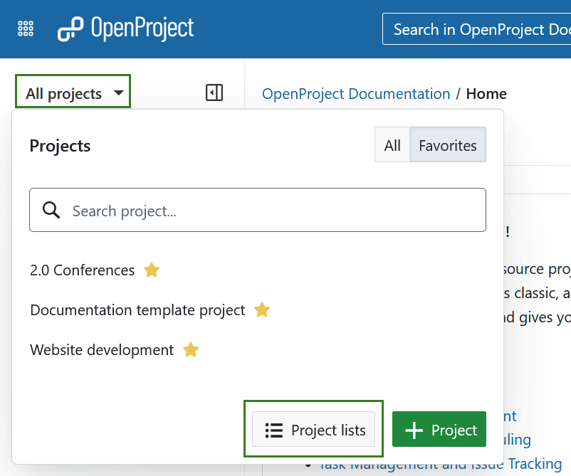
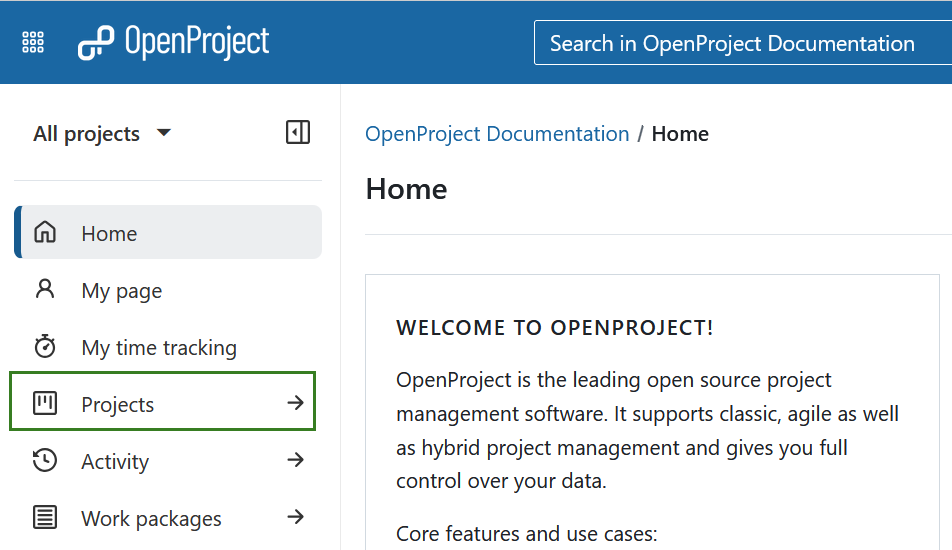
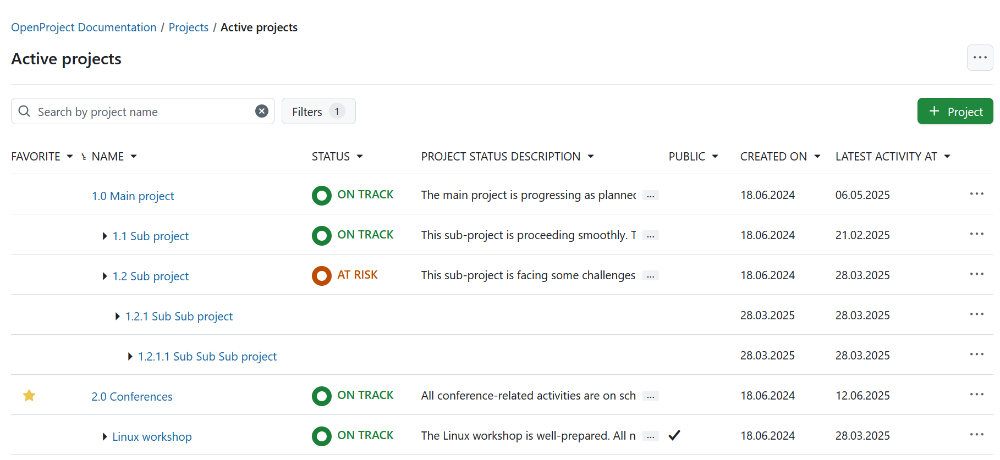

---
sidebar_navigation:
  title: Projects
  priority: 900
description: Introduction to projects in OpenProject.
keywords: open project, create project, projects introduction
---
# Projects introduction

Get an introduction how to work with projects in OpenProject. To start collaboration in OpenProject, you first have to set up a new project.

A **project** is defined as a temporary, goal-driven effort to create a unique output. A project has clearly defined phases, a start and an end date, and its success is measured by whether it meets its stated objectives.
A project in OpenProject can be understood as a project as defined above. Also, it can be set up as a "workspace" for teams to collaborate on one common topic, e.g. to organize a department.

>  [!NOTE]
>
> In order to see a project and work in it, you have to be a [member of the project](../invite-members).

| Topic                                                   | Content                                                      |
| ------------------------------------------------------- | ------------------------------------------------------------ |
| [Open a project](#open-an-existing-project)             | Select and open an existing project.                         |
| [Create a new project](#create-a-new-project)           | Create a project from scratch or use existing project templates. |
| [View all projects](#view-all-projects)                 | Get an overview about all your projects.                     |
| [Advanced project settings](#advanced-project-settings) | Configure further advanced settings for your project.        |

<video src="https://openproject-docs.s3.eu-central-1.amazonaws.com/videos/OpenProject-Projects-Introduction.mp4"></video>

## Open an existing project

In order to open an existing project, click the **All projects** dropdown menu in the upper left corner of the header and select the project you want to open.

You can also start typing in a project name to filter by the project's title or filter for favorite projects. 

Projects and subprojects are displayed according to their hierarchy in the drop-down menu.

**Subproject** is defined as a child project of another project. Subprojects can be used to display a hierarchy of projects. Several filter options (e.g. in work package table and timeline) can be applied only to the current project and its subprojects.

Alternatively, you can open the list of all existing projects using the [**Global modules**](../../user-guide/home/global-modules/#projects) menu.

Also, you will see your newest and favored projects on the application landing page in the **Projects** section. Here you can simply click on one of the projects to open it. Alternatively, select favorite projects from the **All projects** dropdown menu by using the respective switch.

## Create a new project

There are several ways to create a new project in OpenProject. 

1. Click the green button **+ Project** directly on the system's home screen in the **Project** section.

   

2. You can use the **+ Project** button at the bottom of *All projects* dropdown menu in the header navigation to create a new project.

3. You can also use the **+ (Plus)** button in the top right corner of the header navigation. 

   

4. In addition, you can also create a new project on the [project lists](../../user-guide/projects/project-lists/) overview page. 

- You can either create a completely new project, a subproject of an existing project or a (sub)project from a template. For the latter option, choose a [template](../../user-guide/projects/project-templates/#create-a-project-template) using the drop-down menu.
- Enter a **name** for your project and click the **Create** button.
- Integrate the project into the existing project hierarchy by defining it as a subproject of an existing project.
- The **Advanced settings** allow for further configuration, e.g. description, URL, etc.

By default, creating a new project will set you as project admin, regardless of whether you copied a project, used a template or created a project from scratch. Now, you can get started working on your project.

To configure further project information, see the documentation for [project settings](../../user-guide/projects/project-settings/project-information/).

### View all projects

To view all your projects in which you are a member, click on the **Project lists** button at the bottom of the action bar after opening the **Select a project** drop-down menu.

Alternatively you can use the [**Global modules menu**](../../user-guide/home/global-modules/#projects) on the left or select *Projects* using the grid icon in the top left corner.

You will see a list with all your projects and their details.

## Advanced project settings

In our detailed user guide you can find out how to configure further [advanced project settings](../../user-guide/projects/) for your projects, e.g. description, project hierarchy or setting it to public.
