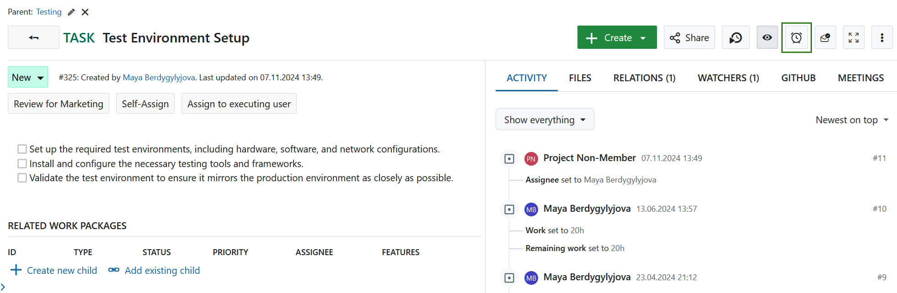
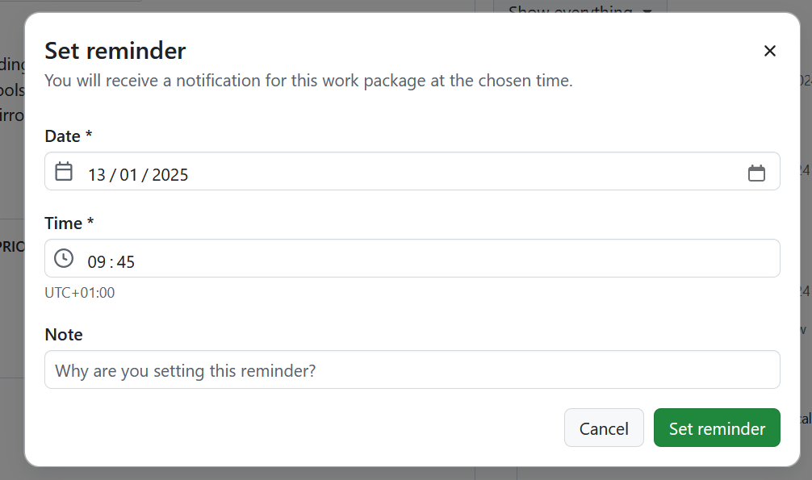
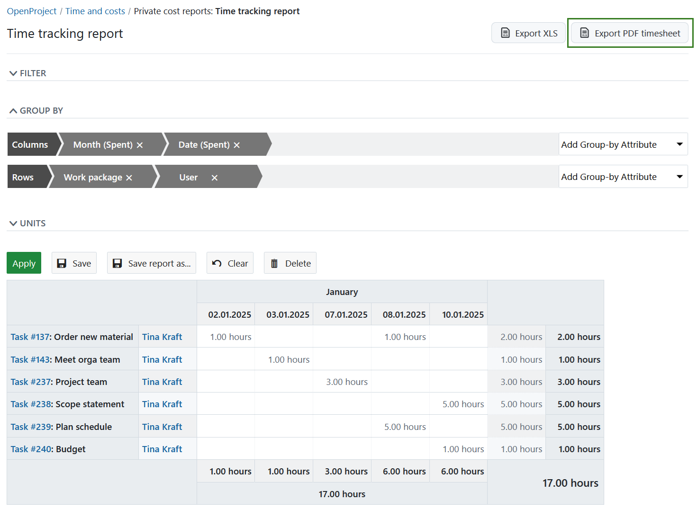
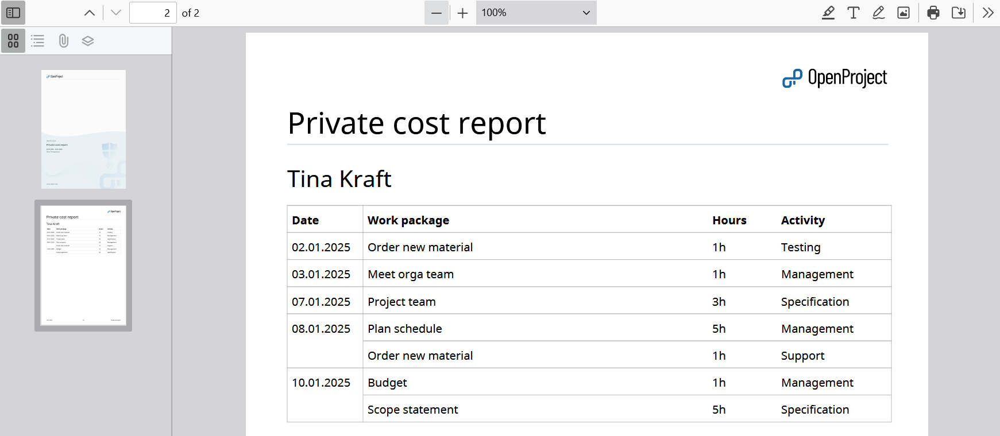
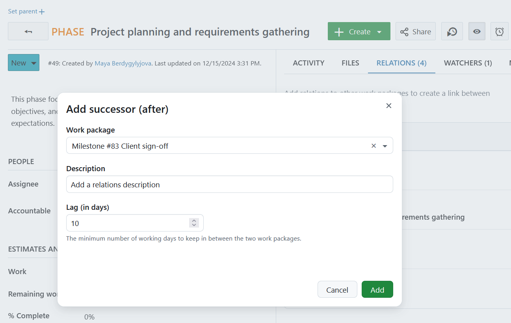
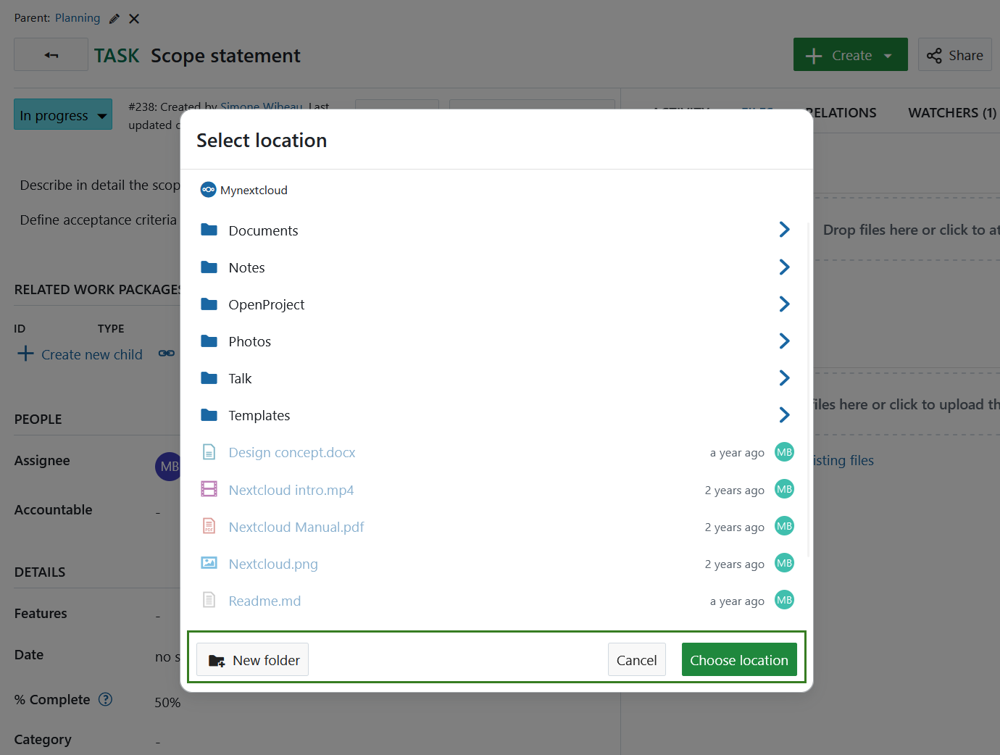
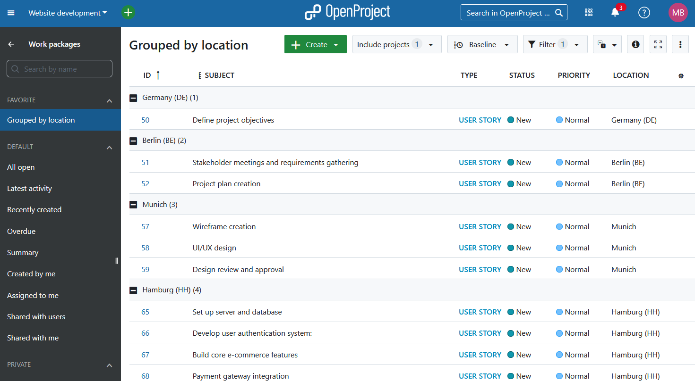
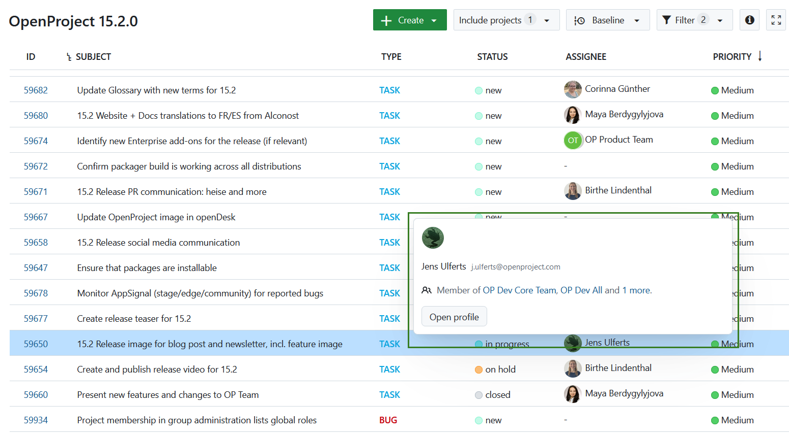

# OpenProject 15.2.0

Release date: 2024-12-23

We released OpenProject [OpenProject 15.2.0](https://community.openproject.org/versions/2143).
The release contains several bug fixes and we recommend updating to the newest version.
In these Release Notes, we will give an overview of important feature changes. At the end, you will find a complete list of all changes and bug fixes.

## Important feature changes

### Work package reminders

You can now use the *Reminder* function to receive a reminder about a work package at a later point in time. Simply navigate to any work package, select the **Reminder icon** and specify when you would like to be reminded. You will receive a notification in the notification center. 

> ![TIP] You can also receive immediate notifications via e-mail for personal reminders. To do that adjust your [account settings](../../user-guide/account-settings/#email-reminders) accordingly.

[Read more about setting work package reminders](../../user-guide/work-packages/edit-work-package/#work-package-reminders)

### Export timesheets as PDF

Time reports can now be exported not only in Excel, but also in PDF format. Navigate to the Time and costs module of your project, specify all report filters according to your needs and press the **Export PDF timesheet** button. 

Here is an example of a timesheet PDF export.

> [!TIP]
>
> Keep in mind that this report will only include time entries, but not the cost ones.

[Learn how to export timesheets as PDF](../../user-guide/time-and-costs/reporting/#export-time-sheets).

### Edit lag to follow-precedes relations

For Predecessor/Successor relations, you can specify **lag**, which represents the minimum number of working days to maintain between two work packages. This flexibility ensures more precise scheduling and helps align task dependencies effectively. By default, the lag is set to 0 working days, but you can update the *Description* and *Lag* fields anytime to adapt to changes in your project timeline.

[Read more about work package relations](https://www.openproject.org/docs/user-guide/work-packages/work-package-relations-hierarchies)

### Create new folder directly when using file storages integrations

Users can now create a folder structure directly while selecting the destination folder for file uploads, enhancing the integration with both Nextcloud and OneDrive/SharePoint. This improvement simplifies the process by allowing users to organize their files during the upload, without the need to separately create folders in the file storage, thus streamlining workflows and improving overall efficiency.

### Group and order by for custom fields of type hierarchy

Users can now sort their work package list by the assigned values of custom fields of type hierarchy. This enhancement allows for a more efficient overview, helping users quickly organize and filter work packages within a specific hierarchical context. Here is an example of how work packages grouped by a custom field of a type hierarchy looks like:

### Popover on user information on hover

To simplify accessing specific user details without needing to navigate to their profile, user information will now be displayed when hovering over a user's avatar, on pages like the Members or Activity page.

### Continued updating page headers and subheaders

We continued introducing standardized components for page headers and subheaders across multiple project pages, to further improve design consistency. 

[Find out in more detail which pages were updated](https://community.openproject.org/projects/openproject/work_packages/53810)

## Bug fixes and changes

<!-- Warning: Anything within the below lines will be automatically removed by the release script -->
<!-- BEGIN AUTOMATED SECTION -->

- Feature: Edit lag to follow-precedes-relations \[[#22360](https://community.openproject.org/wp/22360)\]
- Feature: Create new folder from within the location picker \[[#46811](https://community.openproject.org/wp/46811)\]
- Feature: Update PageHeaders &amp; SubHeaders in the (rails) project pages (Part 1) \[[#53810](https://community.openproject.org/wp/53810)\]
- Feature: Popover for user information on hover \[[#55581](https://community.openproject.org/wp/55581)\]
- Feature: Enable group by CF hierarchy for the work package query \[[#59174](https://community.openproject.org/wp/59174)\]
- Feature: Basic functionality of work package &quot;Reminders&quot;, scheduling &quot;Reminder&quot; notifications \[[#59436](https://community.openproject.org/wp/59436)\]
- Feature: Enable ordering for work packages on values of custom fields of type hierarchy \[[#59766](https://community.openproject.org/wp/59766)\]
- Feature: When adding new relations, auto-scroll to show the newly added relation \[[#59769](https://community.openproject.org/wp/59769)\]
- Feature: Create new icon for setting reminders \[[#59793](https://community.openproject.org/wp/59793)\]
- Feature: Export cost query as timesheet PDF \[[#59824](https://community.openproject.org/wp/59824)\]
- Feature: Generate PDF document from a work package description  \[[#45896](https://community.openproject.org/wp/45896)\]
- Bugfix: Mobile: tap twice on comment input to start typing \[[#57107](https://community.openproject.org/wp/57107)\]
- Bugfix: Folders missing in log lines for &quot;Unexpected Content Error&quot; \[[#59346](https://community.openproject.org/wp/59346)\]
- Bugfix: Activity tab does not scroll to the bottom or correct comment on mobile \[[#59458](https://community.openproject.org/wp/59458)\]
- Bugfix: Proto plugin dose not work with OpenProject 15 \[[#59931](https://community.openproject.org/wp/59931)\]
- Bugfix: Project membership in group administration lists global roles \[[#59934](https://community.openproject.org/wp/59934)\]
- Bugfix: Internal server error on Azure OIDC login with expired client secret \[[#59960](https://community.openproject.org/wp/59960)\]
- Bugfix: OpenID setup fails due to Claims is not a valid JSON object \[[#59962](https://community.openproject.org/wp/59962)\]
- Bugfix: Filter translations for Meetings Module missing \[[#60113](https://community.openproject.org/wp/60113)\]
- Bugfix: New WP form doesn&#39;t open in split view when on the WP list page \[[#60274](https://community.openproject.org/wp/60274)\]

<!-- END AUTOMATED SECTION -->
<!-- Warning: Anything above this line will be automatically removed by the release script -->

## Contributions
A heartfelt thank you to the City of Cologne for sponsoring parts of this release. Your support, combined with the incredible efforts of our Community, continues to drive these innovations forward.

Also a big thanks to our Community members for reporting bugs and helping us identify and provide fixes. Special thanks for reporting and finding bugs go to Andrej Sandorf, Stefan Weiberg.

Last but not least, we are very grateful for our very engaged translation contributors on Crowdin, who translated quite a few OpenProject strings! This release we would like to highlight
- ADD

Would you like to help out with translations yourself? Then take a look at our [translation guide](../../contributions-guide/translate-openproject/) and find out exactly how you can contribute. It is very much appreciated!

