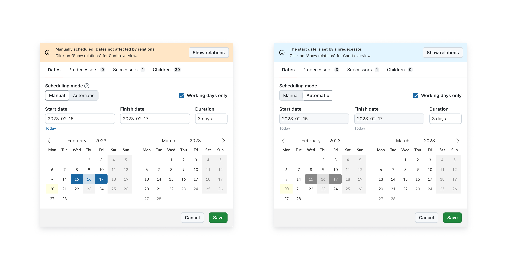
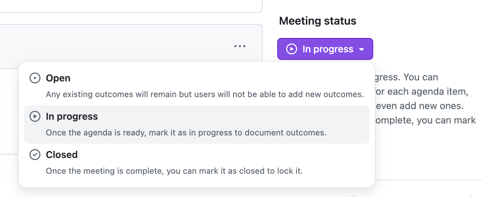
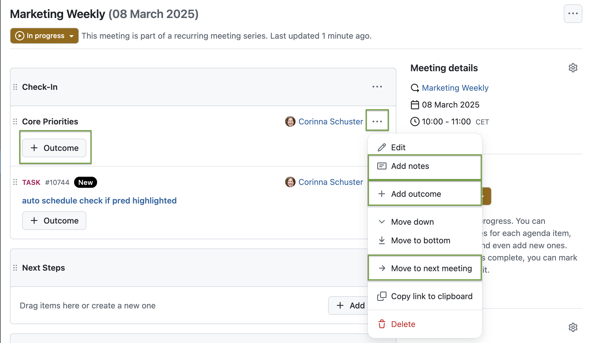

# OpenProject 15.4.0

Release date: 2025-03-06

We released OpenProject [OpenProject 15.4.0](https://community.openproject.org/versions/2165). The release contains several bug fixes and we recommend updating to the newest version. In these Release Notes, we will give an overview of important feature changes. At the end, you will find a complete list of all changes and bug fixes.

## Important feature changes

Take a look at the release video showing most important features introduced in 15.4.0:

VIDEO

### Enable automatic scheduling mode - to start as soon as possible

Starting with OpenProject 15.4, users will be able to choose wheather they want to manually schedule their work packages or enable automatic scheduling. This highly requested feature of automatic scheduling, based on predecessor/successor relations, will make managing complex project setups much easier.

> [!NOTE]
> The new feature will not overwrite existing dates for any existing work packages. However, it can change the scheduling mode. By default, manual scheduling is enabled. Existing work packages with children will be in automatic mode – with dates derived from their children.

In **manual mode**, users can freely select dates and can set timelines based on specific needs, deadlines or external factors. Manually scheduled work packages behave as they did before 15.4.

In the **new automatic mode**, manually setting a start date is not possible. Instead, when a task is scheduled, the date picker automatically determines the start date based on the nearest predecessor. However, you can still define a duration, which adjusts the finish date accordingly. This ensures a reliable sequence of automatically scheduled work packages that adapt dynamically to planning changes.

To learn more about why we needed this change and how it might help you manage your projects, please read [this blog article on the new automatic scheduling mode](https://www.openproject.org/blog/new-automatic-scheduling-mode/blog/new-automatic-scheduling-mode/) that we published some weeks ago. See our documentation to get detailed information about how to use the automatic schedlung mode.

### Set agenda item outcomes for meetings

In February 2025, we already published a milestone for our Meetings module: [Recurring meetings](../../release-notes/15-3-0/#schedule-recurring-meetings-to-streamline-your-weekly-biweekly-or-custom-appointments). With OpenProject 15.4, we released another great new feature that will help users better manage their meeting outcomes. They can now note relevant decisions, questions and follow-up actions for each agenda item. This way, all participants as well as users that could not attend the meeting will have a documentation of the relevant meeting outcome(s).

> [!NOTE]
> In our classic meetings module, users could write "minutes", which are notes taken during the meeting. Users can still edit the agenda item description to do so, but now they can also use the outcome feature to make it more clear.

The updated Meetings module now allows you to set a Meeting status: 

Once the status is "in progress", you can add outcomes to every agenda item. If it is a recurring meeting, can also move the agenda item to the next meeting:

> [!NOTE]
> In the following months, we will continue working on the Meetings module. For example, when a recurring meeting is closed, it should be possible to move all agenda items without outcomes to the next meeting ([see this feature](https://community.openproject.org/wp/61911)). Also, a meeting agenda items backlog for recurring meetings is planned ([see this feature](https://community.openproject.org/wp/54751)).

### Generate PDF documents from a work package description

Text (important: article here https://www.openproject.org/blog/beyond-documents-generate-pdf-files/)

https://community.openproject.org/wp/45896

Screenshot

### Better manage a large number of projects with an enhanced project lists view

Text (More autocompleters for filtering project lists and version autocompleter for filter falues on the project list)

https://community.openproject.org/wp/59169

Screenshot

### Use @-mention of user when quote replying to a comment

Text

https://community.openproject.org/wp/37093

Screenshot

### Restructured administration and enumerations page removed

Text

https://community.openproject.org/wp/61733

Link to the new 3 parts in the docs which were before enumerations page: https://github.com/opf/openproject/pull/18197/files

Screenshot

## Important updates and breaking changes

<!-- Remove this section if empty, add to it in pull requests linking to tickets and provide information -->

<!--more-->

## Bug fixes and changes

<!-- Warning: Anything within the below lines will be automatically removed by the release script -->
<!-- BEGIN AUTOMATED SECTION -->

- Feature: Use @-mention of user when quote replying to a comment \[[#37093](https://community.openproject.org/wp/37093)\]
- Feature: New scheduling mode: automatic (start as soon as possible) \[[#42388](https://community.openproject.org/wp/42388)\]
- Feature: Single-date mode for work package date pickers \[[#47519](https://community.openproject.org/wp/47519)\]
- Feature: Allow encoding of current enterprise plan in the Enterprise Token \[[#50900](https://community.openproject.org/wp/50900)\]
- Feature: Add and document Keycloak to the Docker based development setup \[[#53590](https://community.openproject.org/wp/53590)\]
- Feature: File storages settings for type Nextcloud: Allow OIDC based connection instead of OAuth2 \[[#55284](https://community.openproject.org/wp/55284)\]
- Feature: Extend Nextcloud files storage to use SSO access tokens  \[[#57056](https://community.openproject.org/wp/57056)\]
- Feature: Agenda item outcomes - let meeting participants note relevant decisions, questions and follow-up actions during a meeting \[[#57799](https://community.openproject.org/wp/57799)\]
- Feature: Store token exchange capability on OIDC providers \[[#58862](https://community.openproject.org/wp/58862)\]
- Feature: Track start time, finish time, and duration in Log time dialog \[[#59038](https://community.openproject.org/wp/59038)\]
- Feature: Add automatic scheduling mode \[[#59539](https://community.openproject.org/wp/59539)\]
- Feature: Highlight closest predecessor in the relations tab \[[#59540](https://community.openproject.org/wp/59540)\]
- Feature: Update and Primerise Datepicker in the scope of automatic scheduling \[[#59845](https://community.openproject.org/wp/59845)\]
- Feature: Define subject patterns in work package type settings \[[#59909](https://community.openproject.org/wp/59909)\]
- Feature: Prevent editing of subject on work package creation and update \[[#59910](https://community.openproject.org/wp/59910)\]
- Feature: Block users from editing managed subjects of work packages in table views \[[#59911](https://community.openproject.org/wp/59911)\]
- Feature: Add times for labor costs to the cost report and export \[[#59914](https://community.openproject.org/wp/59914)\]
- Feature: Add enterprise banner to subject configuration \[[#59929](https://community.openproject.org/wp/59929)\]
- Feature: Autocompleters for filter values on the project list \[[#60521](https://community.openproject.org/wp/60521)\]
- Feature: Consolidate &quot;Download PDF&quot; feature with the &quot;Generate PDF&quot; feature in one export modal \[[#60562](https://community.openproject.org/wp/60562)\]
- Feature: Add start and end times to the API \[[#60633](https://community.openproject.org/wp/60633)\]
- Feature: Amend work package comment href from \`#activity-&lt;journal-sequence&gt;\` to \`#comment-&lt;journal-id&gt;\` with backwards compatibility for old links \[[#60875](https://community.openproject.org/wp/60875)\]
- Feature: Primerize time tracking settings in administration \[[#61290](https://community.openproject.org/wp/61290)\]
- Feature: Store token expiration information for OIDC user tokens \[[#61344](https://community.openproject.org/wp/61344)\]
- Feature: Version autocompleter for filter values on the project list \[[#61398](https://community.openproject.org/wp/61398)\]
- Feature: OIDC provider creation: Prefill scopes instead of showing a placeholder \[[#61470](https://community.openproject.org/wp/61470)\]
- Feature: Move &#39;Meetings&#39; higher up in the left-hand sidebar  \[[#61475](https://community.openproject.org/wp/61475)\]
- Feature: Reword recurring meeting labels and frequency options \[[#61476](https://community.openproject.org/wp/61476)\]
- Feature: Allow to configure SSO authentication + two-way OAuth 2 \[[#61532](https://community.openproject.org/wp/61532)\]
- Feature: Add &quot;Move to next meeting&quot; option for agenda items in a recurring meeting \[[#61536](https://community.openproject.org/wp/61536)\]
- Feature: Allow more characters for Time Entry Comment \[[#61607](https://community.openproject.org/wp/61607)\]
- Feature: Show proper error message when refresh token is unusable \[[#61612](https://community.openproject.org/wp/61612)\]
- Feature: Audience selection for Nextcloud Hub scenario \[[#61623](https://community.openproject.org/wp/61623)\]
- Feature: Validate subject pattern \[[#61692](https://community.openproject.org/wp/61692)\]
- Feature: Restructure the administration and remove the enumerations page \[[#61733](https://community.openproject.org/wp/61733)\]
- Feature: Create component Status button based on Action menu \[[#61745](https://community.openproject.org/wp/61745)\]
- Feature: Redirect users to the home page, link to My Page to the global menu \[[#61881](https://community.openproject.org/wp/61881)\]
- Feature: Reduce flickering when switching between meeting states \[[#61895](https://community.openproject.org/wp/61895)\]
- Feature: Focus on the banner while opening the date pickr \[[#61906](https://community.openproject.org/wp/61906)\]
- Feature: For recurring meetings, indicate original time zone in the meeting series details \[[#61946](https://community.openproject.org/wp/61946)\]
- Feature: Visual changes for outcomes \[[#61956](https://community.openproject.org/wp/61956)\]
- Feature: Add icon to indicate automatic scheduling mode \[[#61971](https://community.openproject.org/wp/61971)\]
- Bugfix: &quot;During the last days&quot; filter input in cost reports shows a calendar popup \[[#42811](https://community.openproject.org/wp/42811)\]
- Bugfix: Missing space for no-results box on mobile \[[#43665](https://community.openproject.org/wp/43665)\]
- Bugfix: Always Show CKeditor Tool Bar On Screen When Scrolling \[[#53451](https://community.openproject.org/wp/53451)\]
- Bugfix: Calendar headers don&#39;t respect date format (always show it in North American MM/DD format) \[[#54378](https://community.openproject.org/wp/54378)\]
- Bugfix: Search results for projects does not render the description correctly \[[#56694](https://community.openproject.org/wp/56694)\]
- Bugfix: If user removes all columns for their PDF export then default columns are used \[[#57618](https://community.openproject.org/wp/57618)\]
- Bugfix: Project members: Unexpected opening of links in new tab (target=&quot;\_blank&quot;) \[[#58135](https://community.openproject.org/wp/58135)\]
- Bugfix: Required custom fields prevent a WorkPackage from being added as a child \[[#60122](https://community.openproject.org/wp/60122)\]
- Bugfix: Missing breadcrumb in Times &amp; Cost Administration \[[#60746](https://community.openproject.org/wp/60746)\]
- Bugfix: Time Entry creation via the API is not correctly handling user timezones \[[#61081](https://community.openproject.org/wp/61081)\]
- Bugfix: Date picker is partially off screen \[[#61091](https://community.openproject.org/wp/61091)\]
- Bugfix: Pattern input style issues \[[#61165](https://community.openproject.org/wp/61165)\]
- Bugfix: Reminder Button: Active state isn&#39;t used for active reminder \[[#61314](https://community.openproject.org/wp/61314)\]
- Bugfix: Adding custom field of the work package itself to subject pattern not possible (only for parents) \[[#61315](https://community.openproject.org/wp/61315)\]
- Bugfix: Subject field stays editable in create work package form after switching to a type that has automatically generated subjects \[[#61316](https://community.openproject.org/wp/61316)\]
- Bugfix: Activity tab scrolling when adding new comments \[[#61399](https://community.openproject.org/wp/61399)\]
- Bugfix: Users in lists miss popover \[[#61465](https://community.openproject.org/wp/61465)\]
- Bugfix: Popover missing in multi-select custom fields of type user \[[#61466](https://community.openproject.org/wp/61466)\]
- Bugfix: Mail handler keyword translations are confusing, not stable \[[#61482](https://community.openproject.org/wp/61482)\]
- Bugfix: WP creation form: Click on file link renders API error \[[#61554](https://community.openproject.org/wp/61554)\]
- Bugfix: Can&#39;t click outside of an added attribute on Google Chrome \[[#61573](https://community.openproject.org/wp/61573)\]
- Bugfix: Should not display &quot;Delete relation&quot; for child if lacking &quot;Manage work package hierarchies&quot; permission \[[#61597](https://community.openproject.org/wp/61597)\]
- Bugfix: Unclear error when cf that was added as an attribute does not belong to wp configuration form \[[#61604](https://community.openproject.org/wp/61604)\]
- Bugfix: Unclear error message upon save on empty Subject patterns \[[#61619](https://community.openproject.org/wp/61619)\]
- Bugfix: Wrong tab opens upon error message on Subject configuration tab \[[#61625](https://community.openproject.org/wp/61625)\]
- Bugfix: Danger Dialog and Feedback Dialog close button ARIA label is not localised \[[#61631](https://community.openproject.org/wp/61631)\]
- Bugfix: The costlog edit form shows incorrect cost value after update \[[#61689](https://community.openproject.org/wp/61689)\]
- Bugfix: OIDC data sent to AppSignal \[[#61691](https://community.openproject.org/wp/61691)\]
- Bugfix: Rescheduled series creates invalid open meetings \[[#61729](https://community.openproject.org/wp/61729)\]
- Bugfix: Edit relation modal doesn&#39;t show the WP subject \[[#61737](https://community.openproject.org/wp/61737)\]
- Bugfix: Regression: Rich text headlines show link icon on hover before the headline, while rendering after would be correct \[[#61780](https://community.openproject.org/wp/61780)\]
- Bugfix: Not enough spacing on Categories page \[[#61790](https://community.openproject.org/wp/61790)\]
- Bugfix: (Mobile) Left-side menu cannot be opened in Administration \[[#61806](https://community.openproject.org/wp/61806)\]
- Bugfix: Meeting filter gets reset when clicking on &#39;Show more&#39; \[[#61873](https://community.openproject.org/wp/61873)\]
- Bugfix: Autocompleter dropdown in pattern input is missing default entry \[[#61935](https://community.openproject.org/wp/61935)\]
- Bugfix: Cannot import BCF issues \[[#61974](https://community.openproject.org/wp/61974)\]
- Bugfix: Icons are barely visible in dark mode \[[#61989](https://community.openproject.org/wp/61989)\]
- Feature: Generate PDF document from a work package description  \[[#45896](https://community.openproject.org/wp/45896)\]
- Feature: Automatically generated work package subjects \[[#53653](https://community.openproject.org/wp/53653)\]

<!-- END AUTOMATED SECTION -->
<!-- Warning: Anything above this line will be automatically removed by the release script -->

## Contributions
A very special thank you goes to City of Cologne, Deutsche Bahn and ZenDiS for sponsoring released or upcoming features. Your support, alongside the efforts of our amazing Community, helps drive these innovations.

Also, a big thanks to our Community members for reporting bugs and helping us identify and provide fixes. Special thanks for reporting and finding bugs go to René Schodder, Abhiyan Paudyal, Gunter Ohrner and Markus K..

Last but not least, we are very grateful for our very engaged translation contributors on Crowdin, who translated quite a few OpenProject strings! This release we would like to highlight
- 

Would you like to help out with translations yourself? Then take a look at our [translation guide](../../contributions-guide/translate-openproject/) and find out exactly how you can contribute. It is very much appreciated!
