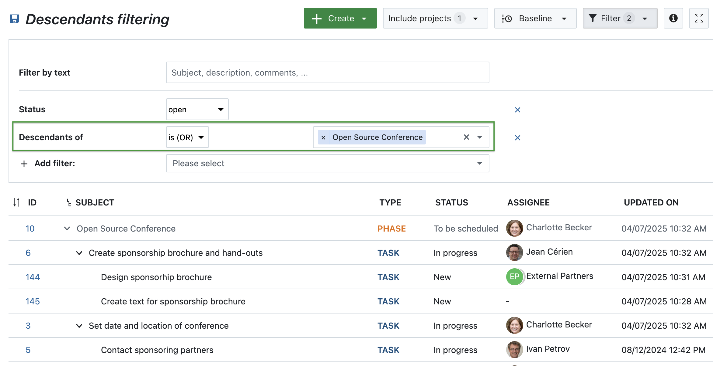

# OpenProject 15.5.0

Release date: 2025-04-16

We released OpenProject [OpenProject 15.5.0](https://community.openproject.org/versions/2171). The release contains several bug fixes, and we recommend updating to the newest version. In these Release Notes, we will give an overview of important feature changes. At the end, you will find a complete list of all changes and bug fixes.

## Important feature changes

### Filter for descendants (children and grandchildren) of work packages

In OpenProject 15.5, you can now filter for all descendants of a work package — including children, grandchildren, and deeper levels. This is especially helpful when focusing on a specific part of a project that includes multiple levels of work packages.

The new filter option **Descendants of** allows you to select one or more parent work packages by ID and display all their subordinate items. It is available wherever filters are supported — such as work package tables or agile boards.

Previously, it was only possible to filter for parent work packages, not their lower-level hierarchy.

### Advanced accessibility in the date picker

Accessibility remains a key focus in OpenProject, and with version 15.5, we’ve enhanced support for screen readers. These improvements ensure that users relying on assistive technologies receive meaningful feedback during manual date input.

- Informative announcements are now triggered when switching between manual and automatic scheduling.
- Changes in one date field (e.g., Start date or Duration) are announced as they update related fields.
- The “Today” shortcuts include ARIA labels to give clear context, such as “Select today as start date.”

This update is part of our ongoing ARIA implementation strategy, with [further accessibility enhancements planned in upcoming versions](https://community.openproject.org/wp/62708).

### % Complete included in work package table sums

The **% Complete** value is now included in the sum row of work package tables. This complements the existing Work and Remaining work columns and gives a quick, consistent overview of project progress.

All three values — Work, Remaining work, and % Complete — are calculated in alignment with the selected progress reporting mode.

### Column for children in work package tables

### Advanced date picker in mobile screens

### PDF exports matching configured form layout

### Chronical ordering of relations

## Important updates and breaking changes

<!-- Remove this section if empty, add to it in pull requests linking to tickets and provide information -->

<!--more-->

## Bug fixes and changes

<!-- Warning: Anything within the below lines will be automatically removed by the release script -->
<!-- BEGIN AUTOMATED SECTION -->

- Bugfix: Custom fields on global work package list can be added as column even when user has no access to it \[[#36559](https://community.openproject.org/wp/36559)\]
- Bugfix: &quot;During the last days&quot; filter input in cost reports shows a calendar popup \[[#42811](https://community.openproject.org/wp/42811)\]
- Bugfix: Autocompleter missing when using double or tripple hash notation for work package IDs \[[#47084](https://community.openproject.org/wp/47084)\]
- Bugfix: Project attributes side panel is hidden on mobile \[[#58229](https://community.openproject.org/wp/58229)\]
- Bugfix: The right-handle column content goes to the top of the page on mobile \[[#58241](https://community.openproject.org/wp/58241)\]
- Bugfix: Misleading caption shown on project list table header \[[#59081](https://community.openproject.org/wp/59081)\]
- Bugfix: Required custom fields prevent a WorkPackage from being added as a child \[[#60122](https://community.openproject.org/wp/60122)\]
- Bugfix: Primer Dialog close button ARIA label is not localised \[[#61631](https://community.openproject.org/wp/61631)\]
- Bugfix: Not enough spacing on Categories page \[[#61790](https://community.openproject.org/wp/61790)\]
- Bugfix: Gantt chart and relations tab are not synchronized \[[#61807](https://community.openproject.org/wp/61807)\]
- Bugfix: Custom actions list sometimes empty and status change value not displayed \[[#61888](https://community.openproject.org/wp/61888)\]
- Bugfix: Caption text for automatically generated subject pattern is unclear \[[#62015](https://community.openproject.org/wp/62015)\]
- Bugfix: Fix flickering time\_entry\_activity\_spec \[[#62032](https://community.openproject.org/wp/62032)\]
- Bugfix: I18n::ArgumentError in RecurringMeetings::ScheduleController#humanize\_schedule \[[#62073](https://community.openproject.org/wp/62073)\]
- Bugfix: Meeting creation uses UTC offset, not timezone \[[#62108](https://community.openproject.org/wp/62108)\]
- Bugfix: GitHub and GitLab extensions branch name generation might generate problematic branch names \[[#62164](https://community.openproject.org/wp/62164)\]
- Bugfix: WP can&#39;t be transformed to a Milestone if it is automatically scheduled \[[#62190](https://community.openproject.org/wp/62190)\]
- Bugfix: Use correct scope for restricting custom field visibility in column selection \[[#62317](https://community.openproject.org/wp/62317)\]
- Bugfix: The text colour of the &quot;Closed&quot; meeting status label in light mode is black instead of white \[[#62373](https://community.openproject.org/wp/62373)\]
- Bugfix: Option to add &quot;Existing child&quot; does not make sense (the work package is only a child once added) \[[#62510](https://community.openproject.org/wp/62510)\]
- Bugfix: Non-working days can be choosen via date field \[[#62525](https://community.openproject.org/wp/62525)\]
- Bugfix: Untranslated string for &#39;Outcome&#39; \[[#62559](https://community.openproject.org/wp/62559)\]
- Bugfix: Excess padding in the Activity tab comment box \[[#62581](https://community.openproject.org/wp/62581)\]
- Bugfix: Mobile OTP generation does not cover all decimal digits \[[#62636](https://community.openproject.org/wp/62636)\]
- Bugfix: Toggling non-working days resets the start date in some cases \[[#62641](https://community.openproject.org/wp/62641)\]
- Bugfix: PDF Export of a single work package in query view does not open dialog \[[#62657](https://community.openproject.org/wp/62657)\]
- Bugfix: Custom actions load slowly with a lot of users \[[#62741](https://community.openproject.org/wp/62741)\]
- Bugfix: The add relations drop down list doesn&#39;t indicate that there are other options hidden behind a scroll \[[#62743](https://community.openproject.org/wp/62743)\]
- Feature: Filter Work Packages by an Ancestor | show grandparents and grandchildren \[[#36743](https://community.openproject.org/wp/36743)\]
- Feature: Link to application schemes \[[#45052](https://community.openproject.org/wp/45052)\]
- Feature: Relationship column for child \[[#49419](https://community.openproject.org/wp/49419)\]
- Feature: Add % Complete to work package table sums \[[#55802](https://community.openproject.org/wp/55802)\]
- Feature: Automatic scheduling mode: make it possible to enter Finish date by direct input or by clicking on the mini calendar \[[#60667](https://community.openproject.org/wp/60667)\]
- Feature: Amend work package comment href from \`#activity-&lt;journal-sequence&gt;\` to \`#comment-&lt;journal-id&gt;\` with backwards compatibility for old links \[[#60875](https://community.openproject.org/wp/60875)\]
- Feature: Advanced accessibility for the datepicker \[[#60904](https://community.openproject.org/wp/60904)\]
- Feature: Improve date picker rendering in mobile screens \[[#61051](https://community.openproject.org/wp/61051)\]
- Feature: PDF export of a single work package follows work package form configuration including related wp tables \[[#61446](https://community.openproject.org/wp/61446)\]
- Feature: Group work package-related project settings in a new entry called &#39;Work packages&#39; \[[#61861](https://community.openproject.org/wp/61861)\]
- Feature: Change ordering of relations in relations tab/datepicker to always order chronologically \[[#61885](https://community.openproject.org/wp/61885)\]
- Feature: Autofocus on text fields \[[#61916](https://community.openproject.org/wp/61916)\]
- Feature: Display relations not visible to the user (ghost relations) in the same order as all the other relations \[[#61950](https://community.openproject.org/wp/61950)\]
- Feature: Provide all the versions the user has access to on the Project and Global Work package list pages \[[#61967](https://community.openproject.org/wp/61967)\]
- Feature: Project settings: Harmonise &quot;enabled in project&quot; for Types and Custom fields \[[#62291](https://community.openproject.org/wp/62291)\]
- Feature: Always display relations in the relations tab in a fixed order \[[#62607](https://community.openproject.org/wp/62607)\]
- Feature: Add note about imminent sunsetting of Classic meetings in create meeting dropdown \[[#62649](https://community.openproject.org/wp/62649)\]

<!-- END AUTOMATED SECTION -->
<!-- Warning: Anything above this line will be automatically removed by the release script -->

## Contributions
A very special thank you goes to our sponsors for this release.
Also a big thanks to our Community members for reporting bugs and helping us identify and provide fixes.
Special thanks for reporting and finding bugs go to Abhiyan Paudyal, Andreas H., Paul Kernstock, Patrick Stapf, and Stefan Weiberg.

Last but not least, we are very grateful for our very engaged translation contributors on Crowdin, who translated quite a few OpenProject strings!
Would you like to help out with translations yourself?
Then take a look at our translation guide and find out exactly how you can contribute.
It is very much appreciated!

