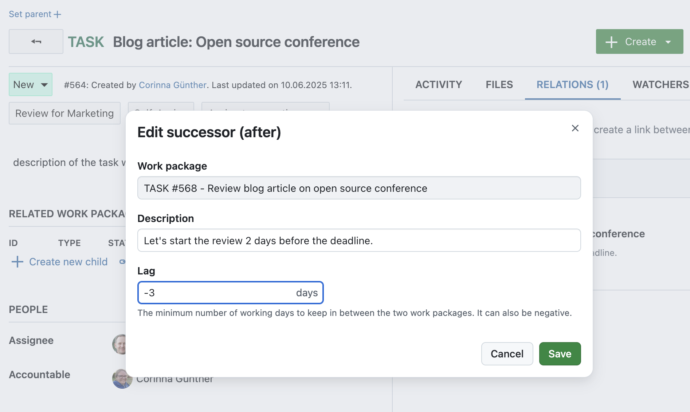
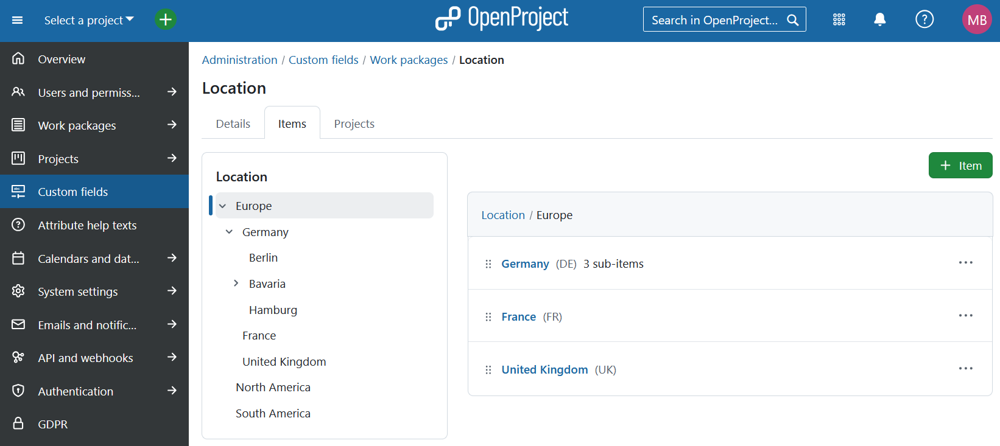

# OpenProject 16.1.0

Release date: 2025-06-05

We released OpenProject [OpenProject 16.1.0](https://community.openproject.org/versions/2194).
The release contains several bug fixes and we recommend updating to the newest version.
In these Release Notes, we will give an overview of important feature changes.
At the end, you will find a complete list of all changes and bug fixes.

## Important feature changes

### Define phases and phase gates with a project life cycle (Enterprise add-on)

Text 

Screenshot

### Export meetings in PDF format

Text 

Screenshot

### Set smart default options for reminders

Text 

Screenshot

### Use negative lag for work package dates

### Use negative lag to start work packages earlier

You can now define **negative lag** when setting up relations between work packages. This allows you to specify that a work package should start a few days before its **predecessor** finishes.

When adding or editing a successor or predecessor relation, the Lag field now accepts negative values. The updated help text reads: “The minimum number of working days in between the two work packages. It can also be negative.”

This makes it easier to represent overlapping tasks and more flexible schedules in your project plan. For example, you may want the review of a document to begin two days before the final draft is complete. You will then have to enter a lag of -3 days for the (review) Successor work package.

Please note that negative lags can be counterintuitive:
- A lag of 0 schedules the Successor one day after the Predecessor’s finish date.
- A lag of -1 schedules it on the same day.
- A lag of -2 schedules it one day before, and so on.

> [!NOTE]
> **Only working days** are taken into account. For example: If work package A finishes on a Tuesday and Saturday/Sunday are non-working days, then a lag of -3 will schedule its successor (work package B) to start on the previous Friday.

### Display hierarchy trees for hierarchy custom fields

Hierarchy custom fields are now easier to explore and use. When viewing such a custom field, a **hierarchical tree is displayed next to the details section**, showing the entire structure at a glance.

This tree helps you understand the position of the current item in the overall hierarchy and makes it easier to add or navigate related items. The currently selected item is highlighted, and all its parent nodes are automatically expanded, while unrelated branches remain collapsed by default.

Clicking on any entry in the tree opens that item in the same view, making it easy to move through even complex hierarchies without losing context. 

### Benefit from improved accessibility with ARIA live regions

Text 

Screenshot

## Important technical changes

### Added API for Emoji reactions, Reminders, and Internal Comments

text

<!--more-->

## Bug fixes and changes

<!-- Warning: Anything within the below lines will be automatically removed by the release script -->
<!-- BEGIN AUTOMATED SECTION -->

- Feature: Extend API V3 to cover Emoji reactions on work package comments (read, toggle) and extend documentation \[[#57265](https://community.openproject.org/wp/57265)\]
- Feature: Allow users to enter negative lag \[[#58011](https://community.openproject.org/wp/58011)\]
- Feature: Fixed set of project stages and gates editable on project overview page \[[#58159](https://community.openproject.org/wp/58159)\]
- Feature: Project stage columns on project list \[[#58160](https://community.openproject.org/wp/58160)\]
- Feature: Global stage administration \[[#58161](https://community.openproject.org/wp/58161)\]
- Feature: Phases as work package attribute \[[#58162](https://community.openproject.org/wp/58162)\]
- Feature: Project specific stage administration \[[#58163](https://community.openproject.org/wp/58163)\]
- Feature: Journalize changes to phases and gates \[[#59178](https://community.openproject.org/wp/59178)\]
- Feature: Option to copy phase on copying a project \[[#59179](https://community.openproject.org/wp/59179)\]
- Feature: Automatic scheduling for phases and phase gates \[[#59180](https://community.openproject.org/wp/59180)\]
- Feature: Filters for phases and phase gates in project list \[[#59183](https://community.openproject.org/wp/59183)\]
- Feature: Order by phases and phase gates on project list \[[#59184](https://community.openproject.org/wp/59184)\]
- Feature: Extend Reminders API V3 to include create, update &amp; delete operations \[[#59473](https://community.openproject.org/wp/59473)\]
- Feature: Optimize lifecycle modal UX \[[#60330](https://community.openproject.org/wp/60330)\]
- Feature: Document and implement proper mobile behaviour for Sub Header component (OP Primer) \[[#60332](https://community.openproject.org/wp/60332)\]
- Feature: Reminders: Offer quick-set options like &#39;tomorrow&#39; or &#39;next week&#39; with smart defaults \[[#60357](https://community.openproject.org/wp/60357)\]
- Feature: PDF export of meetings \[[#60730](https://community.openproject.org/wp/60730)\]
- Feature: Date picker to edit phases and phase gates of a project lifecycle \[[#61610](https://community.openproject.org/wp/61610)\]
- Feature: Turn gates into property of phase (rename lifecycle elements to &quot;Phase&quot; and &quot;Phase gates&quot;) \[[#61952](https://community.openproject.org/wp/61952)\]
- Feature: Add hovercard to gates \[[#62608](https://community.openproject.org/wp/62608)\]
- Feature: TreeView Primer View Component \[[#62667](https://community.openproject.org/wp/62667)\]
- Feature: Implementing ARIA live regions to communicate contextual changes \[[#62708](https://community.openproject.org/wp/62708)\]
- Feature: Show a TreeView on the page of hierachy customFields \[[#62993](https://community.openproject.org/wp/62993)\]
- Feature: Show attribute help texts in Primerized Project Settings &gt; Information form \[[#63737](https://community.openproject.org/wp/63737)\]
- Feature: Primerize attribute help texts \[[#63738](https://community.openproject.org/wp/63738)\]
- Feature: Re-order and re-structure the &#39;More&#39; action menu for sections and agenda items \[[#64074](https://community.openproject.org/wp/64074)\]
- Feature: Configure scopes to be used during Token Exchange \[[#64121](https://community.openproject.org/wp/64121)\]
- Feature: \[TreeView\] Allow nodes to be anchors or buttons \[[#64132](https://community.openproject.org/wp/64132)\]
- Feature: Add work package internal comments (write) API \[[#64166](https://community.openproject.org/wp/64166)\]
- Feature: \[TreeView\] Bubble the expanded state from children to parents \[[#64215](https://community.openproject.org/wp/64215)\]
- Feature: Change icon for the &quot;remove child&quot; function on an embedded table \[[#64305](https://community.openproject.org/wp/64305)\]
- Bugfix: Project search is under the Search icon in New Recurring Meeting modal \[[#59945](https://community.openproject.org/wp/59945)\]
- Bugfix: User can&#39;t save lifecycle modal if project is invalid \[[#60666](https://community.openproject.org/wp/60666)\]
- Bugfix: Autocompleter should not get autofocus by default \[[#61534](https://community.openproject.org/wp/61534)\]
- Bugfix: Activity Tab renders the same turbo frame multiple times inside of itself \[[#61544](https://community.openproject.org/wp/61544)\]
- Bugfix: Pattern input dropdown does not overlay background \[[#61937](https://community.openproject.org/wp/61937)\]
- Bugfix: The &#39;overdue&#39; date colour does not adapt well to dark mode (fixed hex/odd colour variable) \[[#62199](https://community.openproject.org/wp/62199)\]
- Bugfix: Work package datepicker incorrectly renders turbo frame response \[[#62523](https://community.openproject.org/wp/62523)\]
- Bugfix: Seeder fails during upgrade with ArgumentError: Nothing registered with reference :default\_role\_project\_admin (ArgumentError) \[[#62582](https://community.openproject.org/wp/62582)\]
- Bugfix: Version from the shared work package not available in Version filter on global wp page \[[#62610](https://community.openproject.org/wp/62610)\]
- Bugfix: (Regression) Error on Save (in various places) \[[#62627](https://community.openproject.org/wp/62627)\]
- Bugfix: Project phase filters are not ordered alphabetically as other filters \[[#63106](https://community.openproject.org/wp/63106)\]
- Bugfix: &quot;This week&quot; filter is not working correctly \[[#63109](https://community.openproject.org/wp/63109)\]
- Bugfix: Reminders: saving without entering a date or time throws an error but also unnecessarily clears the other field \[[#63461](https://community.openproject.org/wp/63461)\]
- Bugfix: Duplicate work package comments when submitting via ctlr/cmd + enter \[[#63556](https://community.openproject.org/wp/63556)\]
- Bugfix: Project identifier cannot be updated if a required project attribute is created \[[#63668](https://community.openproject.org/wp/63668)\]
- Bugfix: Breadcrumb index creates unnecessary navigation buttons on mobile web \[[#63777](https://community.openproject.org/wp/63777)\]
- Bugfix: ArgumentError in seeder \[[#63826](https://community.openproject.org/wp/63826)\]
- Bugfix: Projects tab displayed for custom fields of type user, group, spent time and version \[[#63900](https://community.openproject.org/wp/63900)\]
- Bugfix: Next SSO Enterprise Banner has no image \[[#64087](https://community.openproject.org/wp/64087)\]
- Bugfix: Back arrow cannot be reached via keyboard \[[#64222](https://community.openproject.org/wp/64222)\]
- Bugfix: Project overview page renders an h2 inside an h3 \[[#64226](https://community.openproject.org/wp/64226)\]
- Bugfix: \[Accessibility\] Editable toolbar header is not recognized as headline by screenreaders \[[#64227](https://community.openproject.org/wp/64227)\]
- Bugfix: Home screen widgets have the wrong headline tag \[[#64228](https://community.openproject.org/wp/64228)\]
- Bugfix: \[Accessibility\] Provide alternative link texts for pagination links \[[#64235](https://community.openproject.org/wp/64235)\]
- Bugfix: Focus issues with WP primary button \[[#64236](https://community.openproject.org/wp/64236)\]
- Bugfix: Flickering Life Cycle Definition specs \[[#64253](https://community.openproject.org/wp/64253)\]
- Bugfix: Access tokens of disabled OAuth applications are accepted by API \[[#64258](https://community.openproject.org/wp/64258)\]
- Bugfix: Automatic subject pattern is editable after enterprise token got invalid \[[#64290](https://community.openproject.org/wp/64290)\]
- Bugfix: Disabling an incomplete phase leads to inconsistencies \[[#64292](https://community.openproject.org/wp/64292)\]
- Bugfix: Input fields suggest previously entered text \[[#64312](https://community.openproject.org/wp/64312)\]
- Bugfix: The time in the pdf export is different from the time in the file name \[[#64337](https://community.openproject.org/wp/64337)\]
- Bugfix: Checkbox label not clickable in 2FA settings \[[#64367](https://community.openproject.org/wp/64367)\]
- Bugfix: Work packages &quot;default&quot; priority is lost when deleted. \[[#64369](https://community.openproject.org/wp/64369)\]
- Bugfix: Attribute help text page is missing a page title \[[#64417](https://community.openproject.org/wp/64417)\]
- Bugfix: The second phase&#39;s start date selection is not enabled \[[#64496](https://community.openproject.org/wp/64496)\]
- Feature: Add API for recent Communicator features (Emoji, Reminders, Comments with restricted visibility) \[[#62507](https://community.openproject.org/wp/62507)\]

<!-- END AUTOMATED SECTION -->
<!-- Warning: Anything above this line will be automatically removed by the release script -->

## Contributions
A very special thank you goes to our sponsors for this release.
Also a big thanks to our Community members for reporting bugs and helping us identify and provide fixes.
Special thanks for reporting and finding bugs go to Cameron Dutro, Maxim Béliveau.

Last but not least, we are very grateful for our very engaged translation contributors on Crowdin, who translated quite a few OpenProject strings!
Would you like to help out with translations yourself?
Then take a look at our translation guide and find out exactly how you can contribute.
It is very much appreciated!

