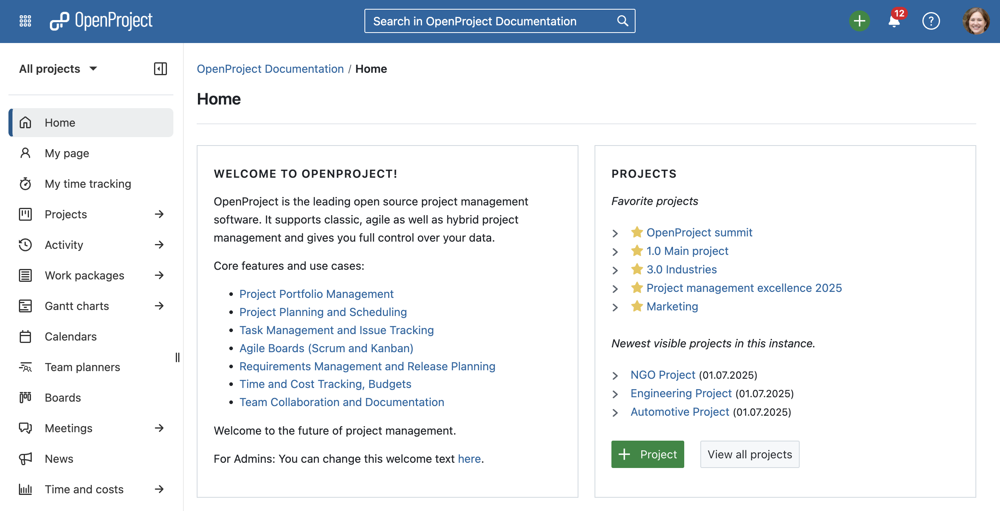

# OpenProject 16.2.0

Release date: 2025-07-16

We released [OpenProject 16.2.0](https://community.openproject.org/versions/2196). The release contains several bug fixes and we recommend updating to the newest version. In these Release Notes, we will give an overview of important feature changes and important technical changes. At the end, you will find a complete list of all changes and bug fixes. 

## Important feature changes

### New header and sidebar with improved navigation and design

OpenProject 16.2 introduces a redesigned header and sidebar that make navigating your projects noticeably easier. The sidebar toggle (hamburger icon) has moved inside the sidebar itself, the default sidebar color in light mode is now lighter and more modern, and the search and create buttons have been repositioned in the top bar for a more intuitive workflow. Together, these changes create a cleaner, more focused interface that helps you find what you need faster and align with the user interface used in [openDesk](/opendesk/).

Please note that if you have customized the sidebar colors, your individual settings will remain unchanged.

### Primer design system added to project create and project copy forms

### Non-latin languages and emojis supported in PDF exports

### Second level navigation for Relations create menu

### Select custom field format earlier when creating a new custom field

### Work package reminders presented in relative humanized time format

### My time tracking: Collapse future days for week and work week views

### Option to disable keyboard shortcuts for better accessibility

## Important technical changes

### SCIM server functionality added to OpenProject via SCIM API (Enterprise add-on)

### API support for internal comments

### Commenting on work packages fires a webhook

<!--more-->

## Bug fixes and changes

<!-- Warning: Anything within the below lines will be automatically removed by the release script -->
<!-- BEGIN AUTOMATED SECTION -->

- Feature: PDF Export: Support non-latin languages and emojis \[[#52082](https://community.openproject.org/wp/52082)\]
- Feature: Add SCIM server API  \[[#62107](https://community.openproject.org/wp/62107)\]
- Feature: Accept client credentials token issued by OIDC IDP \[[#62301](https://community.openproject.org/wp/62301)\]
- Feature: Allow multiple enterprise tokens to be present \[[#62493](https://community.openproject.org/wp/62493)\]
- Feature: Allow managing SCIM clients \[[#62516](https://community.openproject.org/wp/62516)\]
- Feature: Add authentication to SCIM server API \[[#62592](https://community.openproject.org/wp/62592)\]
- Feature: Multi-level Action Menu Primer View Component \[[#62976](https://community.openproject.org/wp/62976)\]
- Feature: Primerize Project create form \[[#63593](https://community.openproject.org/wp/63593)\]
- Feature: Primerise project copy form \[[#63594](https://community.openproject.org/wp/63594)\]
- Feature: PDF Export: Minor design changes in contract template \[[#63609](https://community.openproject.org/wp/63609)\]
- Feature: Move hamburger sidebar toggle from main navigation to sidebar \[[#63811](https://community.openproject.org/wp/63811)\]
- Feature: Updated enterprise banner for automatic subject configuration \[[#63873](https://community.openproject.org/wp/63873)\]
- Feature: Preserve user external accounts data \[[#63912](https://community.openproject.org/wp/63912)\]
- Feature: Add notification / banner to Enterprise features during trial to communicate which plan they are included in \[[#64005](https://community.openproject.org/wp/64005)\]
- Feature: Commenting on work packages fires a webhook \[[#64129](https://community.openproject.org/wp/64129)\]
- Feature: Allow partial updates on work package type \[[#64220](https://community.openproject.org/wp/64220)\]
- Feature: Introduce account setting to disable keyboard shortcuts (for accessibility) \[[#64234](https://community.openproject.org/wp/64234)\]
- Feature: Use second level navigation for Relations create menu \[[#64377](https://community.openproject.org/wp/64377)\]
- Feature: Moving spike for replacing CKEditor 5 with BlockNoteJS into dev branch and behind a feature flag \[[#64507](https://community.openproject.org/wp/64507)\]
- Feature: My time tracking: Collapse future days for week and work week views \[[#64549](https://community.openproject.org/wp/64549)\]
- Feature: Add internal comments to capabilities API \[[#64694](https://community.openproject.org/wp/64694)\]
- Feature: Reminders: Upon setting a work package reminder, present the reminder time in relative humanized format \[[#64695](https://community.openproject.org/wp/64695)\]
- Feature: Select custom field format at the index page of custom fields &amp; project attributes \[[#64800](https://community.openproject.org/wp/64800)\]
- Feature: Make OpenProject the organizer of the meeting \[[#64849](https://community.openproject.org/wp/64849)\]
- Feature: Reorganise Primerized project copy, create forms; Improve copy options display \[[#65026](https://community.openproject.org/wp/65026)\]
- Feature: Change default color of sidebar in light mode \[[#65091](https://community.openproject.org/wp/65091)\]
- Feature: Change position of search and create button in top bar \[[#65324](https://community.openproject.org/wp/65324)\]
- Feature: Limit access to SCIM clients UI to enterprise customers \[[#65339](https://community.openproject.org/wp/65339)\]
- Bugfix: Hide the &quot;Add project attribute&quot; button on the settings admin when sections are empty \[[#53722](https://community.openproject.org/wp/53722)\]
- Bugfix: Docker all in one: Inbound mail not working \[[#57979](https://community.openproject.org/wp/57979)\]
- Bugfix: Sharing project lists does not work \[[#60355](https://community.openproject.org/wp/60355)\]
- Bugfix: Hierarchy custom field - PDF export output display only last item without hierarchy \[[#60404](https://community.openproject.org/wp/60404)\]
- Bugfix: Autocompleter should not get autofocus by default \[[#61534](https://community.openproject.org/wp/61534)\]
- Bugfix: Work package description images scaling issue when exported to PDF \[[#61732](https://community.openproject.org/wp/61732)\]
- Bugfix: Centered text in cells in work package description fields appear left justified when exported to a PDF report. \[[#61734](https://community.openproject.org/wp/61734)\]
- Bugfix: Pattern input dropdown does not overlay background \[[#61937](https://community.openproject.org/wp/61937)\]
- Bugfix: Wrong upcoming meeting times when a user in a different time zone edits meeting series start date \[[#62375](https://community.openproject.org/wp/62375)\]
- Bugfix: User custom field: hovering over group name renders error message \[[#62480](https://community.openproject.org/wp/62480)\]
- Bugfix: Work package datepicker incorrectly renders turbo frame response \[[#62523](https://community.openproject.org/wp/62523)\]
- Bugfix: Version from the shared work package not available in Version filter on global wp page \[[#62610](https://community.openproject.org/wp/62610)\]
- Bugfix: \[Work-Package\] Mixing checkboxes and Bullet Point destroys checkboxes \[[#63309](https://community.openproject.org/wp/63309)\]
- Bugfix: Summer time (CEST) is not handled correctly by Meetings when the original meeting time was in a different time zone \[[#63549](https://community.openproject.org/wp/63549)\]
- Bugfix: Duplicate work package comments when submitting via ctlr/cmd + enter \[[#63556](https://community.openproject.org/wp/63556)\]
- Bugfix: Breadcrumb index creates unnecessary navigation buttons on mobile web \[[#63777](https://community.openproject.org/wp/63777)\]
- Bugfix: Mobile: Visual quirks when opening a storage report with error codes \[[#63790](https://community.openproject.org/wp/63790)\]
- Bugfix: NameError in CostReportsController#index \[[#63823](https://community.openproject.org/wp/63823)\]
- Bugfix: Broken pages in Primer lookbook \[[#63871](https://community.openproject.org/wp/63871)\]
- Bugfix: Notification image does not have a high enough contrast \[[#63914](https://community.openproject.org/wp/63914)\]
- Bugfix: Provide default id for Primer text field clear button \[[#64008](https://community.openproject.org/wp/64008)\]
- Bugfix: Next SSO Enterprise Banner has no image \[[#64087](https://community.openproject.org/wp/64087)\]
- Bugfix: First section has &quot;Move to top&quot; and &quot;Move up&quot; actions \[[#64101](https://community.openproject.org/wp/64101)\]
- Bugfix: \[Accessibility\] Search is missing a screen reader label \[[#64229](https://community.openproject.org/wp/64229)\]
- Bugfix: \[Accessibility\] Contrast issues \[[#64230](https://community.openproject.org/wp/64230)\]
- Bugfix: \[Accessibility\] Provide alternative link texts for pagination links \[[#64235](https://community.openproject.org/wp/64235)\]
- Bugfix: Flickering Life Cycle Definition specs \[[#64253](https://community.openproject.org/wp/64253)\]
- Bugfix: Meeting text fields cleared without warning when status is changed \[[#64260](https://community.openproject.org/wp/64260)\]
- Bugfix: Automatic subject pattern is editable after enterprise token got invalid \[[#64290](https://community.openproject.org/wp/64290)\]
- Bugfix: \[Accessibility\] Focus is not on back arrow when navigating through main menu \[[#64294](https://community.openproject.org/wp/64294)\]
- Bugfix: &quot;Dynamic&quot; meeting mention in permissions \[[#64303](https://community.openproject.org/wp/64303)\]
- Bugfix: Focus should return to trigger element on closing attribute help text dialog \[[#64472](https://community.openproject.org/wp/64472)\]
- Bugfix: TreeView is not updated when a new item is added \[[#64557](https://community.openproject.org/wp/64557)\]
- Bugfix: Time and costs page is broken \[[#64590](https://community.openproject.org/wp/64590)\]
- Bugfix: Link CF in PDF report only partially clickable when in multiple lines \[[#64591](https://community.openproject.org/wp/64591)\]
- Bugfix: Global search loading spinner is misplaced, as it overlaps with the X icon \[[#64653](https://community.openproject.org/wp/64653)\]
- Bugfix: Enterprise banner buttons on homescreen are not bottom-aligned \[[#64799](https://community.openproject.org/wp/64799)\]
- Bugfix: Administration project life cycle page using wrong Primer components \[[#64802](https://community.openproject.org/wp/64802)\]
- Bugfix: PG::UndefinedColumn: ERROR:  column &quot;valid\_from&quot; does not exist \[[#64812](https://community.openproject.org/wp/64812)\]
- Bugfix: Possible to deactivate the default work package priority \[[#64842](https://community.openproject.org/wp/64842)\]
- Bugfix: &quot;Move to top&quot; for sections is broken \[[#64843](https://community.openproject.org/wp/64843)\]
- Bugfix: Console error when loading any meeting \[[#64850](https://community.openproject.org/wp/64850)\]
- Bugfix: Project gate hovercard opens at the same time as date picker \[[#64851](https://community.openproject.org/wp/64851)\]
- Bugfix: Missing/wrong error handling for asynchronous dialogs \[[#64974](https://community.openproject.org/wp/64974)\]
- Bugfix: PDF export: workPackageValue macro for float values formats the number without a thousand delimiter \[[#64999](https://community.openproject.org/wp/64999)\]
- Bugfix: TreeView container should be full height in the Custom Fields \[[#65022](https://community.openproject.org/wp/65022)\]
- Bugfix: Date::Error app/models/custom\_value/date\_strategy.rb:34 in Date.iso8601 \[[#65055](https://community.openproject.org/wp/65055)\]
- Bugfix: URI::InvalidURIError from SlackNotificationJob#perform \[[#65083](https://community.openproject.org/wp/65083)\]
- Bugfix: NoMethodError (undefined method &#39;hierarchy&#39; for class Relation) \[[#65085](https://community.openproject.org/wp/65085)\]
- Bugfix: Addressable::URI::InvalidURIError from CustomValue::LinkStrategy#parsed\_url \[[#65089](https://community.openproject.org/wp/65089)\]
- Bugfix: Socket::ResolutionError from SlackNotificationJob#perform \[[#65107](https://community.openproject.org/wp/65107)\]
- Bugfix: WP title is squeezed on mobile \[[#65114](https://community.openproject.org/wp/65114)\]
- Bugfix: Custom action with multi-select cf doesn&#39;t work correctly for non-admin users \[[#65131](https://community.openproject.org/wp/65131)\]
- Bugfix: ArgumentError during seeding after 16.1.1 deployment \[[#65138](https://community.openproject.org/wp/65138)\]
- Bugfix: Truncation of &quot;Tage&quot; (Days) in duration field when language=DE \[[#65227](https://community.openproject.org/wp/65227)\]
- Bugfix: Wrong focused field in date picker \[[#65236](https://community.openproject.org/wp/65236)\]
- Bugfix: Links in descriptive text not distinguishable enough \[[#65252](https://community.openproject.org/wp/65252)\]
- Bugfix: Project attributes modal has no divider \[[#65254](https://community.openproject.org/wp/65254)\]
- Bugfix: Performance: Add modal routes to robots.txt \[[#65261](https://community.openproject.org/wp/65261)\]
- Bugfix: Missing breadcrumb in create new WP page \[[#65336](https://community.openproject.org/wp/65336)\]
- Feature: Add SCIM server functionality to OpenProject via SCIM API \[[#55941](https://community.openproject.org/wp/55941)\]

<!-- END AUTOMATED SECTION -->
<!-- Warning: Anything above this line will be automatically removed by the release script -->

## Contributions
A very special thank you goes to our sponsors for this release.
Also a big thanks to our Community members for reporting bugs and helping us identify and provide fixes.
Special thanks for reporting and finding bugs go to Michael Lathion, Jason Culligan, Sven Kunze, Gábor Alexovics.

Last but not least, we are very grateful for our very engaged translation contributors on Crowdin, who translated quite a few OpenProject strings!
Would you like to help out with translations yourself?
Then take a look at our translation guide and find out exactly how you can contribute.
It is very much appreciated!

