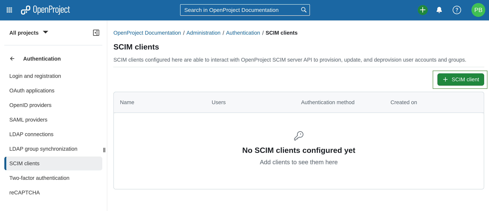

---
sidebar_navigation:
  title: SCIM
  priority: 800
description: SCIM
keywords: SCIM
---
# SCIM provisioning (Enterprise add-on)

> [!IMPORTANT] 
> SCIM provisioning is an Enterprise add-on. If you do not see the button you will have to activate the Enterprise edition first.

To activate and configure SCIM user and group provisioning in OpenProject, navigate to *Administration* -> *Authentication* and select -> *SCIM provisioning*.

## Configure new SCIM client.

SCIM client is a system(e.g. Keycloak with [SCIM plugin](https://github.com/mitodl/keycloak-scim)) that uses SCIM protocol to provision user and group identities in an automated and standardized way.
A SCIM client sends requests to a SCIM server (OpenProject in this case), asking it to create, update, retrieve, or delete users and groups.
To add a new SCIM client, click the green **+ SCIM client** button.

 

Configure your SCIM client in the following form:

1. Enter the **Name** of your SCIM client.

    
2. Choose an **Authentication provider**. 
   This is the service that users added by the SCIM provider will use to authenticate in OpenProject.
   It must have been configured before creating the SCIM client. It can be an [OIDC provider](../system-admin-guide/authentication/openid-providers/) or a [SAML provider](../system-admin-guide/authentication/saml/).
   
    
3. Choose an **Authentication method**. 
   This is how the SCIM client authenticates at OpenProject. Please ensure that OAuth tokens include the **scim_v2** scope.
   There are three option:
   a. **Static access token**
      
      > [!IMPORTANT] 
      > Static access tokens are valid for period of 1 year. Then they expire and must be replaced.

      This is the most commonly used authentication method for SCIM clients. In this case after clicking **Create** you get an access token that should be put to the SCIM client configuration on the other end.
      
      

      There is generated access token. After closing the dialog with generated token you will not see it anymore.
      
      

      Tokens can be revoked. And you can generate a new one.

      

      For example, if you use Keycloak with [SCIM plugin](https://github.com/mitodl/keycloak-scim) then configuration form looks like:
      
      
      
      1. Fill in the **UI Display name**
      2. Fill in the **SCIM 2.0 endpoint**
         It must be in the following form: `https://<your_openproject_hostanme>/scim_v2/`
      3. Set **Endoint content type** to **application/scim+json**
      4. Set **Auth mode** to **Bearer**
      5. Paste the generated static access token to **Auth password/token** 
      6. Enable user and group propagation. Enable import during sync.
      7. **Save** the configuration.

   b. **OAuth 2.0 client credentials**
      In this case after clicking **Create** you get client credentials of newly created [OpenProject OAuth Application](../oauth-applications/#oauth-applications) that should be put to the SCIM client configuration on the other end. Then SCIM client is supposed to use provided client credentials to send an access token request to OpenProject.
      
       
      
      There are generated client id and client secret. After closing the dialog with not see client secret anymore. 
      
       
   
   c. **JWT from identity provider**
      In this case you have to specify **Subject claim** that authentication JWT contains.
      
       
