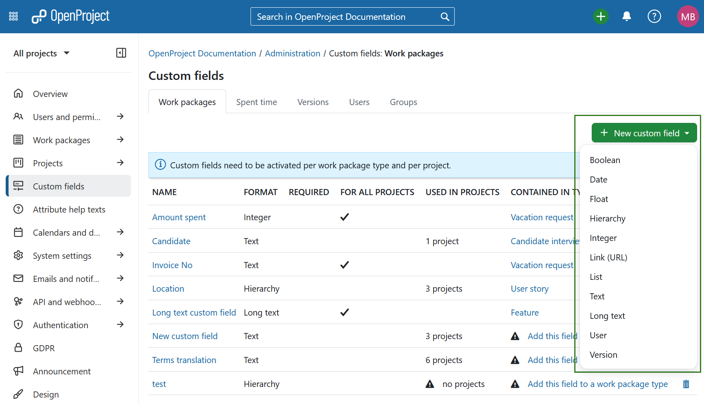
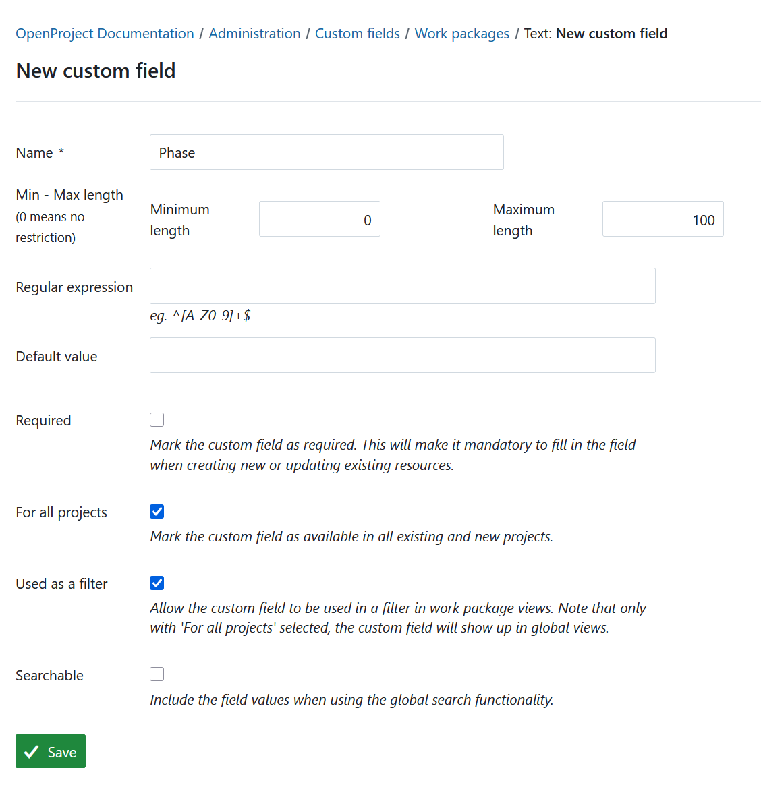
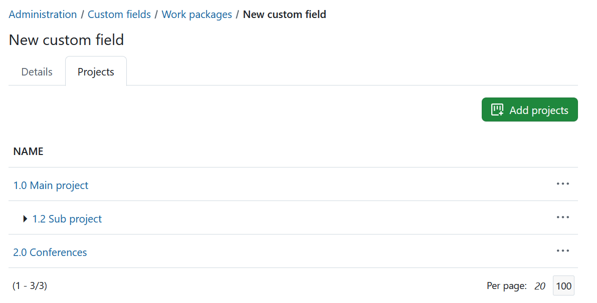
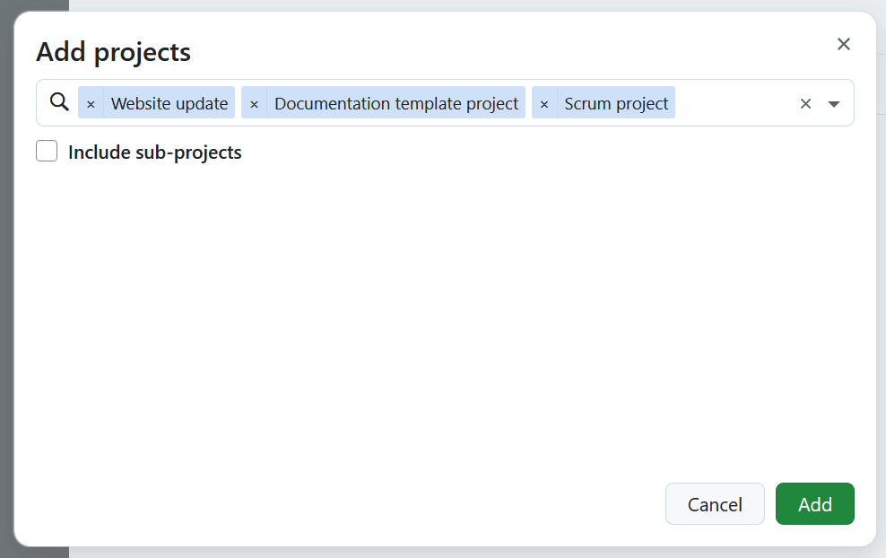
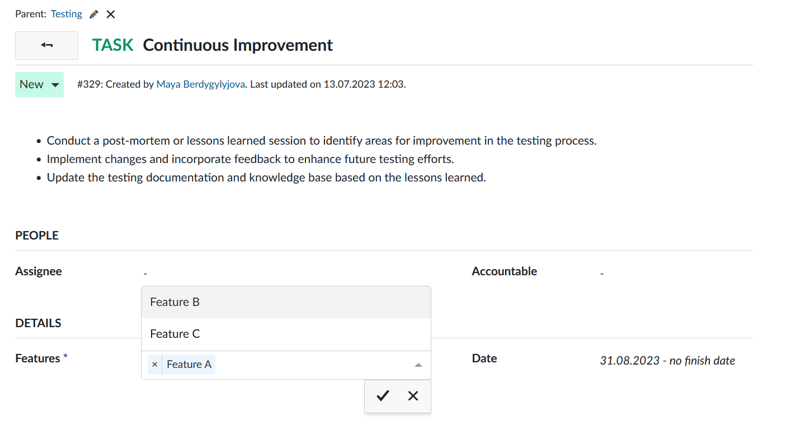

---
sidebar_navigation:
  title: Custom fields
  priority: 960
description: Manage custom fields in OpenProject.
keywords: manage custom fields
---
# Manage custom fields

You can **create additional custom fields for different sections**, e.g. work packages, projects, users or groups in OpenProject.

Custom fields enable to configure your OpenProject exactly to your needs, i.e. to adapt work package forms to your company specific requirements.

<video src="https://openproject-docs.s3.eu-central-1.amazonaws.com/videos/OpenProject-Forms-and-Custom-Fields-1.mp4" type="video/mp4" controls="" style="width:100%"></video>

## Add a new custom field

To **create a new custom field** navigate to *Administration* -> *Custom fields* and select the section for which you will create a new custom field, e.g. for work packages.

You will see the list of all the custom fields that have been created so far, divided by the section on the different tabs for which they were created.

If none have been created so far, click on the link **Create a new custom field** in the respective section, e.g. on the tab for work packages.

Depending on the module, for which the new custom field is being  created, slightly different options may be offered. This is an example of a new custom field for a work package.

1. Custom field **Name**, which will appear as the attribute name on the work package form.
2. Choose a **Format** of the custom field, e.g. text, list, date, boolean. You can choose between the following formats for custom fields:

> [!TIP]
> Depending on the format of the custom field, the fields to specify vary.
4. Specify the **minimal and maximal length**. If a 0 is chosen, no restriction will be imposed on the length of the custom field.
5. **Regular expression** specifying which values are allowed for the custom field.
6. **Default value** will be used as a default value for the custom field.
7. Set if the new custom field should be a **required** field.
8. Specify if the new custom field should be **used for all projects**. This means the custom field will be active for all projects and does not need to be activated separately per project.
9. Specify if the new custom field should be **used as a filter for work packages**. See [here](../../user-guide/work-packages/work-package-table-configuration/#filter-work-packages) how to filter work packages.
10. Specify if the new custom field should be **searchable** via the global search.
11. **Save** the new custom field.

## Assign a custom field to a work package type and project

> [!IMPORTANT]
> Custom fields need to be activated per work package type and added to a project. Work package custom fields are only visible when two conditions are met:
>
> 1. Custom field has been added to the work package type (form configuration).
> 2. Custom field is activated for the project.

### Assign a custom field to a work package type (Enterprise add-on)

You can [assign a custom field to a work package type](../manage-work-packages/work-package-types/#work-package-form-configuration-enterprise-add-on) (form configuration) directly via the link in the custom field overview.

> [!IMPORTANT]
>
> Starting with OpenProject 15.0, when adding new custom fields to a type through the  form configuration, the added custom fields will not automatically be enabled in all projects that have this work package type currently enabled.

### Add a custom field to one or multiple projects

You can activate the custom field for specific projects under the respective [project settings](../../user-guide/projects/project-settings/custom-fields/). 

> [!TIP]
> This is not relevant if the setting **For all projects** has been configured for the custom field.

You can active a custom field for multiple projects at once by opening the custom field in question and selecting the *Projects* tab. Click the **Add projects** button.

Use the search field to identify the projects and select multiple projects at once. You can also include the sub-projects by checking the respective option. Click the **Add** button to active the custom fields in all of the selected projects.

## Edit or remove a custom field

To **edit an existing custom field** select the appropriate tab and click on the custom field name.

To **delete** a custom field, click on the delete icon next to the respective custom field in the list.

## Create a multi-select custom field

For work package custom fields of type **List**, **User**, **Version** and **Hierarchy** you may also select **multi-select custom fields** to select more than one value at once.

To create a multi-select custom field follow the same steps as you would when [creating a standard custom field](#add-a-new-custom-field). Select format **List**, **User**, **Version** or **Hierarchy **and check the option *Allow multi-select*.

When using multi-select custom fields, you can add as many options as required. The cross icon next to an option will remove it from the selection. The check mark will save your changes.

## Create a Hierarchy custom field (Enterprise add-on)

> [!NOTE]
> Custom fields with type Hierarchy are an Enterprise add-on. Click here for more information on the [OpenProject Enterprise edition](https://www.openproject.org/enterprise-edition/).

Hierarchy custom fields allow organizing hierarchical structures in work packages by making use of multi-level select lists. To create a custom field of type Hierarchy follow the same steps as you would when [creating a standard custom field](#add-a-new-custom-field) and select **Hierarchy** format. Select the 

