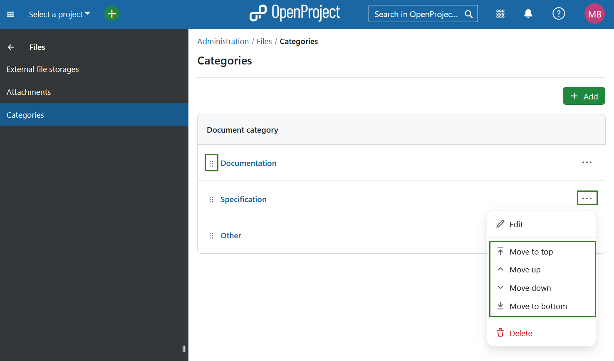
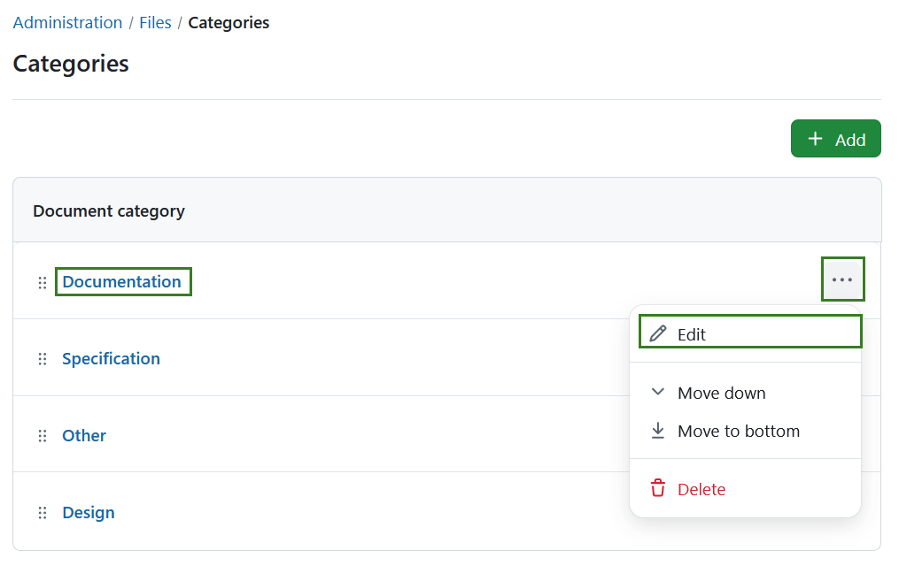

---
sidebar_navigation:
  title: Categories
  priority: 700
description: File storages in OpenProject.
keywords: file storages, Nextcloud setup, Nextcloud integration, OneDrive setup, Sharepoint setup, OneDrive, Sharepoint
---

# Documentation categories

To create or edit documentation categories in OpenProject, navigate to *Administration → Files → Categories*. Here, you will see all existing values. You can adjust the items within the list by using the options behind the **More (three dots)** menu on the right side. You can also rearrange the order by using the drag-and-drop handle on the left. 

## Create new documentation category

To create a new documentation category, select the **+ Add** button in the top right corner.

You can then enter a name activate it. Press the **Save** button to save your changes.

## Edit or remove documentation category

To **edit** an existing category, either click on the name directly or select the **Edit** option from the **More (three dots)** menu on the right end of the row.

To remove a documentation category, open the **More (three dots)** menu on the right end of the row and click on the **delete** icon.
