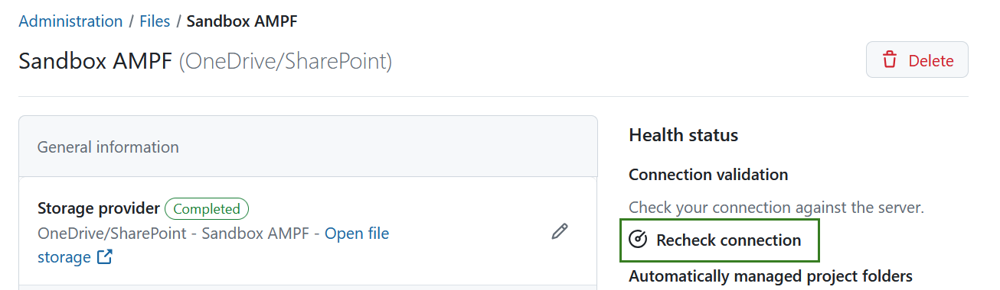
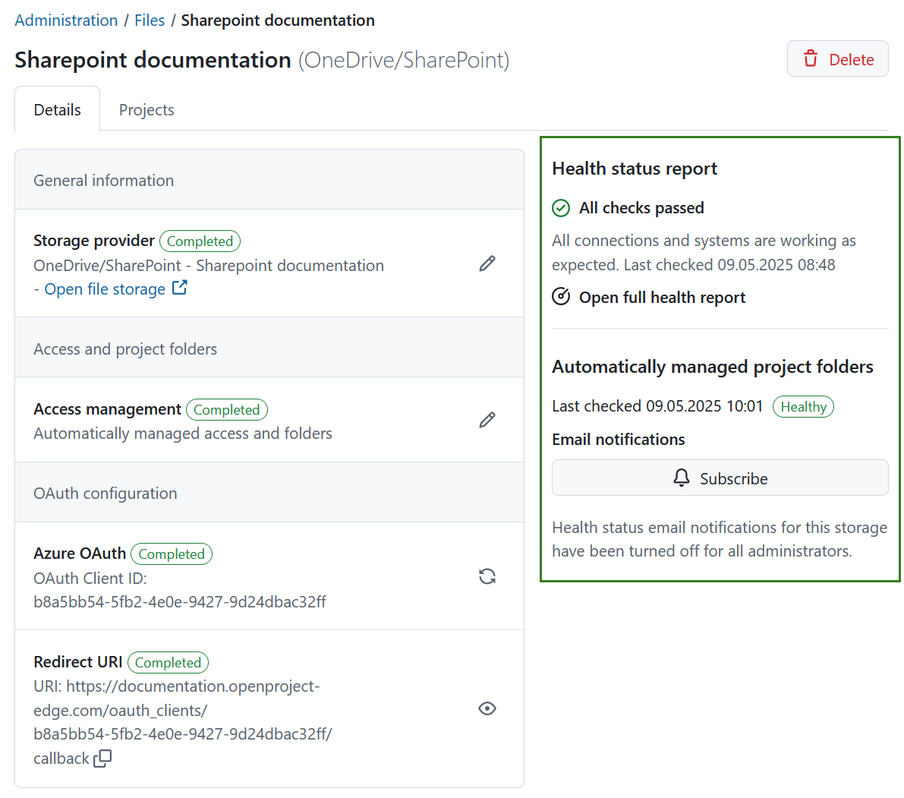

---
sidebar_navigation:
  title: Health status / Troubleshooting
  priority: 999
description: Health status checks and troubleshooting for file storages in OpenProject.
keywords: file storages, health, health status, error, troubleshooting, Nextcloud, OneDrive, SharePoint, Connection validation, Connection test
---

# Health status checks and troubleshooting

If a file storage is not working as expected, you can find additional information about possible errors in the details
view of the file storage. You can access this view by clicking on the file storage's name in the list under
*Administration* → *Files* → *External file storages*. There, administrators can manually trigger a connection
validation and receive a health status report, or review any errors reported by background synchronization workers
needed for file storages with automatically managed project folders.

## Connection validation

Every file storage is able to run a connection test. This test is triggered manually by clicking on **Run checks now**
in the sidebar on the right side of the file storage's details view. This check is available after the file storage is
fully configured.

After the check has run, a brief summary is displayed. For more details the administrator can open the full report by
clicking on **Open full health report**.

> [!IMPORTANT]
> INSERT SCREENSHOT WITH HEALTH REPORT SUMMARY (WITH ERROR) AND THE BUTTON TO FULL REPORT

There are several possible errors that can occur during the connection test. While some errors can occur for all types
of file storages, most errors are quite specific for the provider type. The following table lists the error codes
that can happen on all files storages.

| Error code         | Error description                         | Possible reasons                                                            | Next steps and solutions                                                                                                                 |
|--------------------|-------------------------------------------|-----------------------------------------------------------------------------|------------------------------------------------------------------------------------------------------------------------------------------|
| ERR_NOT_CONFIGURED | The file storage is not fully configured. | Important data is missing, so that the file storage is labelled incomplete. | Check the input fields and fill in the missing data.                                                                                     |
| ERR_UNKNOWN_ERROR  | An unknown error occurred.                | There can be multiple reasons and the error source was not foreseen.        | Errors of this kind are logged to the server logs. Look for a log entry starting with `Connection validation failed with unknown error:` |

### Error codes specific for OneDrive/SharePoint

The following table lists the error codes of failures specific for OneDrive/SharePoint, with a description of the
possible reasons and suggested solutions.

| Error code                             | Error description                                                                     | Possible reasons                                                                                                                                                                                           | Next steps and solutions                                                                                                                                                                                                                                                                                                                                                                                                                               |
|----------------------------------------|---------------------------------------------------------------------------------------|------------------------------------------------------------------------------------------------------------------------------------------------------------------------------------------------------------|--------------------------------------------------------------------------------------------------------------------------------------------------------------------------------------------------------------------------------------------------------------------------------------------------------------------------------------------------------------------------------------------------------------------------------------------------------|
| ERR_CLIENT_ID_INVALID                  | The configured client id is invalid.                                                  | The configured client id is invalid and cannot be used to authenticate against the Microsoft login servers.                                                                                                | Go to the correct application overview in the [Azure Portal](https://portal.azure.com/). Copy the correct client ID to the input field of the file storage configuration form.                                                                                                                                                                                                                                                                         |
| ERR_CLIENT_SECRET_INVALID              | The configured client secret is invalid.                                              | The configured client secret is invalid and cannot be used to authenticate against the Microsoft login servers.                                                                                            | Go to the correct application overview in the [Azure Portal](https://portal.azure.com/). Check whether the client secret is still valid. Attention: secrets might have an expiration date. If a secret is expired, you will have to generate a new one.                                                                                                                                                                                                |
| ERR_OD_DRIVE_ID_INVALID                | The configured drive id has an invalid format.                                        | There might be a typo in the drive id.                                                                                                                                                                     | Consult the [drive guide](../../../integrations/one-drive/drive-guide/) and fetch the desired drive ID again, to fill out the input field.                                                                                                                                                                                                                                                                                                             |
| ERR_OD_DRIVE_ID_NOT_FOUND              | The configured drive id was not found.                                                | There might be a typo in the drive id, the drive might be deleted, or your application has no permissions to see it.                                                                                       | Consult the [drive guide](../../../integrations/one-drive/drive-guide/) and fetch the desired drive ID again, to fill out the input field.                                                                                                                                                                                                                                                                                                             |
| ERR_OD_TENANT_ID_WRONG                 | The configured directory (tenant) id is invalid.                                      | There might be a typo or the tenant name or ID has changed recently.                                                                                                                                       | Go to the correct application overview in the [Azure Portal](https://portal.azure.com/) and copy the correct tenant id to the input field.                                                                                                                                                                                                                                                                                                             |
| ERR_OD_OAUTH_REQUEST_NOT_FOUND         | ...                                                                                   | ...                                                                                                                                                                                                        | ...                                                                                                                                                                                                                                                                                                                                                                                                                                                    |
| ERR_OD_OAUTH_REQUEST_UNAUTHORIZED      | ...                                                                                   | ...                                                                                                                                                                                                        | ...                                                                                                                                                                                                                                                                                                                                                                                                                                                    |
| ERR_OD_CLIENT_WRITE_PERMISSION_MISSING | The application is missing write permissions.                                         | The application might be missing the API permission `Files.ReadWrite.All`.                                                                                                                                 | Go to the correct application api permissions in the [Azure Portal](https://portal.azure.com/) and set the GRAPH API permission `File.ReadWrite.All` on application level. Do not forget to submit the administrator consent.                                                                                                                                                                                                                          |
| ERR_OD_CLIENT_CANT_DELETE_FOLDER       | The application is missing permissions to delete.                                     | ...                                                                                                                                                                                                        | ...                                                                                                                                                                                                                                                                                                                                                                                                                                                    |
| ERR_OD_EXISTING_TEST_FOLDER            | The folder needed for testing already exists.                                         | A folder is created and deleted while testing the setup for automatically managed project folders. The deletion of this folder might have failed in a previous run.                                        | Check the error message for the exact name of the folder. Go to the website of the drive and delete that folder.                                                                                                                                                                                                                                                                                                                                       |
| WRN_OD_OAUTH_TOKEN_MISSING             | The current user has no authentication token.                                         | The current user probably never did a successful login from OpenProject to the file storage, or the token was deleted from the account details.                                                            | Visit any work package of a project, where the current file storage is used. Click on the **Login** button in the **Files** tab.                                                                                                                                                                                                                                                                                                                       |
| WRN_OD_UNEXPECTED_CONTENT              | The connection request was successful, but unexpected content was found in the drive. | This warning is only shown, if the file storage is configured to automatically managed project folder permissions. There was data found in the drive, that is not a project folder created by OpenProject. | Go to your drive and migrate or delete the data from the drive root, that was not created by OpenProject. Further information about the unexpected data is found in the server logs. A drive configured for usage with the *Automatically managed project folders* option has a disrupted inheritance chain. Any data in here can only be seen by site owner. It is discouraged to use this drive for other purposes than the OpenProject integration. |

### Connection validation for Nextcloud

The following table lists the error codes of failures specific for Nextcloud, with a description of the possible reasons
and suggested solutions.

| Error code                         | Error description                                                                           | Possible reasons                                                                                                                                                           | Next steps and solutions                                                                                                                                                                                   |
|------------------------------------|---------------------------------------------------------------------------------------------|----------------------------------------------------------------------------------------------------------------------------------------------------------------------------|------------------------------------------------------------------------------------------------------------------------------------------------------------------------------------------------------------|
| ERR_NC_HOST_NOT_FOUND              | No Nextcloud server was found at the configured host URL.                                   | There might be a typo or the URL has changed.                                                                                                                              | Check the configuration and enter a valid URL.                                                                                                                                                             |
| ERR_NC_DEPENDENCY_MISSING          | A required dependency is missing on the file storage.                                       | Either the Integration OpenProject app or the Team Folders app is not enabled in Nextcloud.                                                                                | Add the missing dependency to the Nextcloud server.                                                                                                                                                        |
| ERR_NC_DEPENDENCY_VERSION_MISMATCH | A required dependency has an outdated version.                                              | Either the Integration OpenProject app or the Team Folders app is outdated or was not updated to the officially minimal supported version.                                 | Update your apps to the latest version. It might be necessary to update your Nextcloud server to the latest version in order to be able to install the latest app versions.                                |
| ERR_NC_GROUP_FOLDER_NOT_FOUND      | The team folder could not be found.                                                         | The team folder used by the Integration OpenProject app was not found. This folder is usually named `OpenProject` and is owned by the group `OpenProject`.                 | The team folder is used only by the automatically managed project folders mode. Try to disable this option in the Nextcloud administration for the Integration OpenProject app and reenable it afterwards. |
| ERR_NC_OAUTH_REQUEST_NOT_FOUND     | ...                                                                                         | ...                                                                                                                                                                        | ...                                                                                                                                                                                                        |
| ERR_NC_OAUTH_REQUEST_UNAUTHORIZED  | ...                                                                                         | ...                                                                                                                                                                        | ...                                                                                                                                                                                                        |
| ERR_NC_USERLESS_ACCESS_DENIED      | The userless request was unauthorized                                                       | The configured app password is invalid.                                                                                                                                    | Generate a new app password in the Nextcloud administration section of the Integration OpenProject app and copy it over to the OpenProject file storage configuration form.                                |
| WRN_NC_OAUTH_TOKEN_MISSING         | The current user has no authentication token.                                               | The current user probably never did a successful login from OpenProject to the file storage, or the token was deleted from the account details.                            | Visit any work package of a project, where the current file storage is used. Click on the **Login** button in the **Files** tab.                                                                           |
| WRN_NC_UNEXPECTED_CONTENT          | The connection request was successful, but unexpected content was found in the team folder. | The team folder `OpenProject` might contain data, that was put there by a user, or there are remnants from projects that no longer have a valid connection in OpenProject. | Go to Nextcloud and migrate or delete the data in the OpenProject team folder, that was not created by OpenProject. Further information about the unexpected data is found in the server logs.             |

The officially minimal supported app versions are listed in
the [system admin guide](../../../../system-admin-guide/integrations/nextcloud/#required-system-versions).

### Error codes specific for file storages with SSO configuration

Some file storages can be configured to use SSO login methods. There are a couple of checks run explicitly for this kind
of setup. The following table contains the error codes of those checks.

| Error code                       | Error description                                          | Possible reasons                                                                                                                                                                                                      | Next steps and solutions                                                                                                     |
|----------------------------------|------------------------------------------------------------|-----------------------------------------------------------------------------------------------------------------------------------------------------------------------------------------------------------------------|------------------------------------------------------------------------------------------------------------------------------|
| ERR_OIDC_CANT_ACQUIRE_TOKEN      | No token could be acquired for accessing the file storage. | The OpenID Connect (OIDC) setup doesn't have the necessary audience, nor does it provide the possibility to exchange tokens.                                                                                          | ...                                                                                                                          |
| ERR_OIDC_CANT_EXCHANGE_TOKEN     | The token exchange failed.                                 | ...                                                                                                                                                                                                                   | ...                                                                                                                          |
| ERR_OIDC_CANT_REFRESH_TOKEN      | The expired access token could not get refreshed.          | ...                                                                                                                                                                                                                   | ...                                                                                                                          |
| WRN_OIDC_NON_OIDC_USER           | The user is not a OIDC user.                               | The current user is provisioned to OpenProject, but not by an OIDC identity provider.                                                                                                                                 | Log in to an admin user with the correct OIDC identity provider, the same one used by the file storage, and rerun the check. |
| WRN_OIDC_NON_PROVISIONED_USER    | The user is not a provisioned user.                        | The current user is not provisioned by an OIDC identity provider.                                                                                                                                                     | Log in to an admin user with the correct OIDC identity provider, the same one used by the file storage, and rerun the check. |
| WRN_OFFLINE_ACCESS_SCOPE_MISSING | The OIDC provider has no `offline_access` scope.           | The OIDC provider was configured without `offline_access` scope. While this does not cause the integration to break, this scope ensures, that refresh tokens to not expire and OpenProject can maintain a connection. | Add the scope `offline_access` to the OIDC provider configuration.                                                           |

## Health checks for automatically managed project folders

File storages with the *Automatically managed project folders* option will have reoccurring synchronization
runs, that update the user permissions on the external system and report possible errors. An additional section is
displayed for those file storages in the side bar.

If a problem has been detected, the OpenProject administrators will be notified of the detected error via email.
Administrators will be notified of the faulty integration once a day, including the specific error description and
solution suggestions (see the table below).

Once the error has been resolved, the administrators will also receive an email informing them of this.

You can choose to subscribe or unsubscribe to these email notifications by clicking the respective button under the
error message.

### File storage errors description

Please consult the following table for possible reasons behind the errors and suggested solutions.

| Error name   | Error description                       | Possible reasons                                                                                                                                                                                                                                                                                                                                                                 | Next steps and solutions                                                                                                                                                                                                                                              |
|--------------|-----------------------------------------|----------------------------------------------------------------------------------------------------------------------------------------------------------------------------------------------------------------------------------------------------------------------------------------------------------------------------------------------------------------------------------|-----------------------------------------------------------------------------------------------------------------------------------------------------------------------------------------------------------------------------------------------------------------------|
| Error        | No group specified                      | The name may not be specified for the storage. A glitch during setup or manual changes to the DB could cause this problem. The group name is saved in the database in the Storages Table in the providers field (JSON).                                                                                                                                                      | Setup the entire storage again.                                                                                                                                                                                                                                       |
| Error        | Group does not exist                    | The app was activated on Nextcloud and the OpenProject group was removed afterwards. Changes on Nextcloud: OpenProject group was removed.                                                                                                                                                                                                                                    | Manually add the group in the Nextcloud setup and call it OpenProject. Add the user OpenProject to the group OpenProject.                                                                                                                                             |
| Error        | User does not exist                     | After the app was activated on Nextcloud and the user was removed afterwards.  Changes on Nextcloud: OpenProject user was removed.                                                                                                                                                                                                                                          | Manually add the user in the Nextcloud setup and call that user OpenProject. Add the user OpenProject to the group OpenProject.   Alternatively reinstall the OpenProject integration app on Nextcloud. You will also need to reconfigure the Nextcloud storage. |
| Error        | Insufficient privileges                 | OpenProject can not change the user permissions for folders or add folders to the OpenProject folder, because the OpenProject user no longer has access to the folder.                                                                                                                                                                                                           | Reinstall the OpenProject integration app on Nextcloud. You will need to reconfigure the Nextcloud storage.   Make sure the OpenProject user is the admin of the OpenProject group and also the admin of the OpenProject folder.                                      |
| Error        | Failed to remove or add user from group | A user does not exist in the file storage.   A user can not be removed from the OpenProject group due to admin rights.   This may occur when running the sync job and further information can be found in the server logs.                                                                                                                                             | Ensure that the user exists in the file storage platform.  Remove admin rights for that user on the OpenProject group.   If the user is also an admin in the files storage group, he/she/they need to be removed by a file storage platform admin.          |
| Not allowed  | Outbound request method not allowed     | OpenProject sent wrong requests to the storage.   This error can occur both in Nextcloud and OneDrive/Sharepoint integration.                                                                                                                                                                                                                                               | Report this to [OpenProject community](https://community.openproject.org/projects/openproject/forums) or [support team](https://www.openproject.org/contact/).                                                                                                        |
| Not found    | Outbound request destination not found  | OpenProject can not reach file storage platform.   This could be due to Storage provider being down: - DNS problems  - Network problems (flaky network)  - Local networks (Nextcloud specific setting that needs to enabled)                                                                                                                                 | See if you can access the file storage platform from your browser.   For Nextcloud, see if Nextcloud settings are active if in local network.                                                                                                                    |
| Unauthorized | Outbound request not authorized         | - Authentication is failing  - Application password was changed and not updated in OpenProject (Nextcloud OAuth settings are wrong or OneDrive/SharePoint client secret or ID is wrong). - User has no access, can not login, no token can be negotiated.   Server to server: the client secret might be wrong   OpenProject User credentials might be wrong | Check the storages setup. Check if the client secret (OneDrive/SharePoint) or the OAuth setup is correct (Nextcloud). Check if the application password is correct.                                                                                         |
| Conflict     | *error_text_from_response*              | A folder or a file was created, which already exists on the storage platform, e.g. a folder with the same name exists.   Can happen if for example a user manually created something on the storage platform.                                                                                                                                                               | Check in the storage platform if the folder already exists.                                                                                                                                                                                                           |
| Error        | Outbound request failed                 | An unexpected 500 error, e.g. TOS (Terms of Service) app was activated and OpenProject can not access storage anymore.   Password configuration plugin may have caused problems.                                                                                                                                                                                            | See if file storage is working correctly. If it does, collect as much information as possible and contact [OpenProject community](https://community.openproject.org/projects/openproject/forums) or [support team](https://www.openproject.org/contact/).             |

If the suggested troubleshooting solutions did not resolve your issue, please reach out to
the [OpenProject community](https://community.openproject.org/projects/openproject/forums)
or [support team](https://www.openproject.org/contact/) for further assistance.
