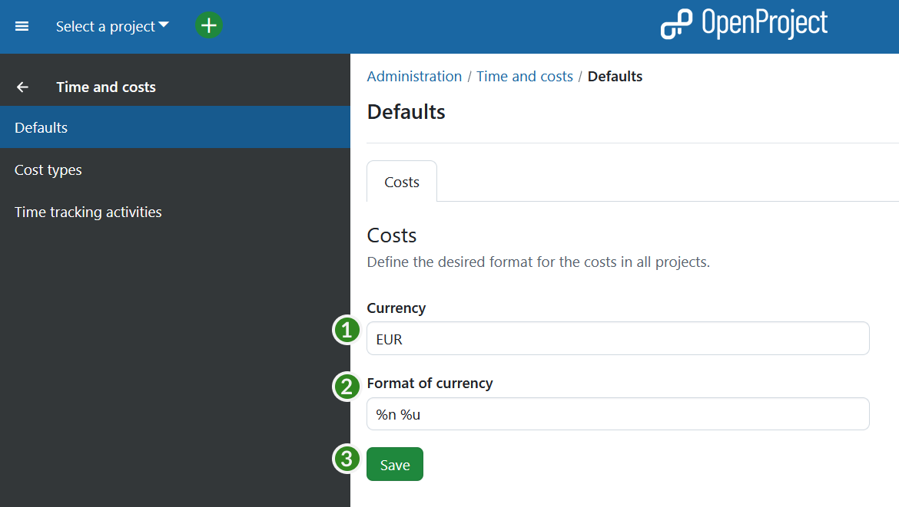
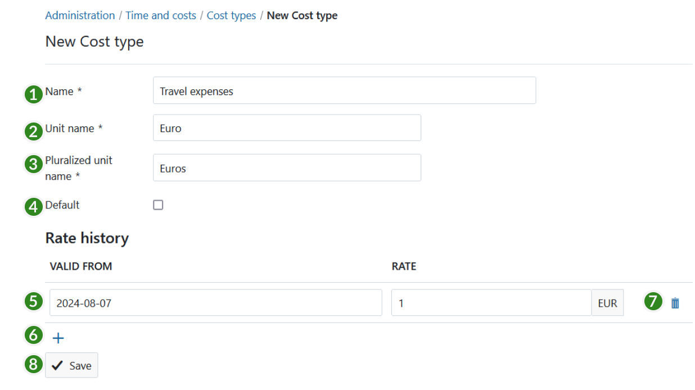
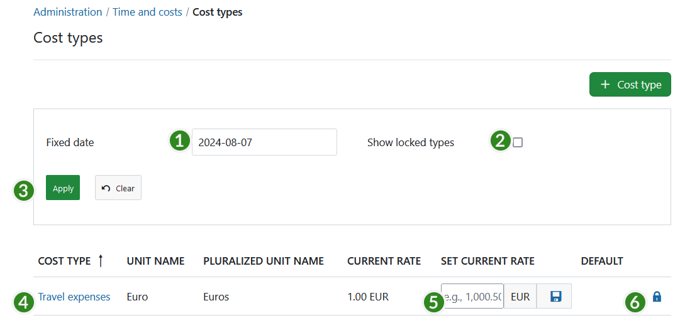
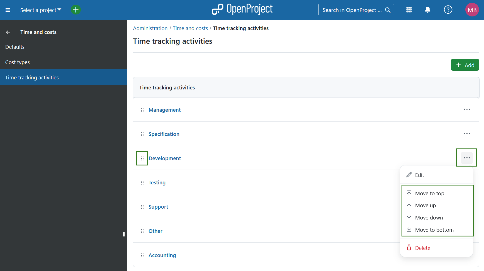
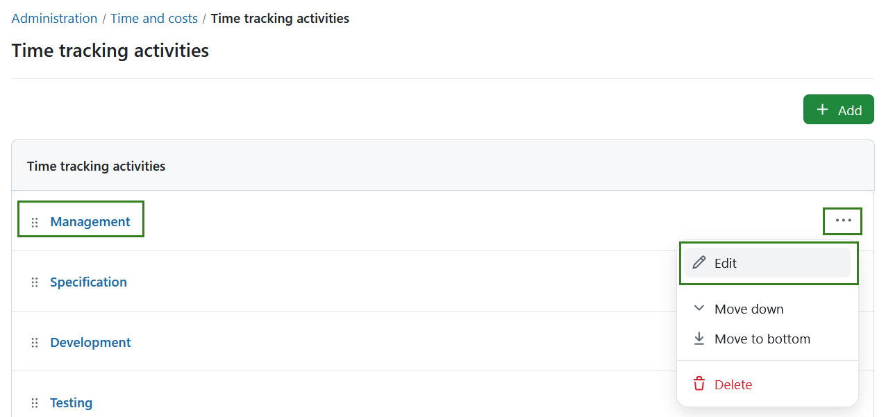

---
sidebar_navigation:
  title: Time and costs
  priority: 850
description: Define cost types and change the currency in OpenProject.
keywords: cost type, currency, time and costs, budget
---
# Time and costs

Navigate to *Administration* -> *Time and costs*. Here you can configure costs in OpenProject and create cost types to track unit costs. Also, you can configure the currency you want to use for your cost reports.

## Default time and cost settings

Navigate to *Administration* -> *Time and costs* -> *Defaults* to define settings for costs in OpenProject.

1. Configure the **currency used in the system, e.g. EUR**.
2. **Specify the format of the currency**, if the number should be before or after the currency, e.g. 10 EUR, or $ 10.
3. Press the **Apply** button to save your changes.

## Create and manage cost types

You can create and manage **cost types** to [book unit costs to work packages in OpenProject](../../user-guide/time-and-costs/cost-tracking/).

Navigate to *Administration* -> *Time and costs* -> *Cost types* to create and manage unit costs types.

Click the green **+ Cost type** button to create a new cost type.

You can set the following options:

1. Enter a **name** for the cost type.
2. Define the **unit name** for this cost type, e.g. Euro, piece, day, etc.
3. Set the **pluralized unit name**, e.g. Euros, pieces, days, etc.
4. Choose if the cost type should be the **default cost type** when booking new unit costs.
5. Define the Rate history and **set a date** from which this cost type should be valid and **set a rate** (in the specified unit) for this date.
6. With the + icon you can add **additional rates for other dates**.
7. The delete icon will **remove a rate** for a certain date.
8. Do not forget to **save** your changes.

In the overview list of all cost types you can define the following.

1. **Filter for cost types at a certain fixed date** in the list
2. Choose whether also locked cost types should be displayed
3. Press the **apply** button: This way you will get the cost types with the rate (at the chosen fixed date) displayed in the list below.
4. Click on the name of a cost type to **edit an existing cost type**.
5. **Set a current rate** (for the current valid from period) and press the save icon to apply it.
6. **Lock** a cost type.
> [!TIP]
> Please note that you **can only lock but not delete** cost types.

> [!NOTE]
> With cost types you can also book any kind of units to work packages, e.g. vacation days, leaves, travel days, etc.. Just choose 1 as a unit. This way, you could e.g. track vacation days against a vacation budget and evaluate the days in the [cost reporting](../../user-guide/time-and-costs/reporting/).

## Create and manage time tracking activities

To get an overview of existing values for time tracking activities, navigate to *Administration -> Time and Costs -> Time tracking activities*. You can adjust the items within the list by using the options behind the **More (three dots)** menu on the right side. You can also re-arrange the order by using the drag-and-drop handle on the left. 

> [!NOTE]
> To activate the [Activities for time tracking](../../user-guide/projects/project-settings/activities-time-tracking) in a certain project, navigate to *Project settings -> Time tracking activities*.

### Create new time tracking activity

To create a new value, select the **+ Add** button in the top right corner.

You will then be able to name the value and activate it. Press the **Save** button to save your changes.

### Edit or remove time tracking activity

To **edit** an existing configuration either click on the name of the activity directly or select the **Edit** option from the **More (three dots)** menu on the right end of the row.

To remove an enumeration, open the **More (three dots)** menu on the right end of the row and click on the **delete icon**.

> [!NOTE]
> To activate the [Activities for time tracking](../../user-guide/projects/project-settings/activities-time-tracking) in a certain project, navigate to *Project settings -> Time tracking activities*.