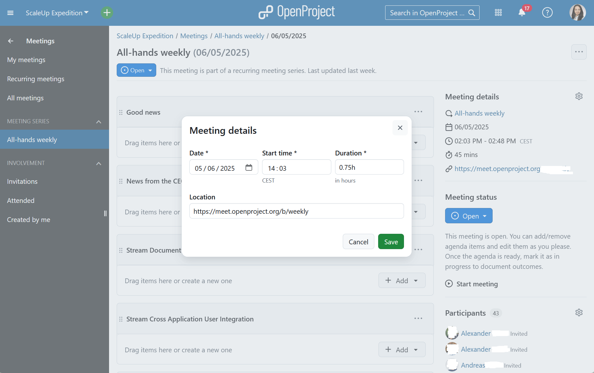
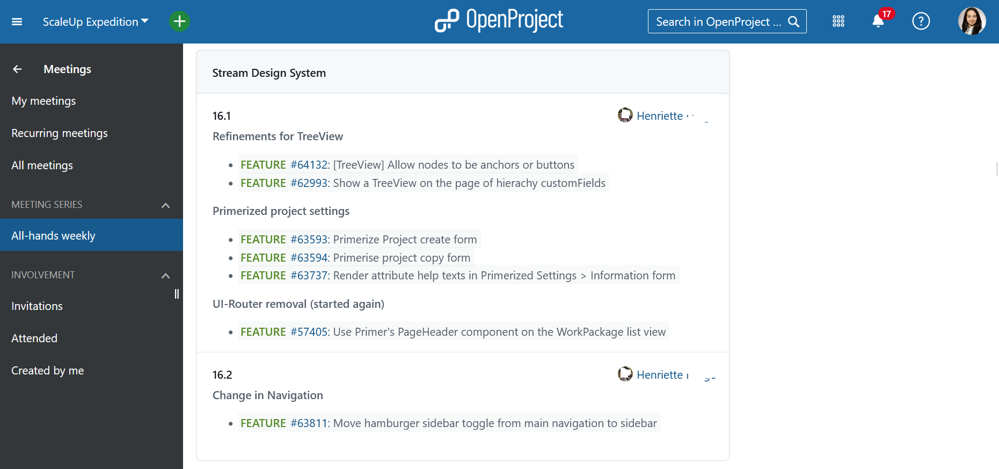
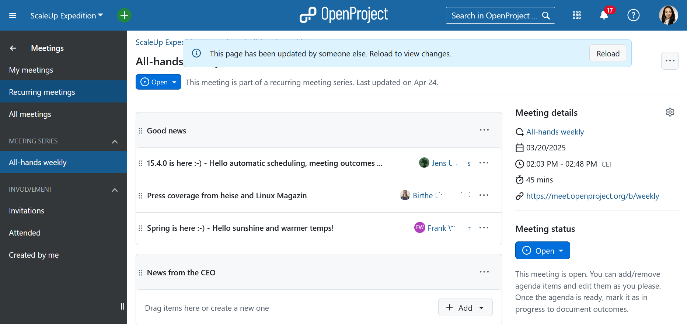
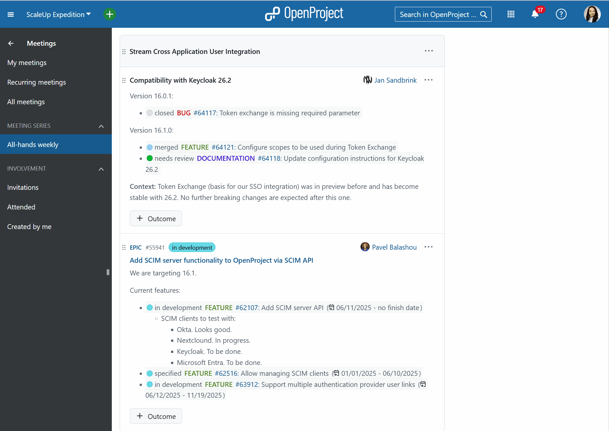
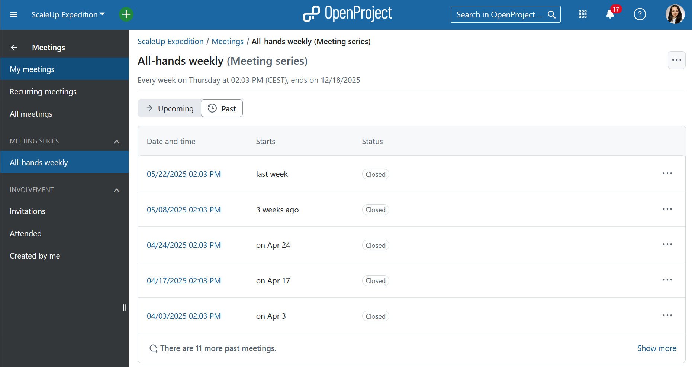

---
sidebar_navigation:
  title: Meeting Management
  priority: 900
description: Meeting management in OpenProject
keywords: meetings, meeting management, use case, use-case, agenda
---

# Use case: meeting management with OpenProject

At OpenProject, we manage internal team coordination using the very tools we build. We actively use the [Meetings module](https://www.openproject.org/collaboration-software-features/meeting-management/) in our daily work at OpenProject. It’s a key part of how we plan, collaborate, and follow up — and it saves us real time and effort.

**Key benefits we rely on**:

- **Time-saving templates**: Recurring meetings with pre-filled agendas reduce manual setup
- **Shared ownership**: Everyone contributes to the agenda
- **Live editing & linking**: Stay focused and in context
- **Meetings backlog**: Park topics for future discussion — without losing them

This use case shows how we run our **weekly all-hands team meetings** with the **Meetings module** — using recurring meetings, collaborative agenda building, and integrated follow-ups.

------

## Set up recurring meetings with agenda templates

We create a **recurring meeting series** to maintain a consistent rhythm for our weekly team sync. We define the participants, schedule, and relevant links.

We then configure a **template agenda** that repeats each week. It includes sections like:

- **Good news** – a space where everyone can share exciting updates about OpenProject
- **News from the CEO** – our CEO highlights any company-wide updates
- **Team updates** – each team gives a short summary of their current focus
- **Customer and user feedback** – team members share insights, especially on newly released features
- **[Core values](https://www.openproject.org/blog/core-values-openproject/)** – a moment to recognize each other and reflect on how we live our values
- **Roadmap outlook** – a look at upcoming initiatives or changes

This setup saves time and ensures a clear structure. Of course, we can still add week-specific topics as needed.

------

## Collaborate on agenda building

Throughout the week, team members add agenda points directly to the upcoming meeting. We also link **work packages** to agenda items — especially helpful for development updates. This keeps discussion connected to actual tasks.

For longer-term or postponed topics, we use the **Meetings Backlog** — a shared parking lot for ideas or issues that aren’t urgent. It appears in every agenda, making it easy to pull in topics when time allows.

------

## Run the meeting: live, linked, and structured

During the meeting, we project the agenda live for everyone to follow. Each item includes links to tasks, documents, or discussions. We can edit the agenda in real time, and document outcomes directly.

If someone adds a last-minute agenda item just before the meeting (or even during), the system shows a helpful banner — making it easy to refresh the agenda and stay on track.

------

## Document important decisions

We finalize **meeting outcomes** right after the meeting (or live during it). These include decisions, notes, and follow-ups — often linked directly to **work packages** so the next steps are clear and actionable.

Nothing gets lost, and action items stay tied to project workflows.

------

## Easy access for follow-up

Meeting records are always available for team members who couldn’t attend — whether due to vacation, client work, or sick leave. It’s easy to catch up on what was discussed, what was decided, and what’s expected next. All team members can navigate to the Meetings module, select "All-hands weekly" from the menu on the left. They will get a list of all past meetings, so they can easily catch. 

This keeps everyone aligned, even when not everyone is in the room.

## Why it matters

Using the Meetings module helps us keep our communication clear, our priorities visible, and our teams aligned. It’s not just a tool for note-taking — it’s a shared workspace that supports structure, transparency, and accountability across the entire company. By integrating meetings with our projects, we’ve turned a routine process into a driver of clarity and momentum.

Take a look at [meetings documentation](../../user-guide/meetings) for specific instructions on using the module. 
