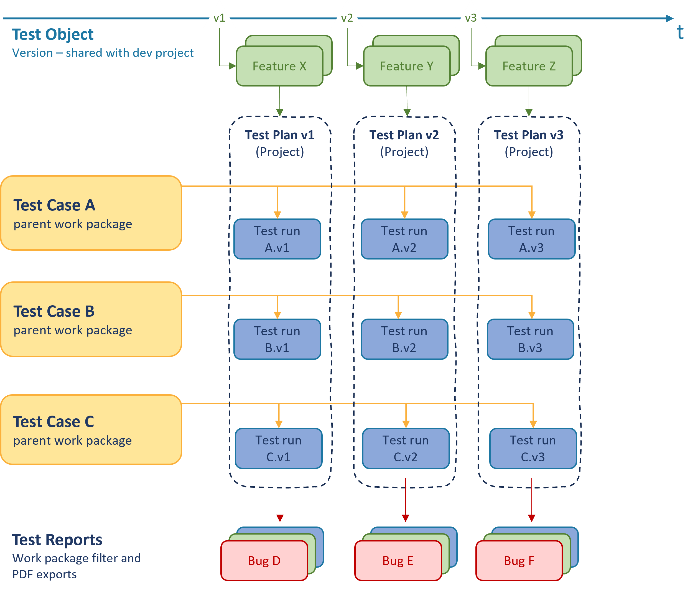
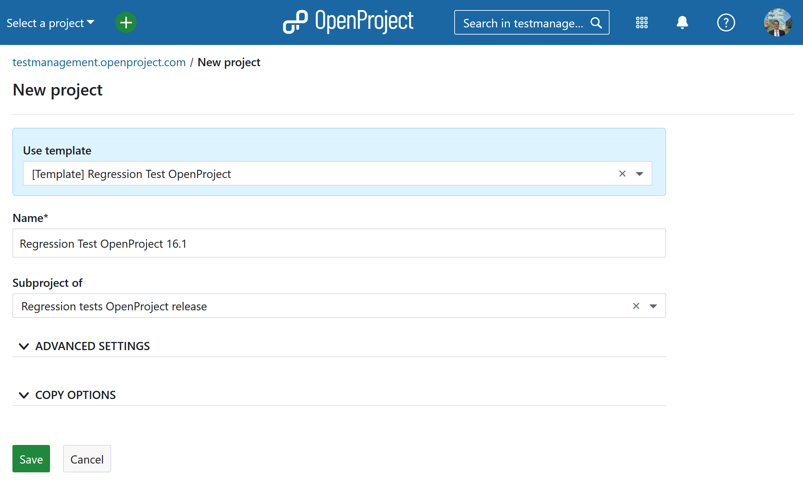
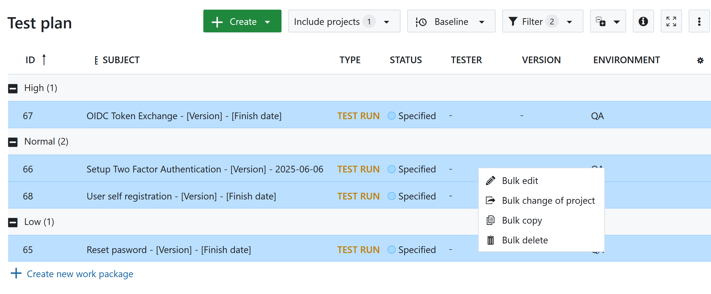
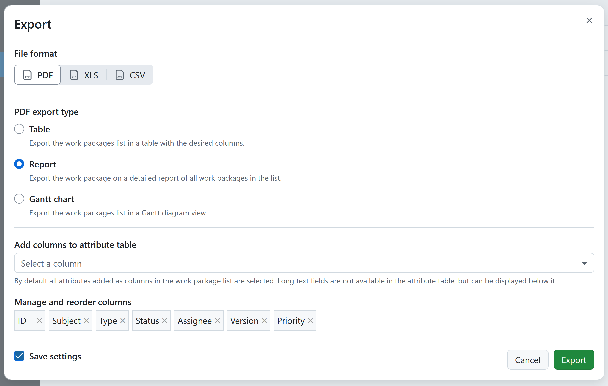
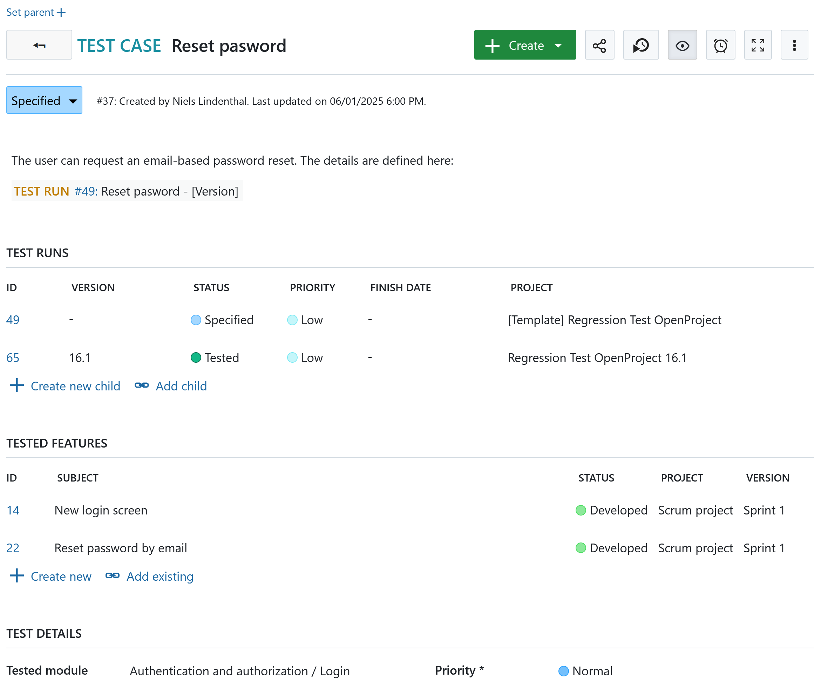
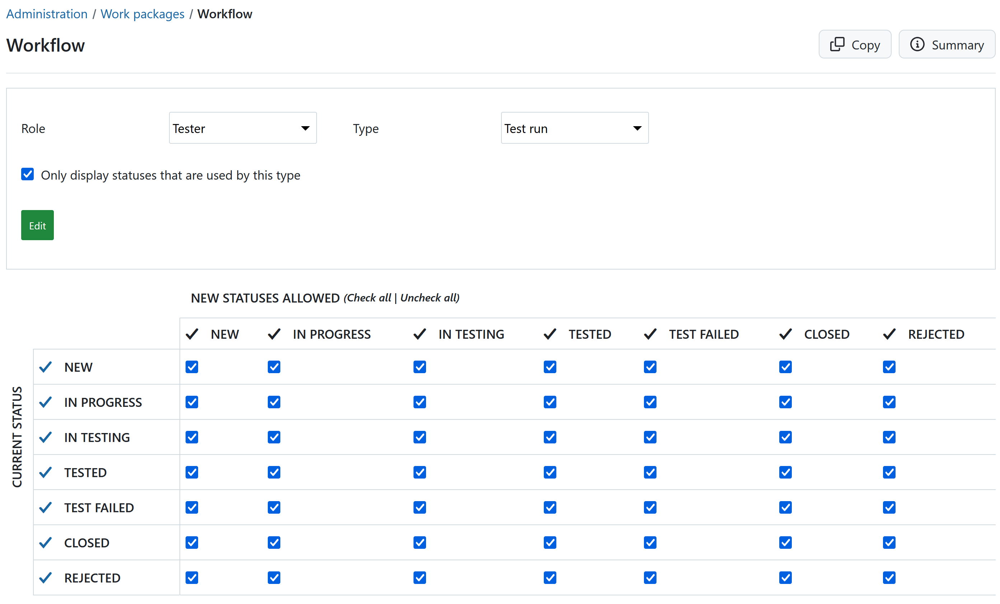

---
sidebar_navigation:
  title: Test Management with OpenProject 
  priority: 950
description: OpenProject can be configured to support lightweight test management using custom work package types, work packages and project templates. This guide describes how to manage test cases and test runs in a reusable, scalable way.
keywords: test plan, test case, test case, test management

---

# Test management in OpenProject

## Purpose

This guide describes how OpenProject can be used for lightweight test management by modeling test plans, test cases, and test runs using built-in features such as work package types and project templates. It enables teams to manage and execute tests within the same environment they already use for project and requirements tracking.

## Scope and assumptions

This use case is intended for teams that:

- Already use OpenProject for project planning and requirements tracking
- Want to include manual or semi-automated testing workflows
- Need traceability between requirements, test cases, executions, and defects

This setup is not a replacement for full-scale test automation or advanced lab management tools, but rather a structured and integrated approach to test tracking.

## Structure and terminology

*Illustration: Relationships between requirements, test cases, test runs, and defects across test plans and versions.*

### Core entities

| Concept            | OpenProject entity                                  |
| ------------------ | --------------------------------------------------- |
| Requirements       | Work package (e.g., type `Feature` or `User Story`) |
| Test case          | Work package type `Test Case`                       |
| Test run           | Work package type `Test Run` (child of test case)   |
| Test plan          | Project (created from a template)                   |
| Version under test | OpenProject *Version* field on test runs            |
| Defect             | Work package (e.g., type `Bug`)                     |

### Relationships

- Each `Feature` or `User Story` may relate to one or more test cases.
- Each `Test Case` defines a reusable test specification.
- Each `Test Case` has one or more Test Runs (child work packages).
- A `Test Run` is specific to one software version.
- `Test Plans` are realized as individual projects per version, created from a reusable template.
- `Bugs` can be linked to failed `Test Runs`.

This structure supports traceability from requirements to execution and defect reporting.

## 1. Test preparation and execution

### 1.1 Creating a test plan (project)

A new test plan project is created based on a predefined template using the [create project form](https://testmanagement.openproject.com/projects/new?parent_id=6).

### 1.2 Adjusting the created test plan 

In the next step the [newly created test plan](https://testmanagement.openproject.com/projects/regression-test-openproject-16-dot-1/work_packages?query_id=90) is adjusted by specifying the test object. The easiest way is to select all work package (`CMD + A`) -> right click -> `bulk edit`.

* Version of the test object (version ideally shared from the development project)
* Tester
* Environment 

For all test runs which are not planned the status should be adjusted to something like `Not planned`.

### 1.3 Test execution

1. Testers open the project corresponding to the release version.
2. Each test run is executed individually:
   - Preconditions are verified
   - Steps are performed
   - Results are recorded
   - Status is updated (e.g., `Passed`, `Test failed`, `Blocked`)
3. If failures occur, related defects (bugs) are created and linked.
4. Boards, filters, or hierarchy views are used to monitor test progress and coverage.
5. The test result can be document creating a pdf report of [all test runs](https://testmanagement.openproject.com/projects/regression-test-openproject-16-dot-1/work_packages?query_id=89).

## 2. Configuration guidance

This section provides guidance on how to configure OpenProject for test management. It assumes familiarity with OpenProject administration features.

### 2.1 Configuration example: Test Cases (work package type)

The work package type `Test case` can be configured so it shows the relevant information:

* Test runs (related work packages table `children`)
* Tested features (related work packages `requires`)
* Priority
* Tested module (custom field of type `Hierarchy`)

Here you find an [example for a test case](https://testmanagement.openproject.com/wp/37).

### 2.2 Configuration example: Test Run (work package type)

The work package type `Test run` can be configured so it shows the relevant information:

* Test specification inlcuding preconditions, excecution steps and testresults: Description field  Tested features (related work packages `requires`)
* Priority
* Tester (custom field of type user)
* Identified bugs (related work packages `related to`)

Here you find an [example for a test run](https://testmanagement.openproject.com/wp/65).

### 2.2 Workflow and statuses

- Define custom statuses such as:
  - `New`,
  - `In progress`
  - `Test passed`
  - `Test failed`
  - ...
- Create a simple workflow for test runs with allowed transitions
- Optionally restrict who can move a test run to `Test passed`.

### 2.3 Roles and permissions

- Define useful roles such as:
  - `Tester`
  -  `Test Manager`

- Add permissions such as:
  - Edit work packages

### 2.4 Custom fields

Define custom fields that describe the test object such as:

- Test environment (type `hierarchy`)
- Tester (custom field type `user`)
