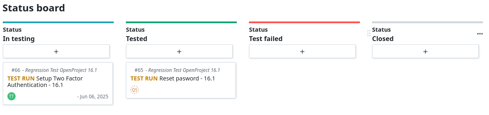
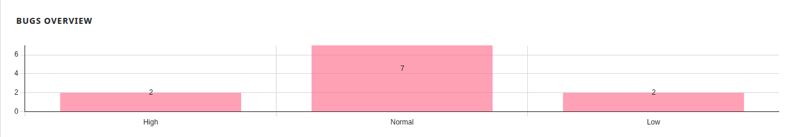
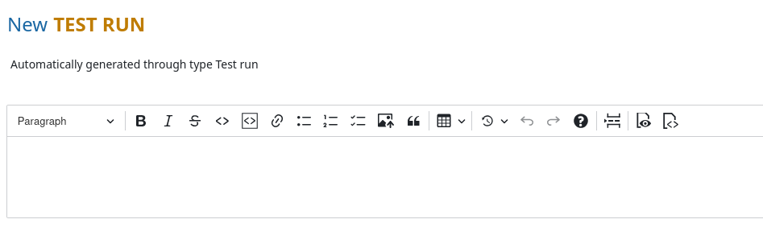
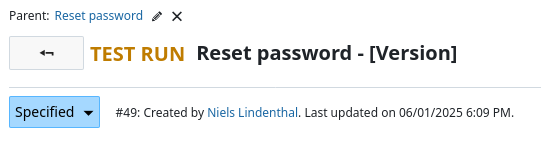
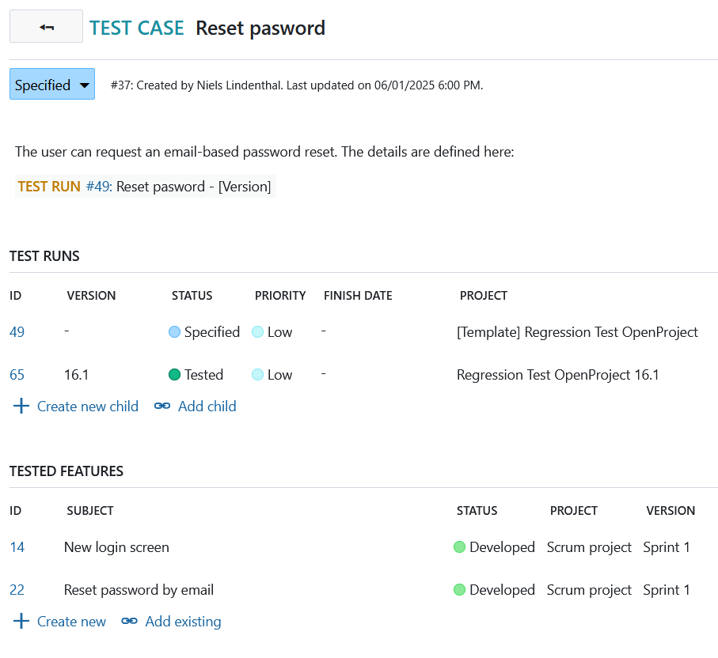
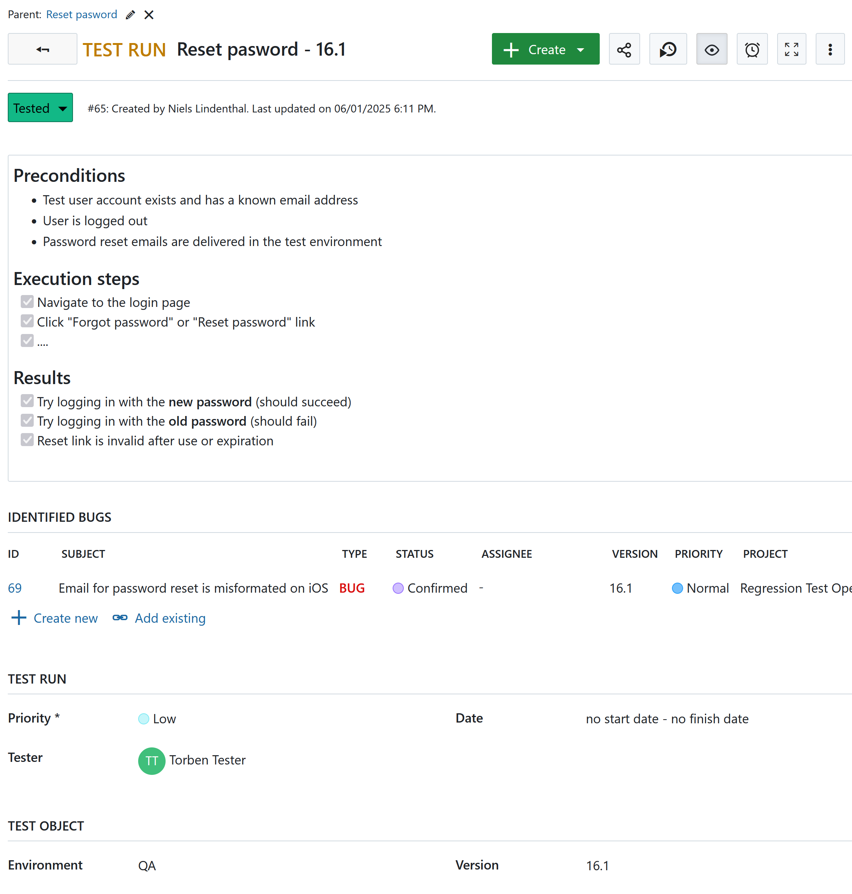

---
sidebar_navigation:
  title: Test Management with OpenProject 
  priority: 950
description: OpenProject can be configured to support lightweight test management using custom work package types, work packages and project templates. This guide describes how to manage test cases and test runs in a reusable, scalable way.
keywords: test plan, test case, test case, test management

---

> [!IMPORTANT]
>
> This use case description is a draft. It will be detailed and improved based on feedback from the community. If you have any feedback please contact us.

# Test management in OpenProject

## Purpose

This guide describes how OpenProject can be used for lightweight test management by modeling test plans, test cases, and test runs using built-in features such as work package types, workflows, custom fields and project templates. It enables teams to manage and execute tests within the same environment they already use for project and requirements tracking.

## Scope and assumptions

This use case is intended for teams that:

- Already use OpenProject for project planning and requirements management
- Want to include manual or semi-automated testing workflows
- Need traceability between requirements, test cases, executions, and defects

This setup is not a replacement for full-scale test automation or advanced lab management tools, but rather a structured and integrated approach to test tracking.

> [!NOTE]
>
> At OpenProject, automated testing is a key part of our development process. It helps us detect bugs early and avoid regressions, especially as the codebase grows. We use continuous integration and deployment (CI/CD) to ensure that changes are tested and released quickly and reliably. You can see our automated test runs on [GitHub Actions](https://github.com/opf/openproject/actions). In addition to automated tests, we also perform smoke tests and exploratory testing to cover areas that are harder to automate and to validate the overall user experience. 

## Structure and terminology

### Core entities

| Concept            | OpenProject entity                                           |
| ------------------ | ------------------------------------------------------------ |
| Requirements       | Work package (e.g., type `Feature` or `User Story`)          |
| Test case          | Work package type `Test Case`                                |
| Test run           | Work package type `Test Run` (child of test case)            |
| Test plan          | Project (created from a [template](../../user-guide/projects/project-templates/)) |
| Version under test | OpenProject [Version](../../user-guide/projects/project-settings/versions/) field on test runs |
| Defect             | Work package (e.g., type `Bug`)                              |

### Relationships

- Each `Feature` or `User Story` may relate to one or more `Test Cases`.
- Each `Test Case` defines a reusable test specification.
- Each `Test Case` has one or more `Test Runs` (child work packages).
- A `Test Run` is specific to one software version.
- `Test Plans` are realized as individual projects per version, created from a reusable template.
- `Bugs` can be linked to failed `Test Runs`.

This structure supports traceability from requirements to execution and defect reporting.

## 1. Test preparation and execution

### 1.1 Creating a test plan (project)

A new test plan project is created based on a predefined template using the [create project form](../../getting-started/projects/#create-a-new-project).

### 1.2 Adjusting the created test plan 

In the next step the [newly created test plan](https://testmanagement.openproject.com/projects/regression-test-openproject-16-dot-1/work_packages?query_id=90) is adjusted by specifying the test object. The easiest way is to select all work packages (`CMD + A`) -> right click -> `bulk edit`.

* Version of the test object (version ideally shared from the development project)
* Tester
* Environment 

For all test runs which are not planned the status should be adjusted to something like `Not planned`.

### 1.3 Test execution

1. Testers open the project corresponding to the release version.
2. Each test run is executed individually:
   - Preconditions are verified
   - Steps are performed
   - Results are recorded
   - Status is updated (e.g., `Passed`, `Test failed`, `Blocked`)
3. If failures occur, related defects (bugs) are created and linked.
4. Boards, filters, or hierarchy views are used to monitor test progress and coverage.
5. The test result can be documented by creating a pdf report of the [test status and results](https://testmanagement.openproject.com/projects/regression-test-openproject-16-dot-1/work_packages?query_id=89).

### 1.4 Progress tracking and reporting

As previously stated, agile boards (Kanban or Scrum) can help us track the test execution progress, i.e. visualize `Test Runs` by status (e.g., `To Do` , `In Progress` , `Failed` , `Passed`).

Comments and activity log (`Activity` tab) complement custom fields in the sense that they can also be used to record:
* Time and date of the execution
* Environment details (e.g., Browser, OS, Build version)
* Qualitative data and detailed explanations, as well as communication and collaboration between testers, developers and other stakeholders around a specific test case.  

Activity tab is especially beneficial during the *static testing* phase. As a reminder, static testing is, among other things, verification of the test cases themselves (sort of testing of test case). Testers review the test cases/test runs searching for inconsistencies, errors, unclarity. Activity tab is a good place to discuss their findings, as well as track the complete and chronological history of a test.

Further tools can be used for reporting and metrics purposes with OpenProject:
* Saved filters: Create and save filters for "Failed Test Cases," "Tests for Feature X," "Tests due this week."
* Export data: Apart from PDF, XLS and CSV are also supported.
* Custom dashboards: On Overview page of your Test plan project, you can create graphs to:
  * Count test cases by status (Passed, Failed, Blocked)
  * Show tests assigned to each tester
  * Track the number of open vs. closed defects, or simply have an overview of the bugs by priority.

### 1.5 Test case evolution: reusability and standardization

As test cases evolve, we need to track changes and reuse them across different cycles. There are several possibilities to achieve this:
* Duplicating work packages, copying projects, creating projects from template, moving work packages to another projects are all good methods for reusing test cases for new test cycles or for creating variations.
* Manual history can be tracked on the activity/comment log for any manual changes to test case steps.
* Naming conventions can be implemented (e.g., "TC-Login-ValidCredentials-v1.0") to help manage variations.

Speaking of naming conventions, there is a way to enforce consistency and standardization within OpenProject through `automatically generated subjects`. Administrators can define specific patterns for the subject (name) of work packages, including those designated as `Test Case` / `Test Run` types. This means every new test case/test run created will automatically follow a predefined structure. This way of working eliminates manual errors, enhances searchability and improves filtering. 

The subject pattern can incorporate dynamic attributes from the test case/test run itself (or its parent). In this example, `Test run`'s subject is derived from 2 fields: `Parent's subject` and `Version`.

Such subject is created upon save and is not manually editable.

Automatically generated subjects reduce manual effort and ensure that the name remains accurate and up-to-date if an attribute referenced in the subject pattern changes.

## 2. Configuration guidance

This section provides guidance on how to configure OpenProject for test management. It assumes familiarity with OpenProject administration features.

### 2.1 Configuration example: Test Cases (work package type)

The work package type `Test case` can be configured so it shows the relevant information:

* Test runs (related work packages table `children`)
* Tested features (related work packages `requires`)
* Priority
* Tested module (custom field of type `Hierarchy`)

Here you find an [example for a test case](https://testmanagement.openproject.com/wp/37).

### 2.2 Configuration example: Test Run (work package type)

The work package type `Test run` can be configured so it shows the relevant information:

* Test specification including preconditions, excecution steps and test results: Description field
* Tested features (related work packages `requires`)
* Priority
* Tester (custom field of type user)
* Identified bugs (related work packages `related to`)

Here you find an [example for a test run](https://testmanagement.openproject.com/wp/65).

### 2.3 Roles and permissions

- Define useful roles such as:
  - `Tester`
  -  `Test Manager`

- Add permissions such as:
  - Edit work packages

### 2.4 Custom fields

Define custom fields that describe the test object such as:

- Test environment (type `hierarchy`)
- Tester (custom field type `user`)

### 2.5 Workflow and statuses

- Define custom statuses such as:
  - `New`,
  - `In progress`
  - `Test passed`
  - `Test failed`
  - ...
- Create a simple workflow for test runs with allowed transitions
- Optionally restrict who can move a test run to `Test passed`.

