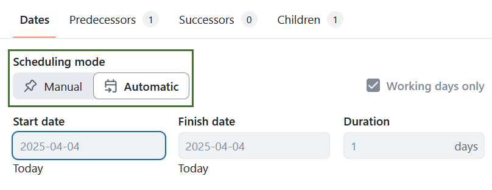
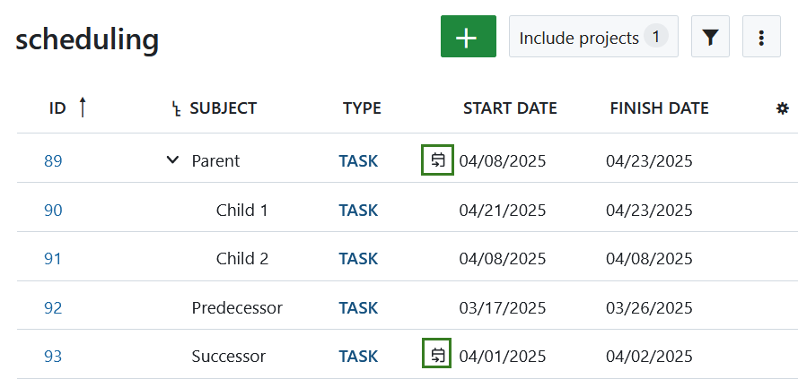

---
sidebar_navigation:
  title: Automatic and manual scheduling
  priority: 999
description: Use manual or automatic scheduling mode in OpenProject
keywords: Gantt chart, automatic scheduling, manual scheduling, start date, finish date, relations

---

# Automatic and manual scheduling modes

To schedule work packages in the Gantt chart there is an **automatic scheduling mode** and a **manual scheduling mode (default)** (new in [release 15.4](../../../release-notes/15-4-0)). To add dependencies between work packages, you can set them as predecessor or follower in the Gantt chart. The automatic and manual scheduling modes determine how work packages behave when the dates of related work packages change.

Since the scheduling mode only affects individual work packages, you can combine manual scheduling (top-down planning) and automatic scheduling (bottom-up planning) within the same project.

| Topic                                                   | Content                                                      |
| ------------------------------------------------------- | ------------------------------------------------------------ |
| [Automatic scheduling mode](#automatic-scheduling-mode) | What happens to work packages, when you connect them in automatic scheduling mode? |
| [Manual scheduling mode](#manual-scheduling-mode)       | What happens to work packages, when you connect them in manual scheduling mode? |
| [Changing mode](#changing-mode)                         | How can I change between manual and automatic scheduling mode? |

## Automatic scheduling mode

The [automatic scheduling mode](../../work-packages/set-change-dates/#automatic-scheduling) is used to automatically set start and finish dates for work packages with existing predecessor and children relations. For [dependencies](../#relations-in-the-gantt-chart) between two work packages this means:

- A work package's start date is automatically determined by the start date of its earliest starting child or predecessor.
- A work package's finish date is automatically determined by the finish date of its latest ending child.
- When you move a work package past the set start date of its follower, the followers start date will be adjusted to its predecessor's finish date. This is not the case the other way round.
  Example: Work package 1 ends on October 5th. Its follower work package 2 starts on October 13th. Now work package 1 gets delayed by ten days, you have to adjust the planning. When you set the finish date of work package 1 to October 15th, the start date of work package 2 will automatically be set to October 16th.
- You can't change the dates of a work package with children or predecessors if it is in automatic scheduling mode.

## Manual scheduling mode

The [manual scheduling mode](../../work-packages/set-change-dates/#manual-scheduling) is the default mode for newly created work packages. It is **often used when creating a top-down project plan** (e.g. by defining the main phases first). You can then add child work packages without affecting the original (high-level) project schedule.

Changing to the **manual scheduling mode makes sense if**

- you want to plan your project top-down without knowing all tasks yet, or
- you want to set a parent work package’s date independently from the dates of its children, or
- you don't want a parent work package's dates being updated automatically when changing the children's dates, or
- you don't want a follower's start date be automatically updated when you change the predecessor's finish date

Moving a child work package in the manual scheduling mode will not move the dates of the parent work package. The scheduling differences will be indicated by a black or red bracket underneath (e.g. when a child is shorter or longer than the parent phase). See [this explanation](../#understanding-the-colors-and-lines-in-the-gantt-chart) to find out more about the lines and colors in the Gantt chart.

<video src="https://openproject-docs.s3.eu-central-1.amazonaws.com/videos/OpenProject-Top-down-Scheduling.mp4" type="video/mp4" controls="" style="width:100%"></video>

## Changing mode

You can **activate manual or automatic scheduling mode** by clicking on the date of a work package and selecting the respective option in the *Scheduling mode* switch of the date picker. This will activate the chosen scheduling mode only for the respective work package.

The auto-date symbol next to the date indicates that a work package is in automatic scheduling mode.

Please note: When switching from manual scheduling to automatic scheduling some work packages' dates might be updated according to principles [stated above](#automatic-scheduling-mode).
