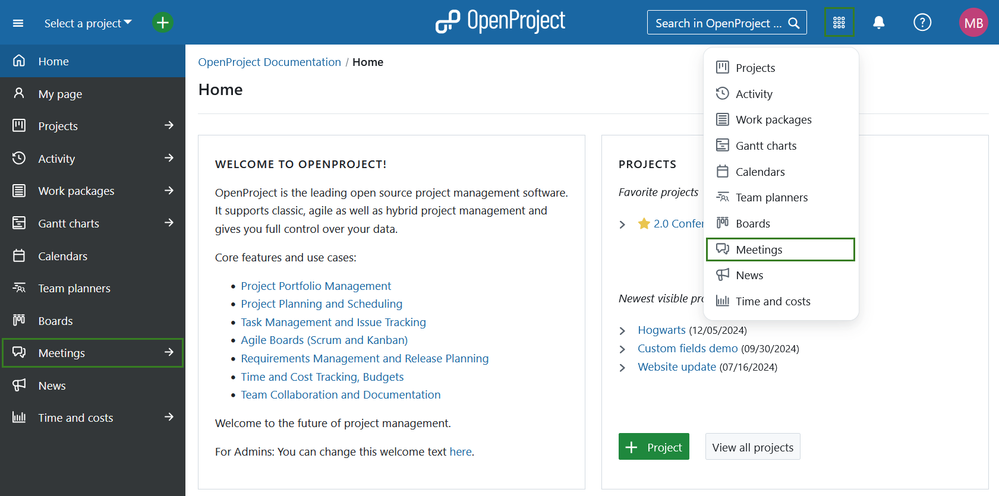
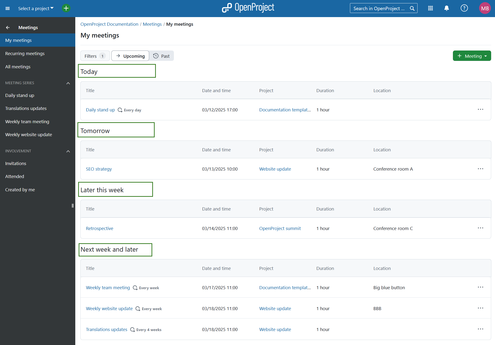
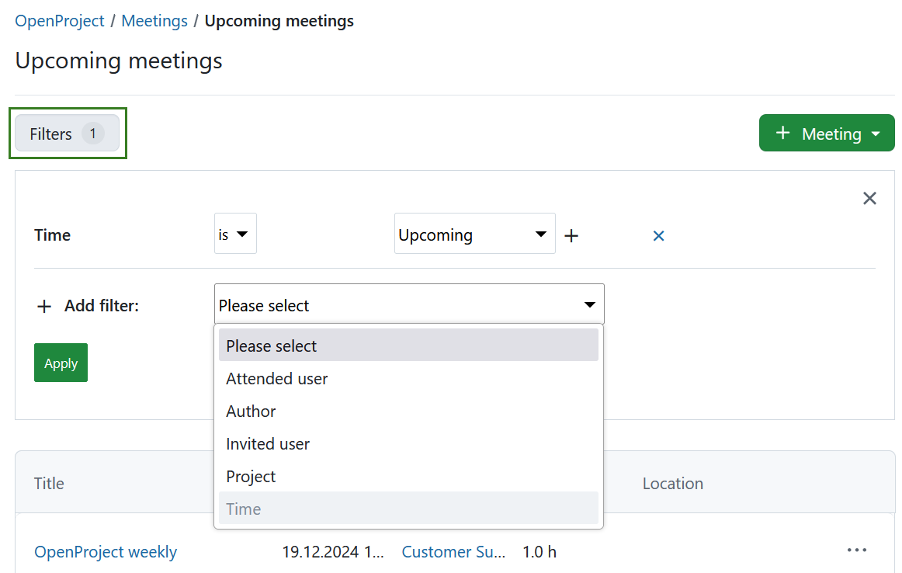

---
sidebar_navigation:
  title: Meetings
  priority: 760
description: Manage meetings with agenda and meeting minutes in OpenProject.
keywords: meetings
---

# Meeting management

Meetings in OpenProject allow you to manage and document your project meetings, prepare a meeting agenda together with your team and document and share minutes with attendees, all in one central place.

**Meetings** is defined as a module that allows the organization of meetings.
**Note:** In order to be able to use the meetings plugin, the **Meetings module needs to be activated** in the [Project Settings](../projects/project-settings/modules/).

> [!IMPORTANT]
> With OpenProject 13.1 we introduced dynamic meetings alongside [classic meetings](classic-meetings). 
> With OpenProject 15.3 dynamic meetings are replaced by [one-time](one-time-meetings) and [recurring](recurring-meetings). 
> Please keep in mind that the ability to create classic meetings will eventually be removed from OpenProject.

| Topic                                               | Content                                                  |
| --------------------------------------------------- | -------------------------------------------------------- |
| [Meetings in OpenProject](#meetings-in-openproject) | How to open meetings in OpenProject.                     |
| [Classic meetings](classic-meetings/)           | How to create and edit a classic meeting in OpenProject. |
| [Dynamic meetings](dynamic-meetings/)                 | How to create and edit a dynamic meeting in OpenProject. |

## Meetings in OpenProject

By selecting **Meetings** in the project menu on the left, you get an overview of all the meetings you have been invited to within a specific project sorted by date. By clicking on a meeting name you can view further details of the meeting.

To get an overview of the meetings across multiple projects, you can select **Meetings** in the [global modules menu](../../../user-guide/home/global-modules/).

The menu on the left will allow you to filter for upcoming or past meetings. You can also filter the list of the meetings based on your involvement.

You can also use the meetings filters to refine the list of meetings based on the following criteria: 

- **Attended user** - shows meetings that a specific user attended
- **Author** - shows meetings that a specific user created
- **Invited user** - shows meetings that a specific user was invited to
- **Project** - shows meetings for a specific project (this will only be displayed in the global module view, i.e. not within a specific project)
- **Time** - shows past or upcoming meetings

> [!TIP]
> If you are interested in how the Meetings module is used by the OpenProject team, please take a look at [this blog article](https://www.openproject.org/blog/meeting-management-example/).
