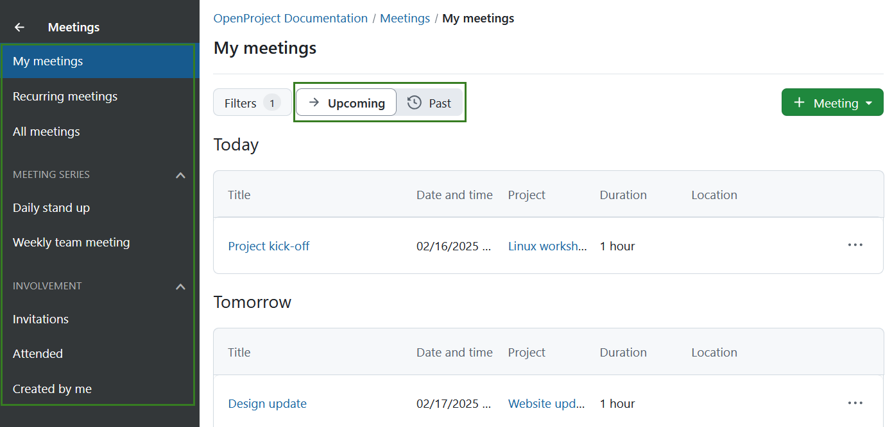
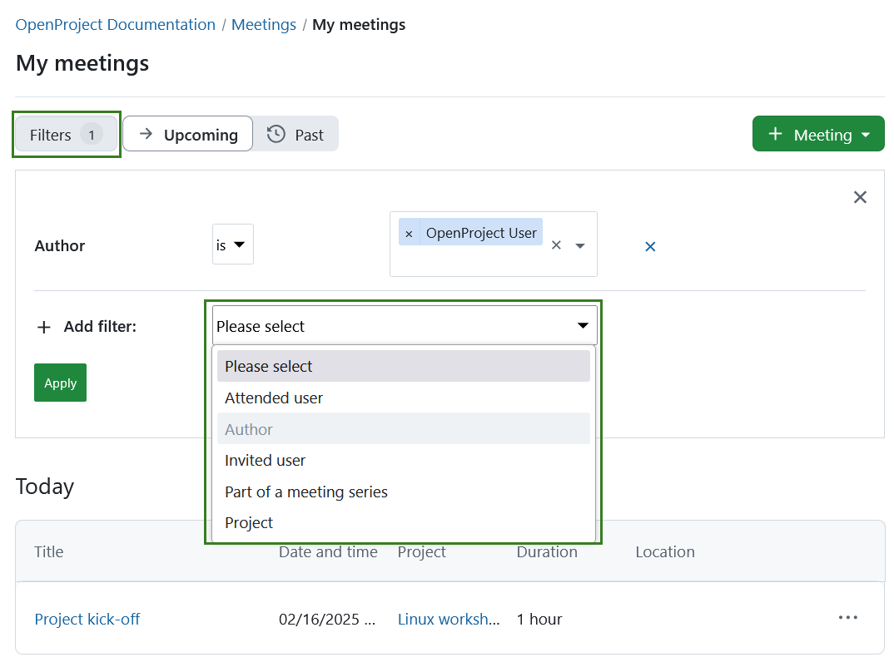

---
sidebar_navigation:
  title: Meetings
  priority: 760
description: Manage meetings with agenda and meeting minutes in OpenProject.
keywords: meetings
---

# Meeting management

Meetings in OpenProject allow you to manage and document your project meetings, prepare a meeting agenda together with your team and document and share minutes with attendees, all in one central place.

**Meetings** is defined as a module that allows the organization of meetings.
**Note:** In order to be able to use the meetings plugin, the **Meetings module needs to be activated** in the [Project Settings](../projects/project-settings/modules/).

> [!IMPORTANT]
> With OpenProject 13.1 we introduced dynamic meetings alongside [classic meetings](classic-meetings). 
> With OpenProject 15.3 dynamic meetings are replaced by [one-time meetings](one-time-meetings) and [recurring meetings](recurring-meetings) to further improve meeting management.
> Please keep in mind that the ability to create classic meetings will eventually be removed from OpenProject.

| Topic                                               | Content                                                   |
| --------------------------------------------------- | --------------------------------------------------------- |
| [Meetings in OpenProject](#meetings-in-openproject) | How to open meetings in OpenProject.                      |
| [One-time meetings](one-time-meetings/)             | How to create and edit single meetings in OpenProject.    |
| [Recurring meetings](recurring-meetings/)           | How to create and edit recurring meetings in OpenProject. |
| [Classic meetings](classic-meetings/)               | How to create and edit a classic meeting in OpenProject.  |
| [Meetings FAQs](meetings-faq)                       | Frequently asked questions about meetings in OpenProject. |

## Meetings in OpenProject

Meetings in OpenProject help teams organise discussions, track meeting agendas, and document decisions efficiently. There are three types of meetings: **one-time meetings**, **recurring meetings**, and **classic meetings**. [One-time meetings](one-time-meetings/) are standalone events scheduled for a specific date and time. [Recurring meetings](recurring-meetings/) introduce a structured way to define a series of related meetings, ensuring consistency and reducing manual setup. [Classic meetings](classic-meetings/) are also standalone events, but are a legacy format that will be eventually be phased out.

### Meetings overview

By selecting **Meetings** in the project menu on the left, you get an overview of all the meetings you have been invited to within a specific project sorted by date. By clicking on a meeting name you can view further details of the meeting.

To get an overview of the meetings across multiple projects, you can select **Meetings** in the [global modules menu](../../../user-guide/home/global-modules/).

Meetings will be grouped based on the meeting start time into the following groups:

- **Today** lists open meetings scheduled for the same day

- **Tomorrow** lists open meetings scheduled for the day after

- **Later this week** lists all open meetings scheduled between two days from now till the end of the week 

- **Next week and later** lists all open meetings scheduled the next week and later

### Meetings filters

The menu on the left will allow you to filter meetings based on following:

- **My meetings** lists all meetings a user participates in
- **Recurring meetings** lists all recurring meetings visible to a user
- **All meetings** lists all meetings visible to a user
- **Meeting series** lists meeting occurrences that are part of recurring meetings
- **Invitations** lists all meetings a user is invited to
- **Attended** lists all meetings are user has attended
- **Created by me** lists all meetings created by user

The buttons next to *Filters* will allow you to filter for upcoming or past meetings.

You can also use the meetings filters to refine the list of meetings based on the following criteria: 

- **Attended user** - shows meetings that a specific user attended

- **Author** - shows meetings that a specific user created

- **Invited user** - shows meetings that a specific user was invited to

- **Part of a meeting series** - shows meetings that are part of specific meeting series

- **Project** - shows meetings for a specific project (this will only be displayed in the global module view, i.e. not within a specific project)

  

> [!TIP]
> If you are interested in how the Meetings module is used by the OpenProject team, please take a look at [this blog article](https://www.openproject.org/blog/meeting-management-example/).
