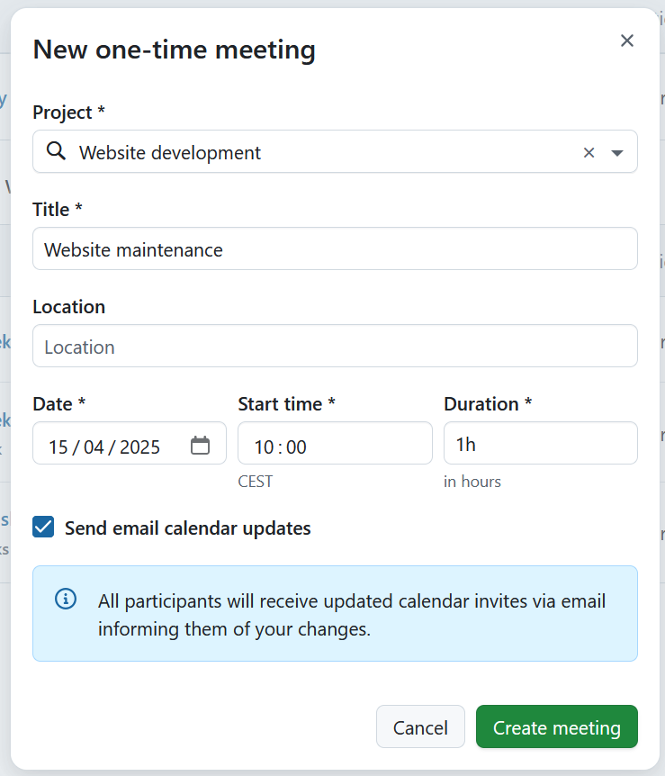
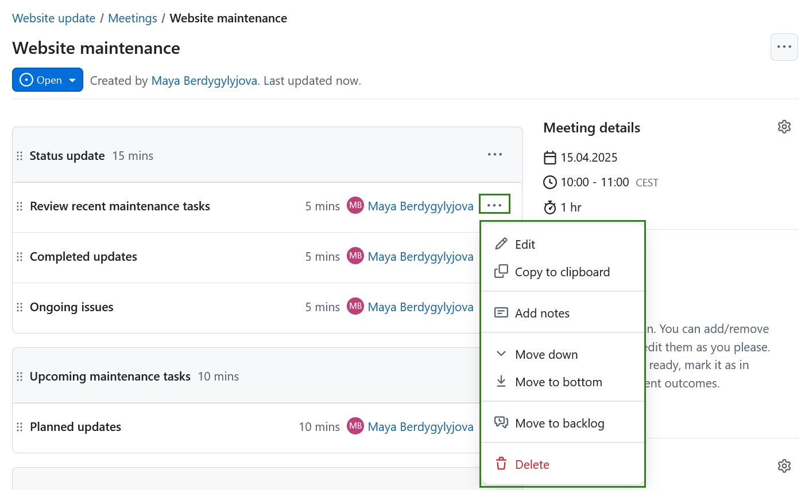

---
sidebar_navigation:
  title: One-time meetings
  priority: 900
description: Manage meetings with agenda and meeting minutes in OpenProject.
keywords: meetings, dynamic meetings, agenda, minutes, one-time meeting
---

# One-time meetings

With OpenProject 15.3, meetings were enhanced by introducing a clear distinction between **one-time meetings** and **recurring meetings**. This page covers the features and functionalities of one-time meetings in OpenProject.

For information on setting up recurring meeting series and templates, please refer to [this page](../recurring-meetings). Note that individual occurrences of a recurring meeting series are one-time meetings and have the same features described here.

> [!NOTE]
> The **Meetings module needs to be activated** in the [Project settings](../../projects/project-settings/modules/) to be able to create and edit meetings.

> [!IMPORTANT]
> With OpenProject 13.1 we introduced dynamic meetings alongside [classic meetings](../classic-meetings). 
> With OpenProject 15.3 dynamic meetings are replaced by [one-time meetings](one-time-meetings) and [recurring meetings]../(recurring-meetings) to further improve meeting management.
> Please keep in mind that the ability to create classic meetings will eventually be removed from OpenProject.

| Topic                                                        | Content                                                    |
| ------------------------------------------------------------ | ---------------------------------------------------------- |
| [Create a new meeting](#create-a-new-meeting)                | How to create a new meeting in OpenProject.                |
| [Edit a meeting](#edit-a-meeting)                            | How to edit an existing meeting.                           |
| [Add a work package to the agenda](#add-a-work-package-to-the-agenda) | How to add a work package to a meeting agenda.             |
| [Create or edit the meeting agenda](#create-or-edit-the-meeting-agenda) | How to create or edit the agenda.                          |
| [Add meeting participants](#add-meeting-participants)        | How to invite people to a meeting.                         |
| [Add meeting attachments](#meeting-attachments)              | How to add attachments to a meeting.                       |
| [Send email to all participants](#send-email-to-all-participants) | How to send an email to all meeting participants.          |
| [Download a meeting as an iCalendar event](#download-a-meeting-as-an-icalendar-event) | How to download a meeting as an iCalendar event.           |
| [Close a meeting](#close-a-meeting)                          | How to close a meeting in OpenProject.                     |
| [Re-open a meeting](#re-open-a-meeting)                      | How to re-open a meeting in OpenProject.                   |
| [Copy a meeting](#copy-a-meeting)                            | How to copy a meeting in OpenProject (recurring meetings). |
| [Delete a meeting](#delete-a-meeting)                        | How to delete a meeting in OpenProject.                    |

## Create and edit one-time meetings

### Create a new meeting

You can either create a meeting from within a project or from the global **Meetings** module.

To create a new meeting, click the green **+ Meeting** button in the upper right corner and select what type of meeting you want to create. You can choose between **one-time, recurring or classic meetings**. 

For steps on creating a classic meetings please consult [this page](../classic-meetings). For steps on setting up recurring meetings please consult [this page](../recurring-meetings).

If you choose the **one-time** option, enter your meeting's title, location, start date and time, and duration. 

If you are creating a meeting from a global module you will first need to select a project to which the meeting is attributed. 

> [!TIP] 
> Duration can be entered both in hours and minutes. For example for a meeting that should last for 1.5 hours, you can enter:
>
> - 1.5h
> - 90m
> - 90min
> - 1:30

Click the **Create meeting** button to save your changes. You can proceed to adding more meeting details.

### Create or edit the meeting agenda

After creating a meeting, you can set up a **meeting agenda**.

You can do this by adding sections, agenda items or existing work packages by selecting the desired option under the green **+ Add** button. You can then add notes to each agenda item.

#### Add an agenda section 

Sections allow you to group agenda items into blocks for better organization.

To add a section, click on the **+ Add** button at the bottom of the agenda items and select the **Section** option. 

If, prior to creating your first section, your meeting already had existing [agenda items](#add-an-agenda-item), they will automatically be contained in a section called **Untitled section**. You can rename this section if you wish. 

> [!NOTE]
> If you use sections, all agenda items must have sections.

After adding a section, you can specify it further by [adding agenda items](#add-an-agenda-item) or [work packages](#link-a-work-pacjage-to-a-meeting) to it. 

You can also add agenda items to specific sections by either dragging and dropping items into each section, or by clicking on the **More** button (⋯) and choosing your desired action.

This menu also lets you rename a section, move it or delete the entire section by selecting the respective option from the dropdown menu behind the **More** (⋯) icon on the right side. If a section is moved, the agenda items will move along with it. 

> [!TIP]
>
> You can also re-arrange sections by dragging and dropping sections up and down.

> [!IMPORTANT]
> Deleting a section will delete all containing agenda items. If a section contains agenda items, you will be asked for confirmation before deletion.

#### Add an agenda item

If you select the **Agenda item** option, you can name that item, add notes, set the anticipated duration in minutes and select a user to be displayed next to the agenda item.  This could for example be a meeting or a project member that is accountable for the item or someone who will present that particular topic. 

By default, when creating an agenda item, this will be pre-filled with the name of the user adding the agenda item, but it can either be removed or replaced by one of the other meeting participants.

Sections will show the sum of all the durations of all containing items (or at least, those that have a duration specified).

> [!TIP]
> If you need to store the agenda outside of OpenProject, you can generate an optimized PDF using the print function (Ctrl/Cmd + P).

#### Link a work package to a meeting

If you select the **Work package** option, you can link a work package by entering either a work package ID, or starting to type in a keyword, which will open a list of possible options.

#### Edit a meeting agenda

After you have finalized the agenda, you can always edit the agenda items, add notes, move an item up or down or delete it. Clicking on the **More** (three dots) menu icon on the right edge of each agenda item will display a menu of available options, including editing, copying link to clipboard, moving the agenda item within the agenda or deleting it.

You may also re-order agenda items by clicking on the drag handle (the icon with six dots) on the left edge of each agenda item and dragging that item above or below.

The durations of each agenda item are automatically summed up. If that sum exceeds the planned duration entered in *Meeting Details*, the duration of those agenda times that exceed the planned duration will appear in red to warn you of the fact.

### Add a work package to the agenda

There are two ways to add a work package to a meeting agenda.

- **From the Meetings module**: using the **+ Add** button [add a work package agenda item](#link-a-work-package-to-a-meeting) or
- **From a particular work package**: using the **+ Add to meeting** button on the [Meetings tab](../../work-packages/add-work-packages-to-meetings)

You can add a work package to both upcoming or past meetings as long as the work package is marked **open**.

> [!TIP]
> The upcoming meetings are displayed in chronological order, from the nearest meeting to the most distant. 
> The past meetings are displayed in reverse chronological order, from the most recent meeting to the oldest.

### Edit a meeting

If you want to change the details of a meeting, for example its time or location, open the meetings details view by clicking the cogwheel icon next to the **Meeting details**.

An edit screen will be displayed, where you can adjust the date, time, duration and location of the meeting.

Do not forget to save the changes by clicking the **Save** button. Cancel will bring you back to the details view.

> [!TIP]
> If someone else edits or updates the current meeting page at the same time and saves their changes, you and all other users on the same page will be notified of this with a small banner at the top of the page. Click the **Reload** button to load the updated version of the page.

In order to edit the title of the meeting select the dropdown menu behind the three dots and select the **Edit meeting title**.

## Meeting participants

### Add meeting participants

You will see the list of all the invited project members under **Participants**. You can add participants (Invitees and Attendees) to a meeting in [edit mode](#edit-a-meeting). The process is the same whether you are creating a new meeting or editing an existing one. You can either click the cogwheel icon next to **Participants** section or click the **Add participants** link under the list of existing participants.

You will see the list of all the project members and be able to tell, based on the check marks next to the name under the *Invited* column, who was invited. After the meeting, you can record who actually took part using the checkmarks under the Attended column.

To remove an invited project member from a meeting, simply uncheck both check marks.

Click on the **Save** button to confirm the changes.

### Send email to all participants

You can send an email reminder to all the meeting participants. Select the dropdown by clicking on the **More** (three dots) icon in the top right corner and select **Send email to all participants**. An email reminder with the meeting details (including a link to the meeting) is immediately sent to all invitees and attendees.

## Meeting attachments

You can attachments in the meetings in the **Attachments** section in the right bottom corner. You can either user the **+Attach files** link to select files from your computer or drag and drop them.

Added attachments can be added to the Notes section of agenda packages by dragging and dropping them from the Attachments section.

## Meeting history

You can track what changes were made to a meeting and by which user. Select the dropdown by clicking on the **More** (three dots) icon in the top right corner and select **Meeting history**.

This will display meeting history details.

## Download a meeting as an iCalendar event

You can download a meeting as an iCalendar event. Select the dropdown by clicking on the **More** (three dots) menu in the top right corner and select the **Download iCalendar event**.

Read more about [subscribing to a calendar](../../calendar/#subscribe-to-a-calendar).

## Close a meeting

Clicking on the **Close meeting** after the meeting is completed with lock the current state and make it read-only.

## Re-open a meeting

Once a meeting has been closed, it can no longer be edited. Project members with the permission to edit and close meetings will, however, see a **Re-open meeting** option. Clicking on this re-opens a meeting and allows further editing.

## Copy a meeting

You can copy an existing meeting. This is useful if you have recurring meetings. To copy a meeting, click on the three dots in the top right corner and select **Copy**.

A modal will open, which will allow you adjust the title, time, location and further details of the copied meeting. By default, the date for the copied meeting will be set to the next day. You also have an option of copying the agenda, attachments and the list of participants. You also have an option to email all participants after the meeting was copied.

If you copy a closed meeting, the new meeting status will automatically be set to open. Don't forget to **save** the copied meeting by clicking the **Create meeting** button.

## Delete a meeting

You can delete a meeting. To do so, click on the three dots in the top right corner, select **Delete meeting** and confirm your choice.

