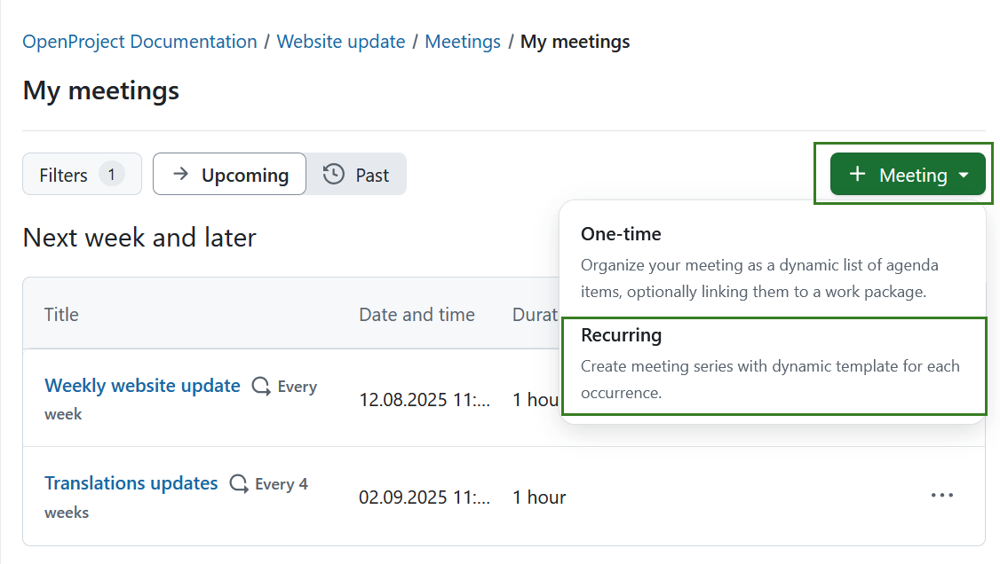
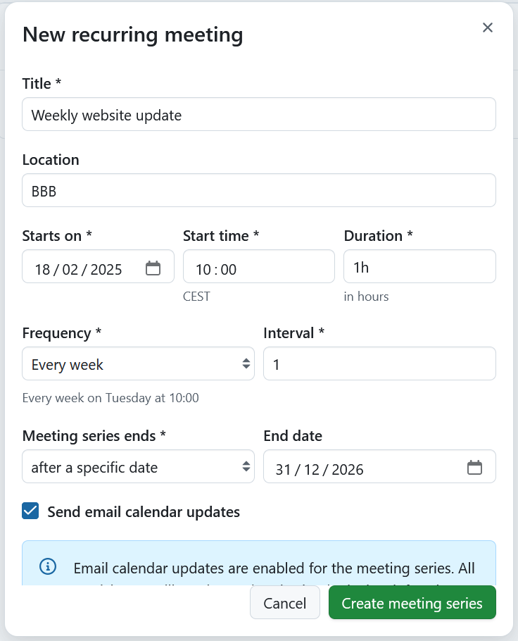
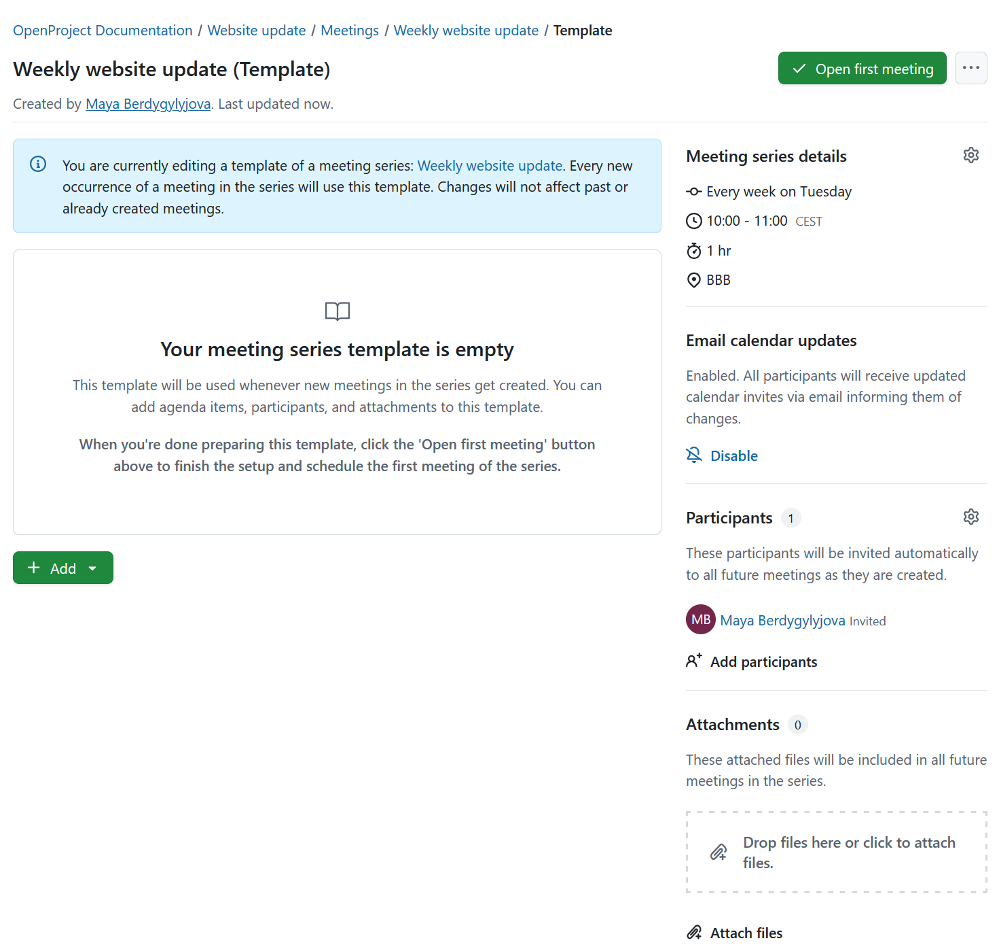

---
sidebar_navigation:
  title: Recurring meetings
  priority: 800
description: Manage meetings with agenda and meeting minutes in OpenProject.
keywords: meetings, dynamic meetings, agenda, minutes, recurring meeting
---

# Recurring meetings management

With OpenProject 15.3, meetings were enhanced by introducing a clear distinction between **one-time meetings** and **recurring meetings**. This page covers the features and functionalities of recurring meetings. For information on one-time meetings, please refer to [this page](../one-time-meetings). 

Recurring meetings are helpful to schedule and organize meetings that have same structure, eliminating redundancy. Recurring meetings in OpenProject consists of a series of meetings, set for a specific duration and frequency, with set agenda and participants. 

> [!NOTE]
> The **Meetings module needs to be activated** in the [Project settings](../../projects/project-settings/modules/) to be able to create and edit meetings.

> [!IMPORTANT]
> With OpenProject 13.1 we introduced dynamic meetings alongside [classic meetings](../classic-meetings). 
> With OpenProject 15.3 dynamic meetings are replaced by [one-time meetings](one-time-meetings) and recurring meetings to further improve meeting management.
> Please keep in mind that the ability to create classic meetings will eventually be removed from OpenProject.

| Topic                                                        | Content                                                    |
| ------------------------------------------------------------ | ---------------------------------------------------------- |
| [Meetings in OpenProject](#meetings-in-openproject)          | How to open meetings in OpenProject.                       |
| [Create a new meeting](#create-a-new-meeting)                | How to create a new meeting in OpenProject.                |
| [Edit a meeting](#edit-a-meeting)                            | How to edit an existing meeting.                           |
| [Add a work package to the agenda](#add-a-work-package-to-the-agenda) | How to add a work package to a meeting agenda.             |
| [Create or edit the meeting agenda](#create-or-edit-the-meeting-agenda) | How to create or edit the agenda.                          |
| [Add meeting participants](#add-meeting-participants)        | How to invite people to a meeting.                         |
| [Add meeting attachments](#meeting-attachments)              | How to add attachments to a meeting.                       |
| [Send email to all participants](#send-email-to-all-participants) | How to send an email to all meeting participants.          |
| [Download a meeting as an iCalendar event](#download-a-meeting-as-an-icalendar-event) | How to download a meeting as an iCalendar event.           |
| [Close a meeting](#close-a-meeting)                          | How to close a meeting in OpenProject.                     |
| [Re-open a meeting](#re-open-a-meeting)                      | How to re-open a meeting in OpenProject.                   |
| [Copy a meeting](#copy-a-meeting)                            | How to copy a meeting in OpenProject (recurring meetings). |
| [Delete a meeting](#delete-a-meeting)                        | How to delete a meeting in OpenProject.                    |

## Create and edit recurring meetings

You can either create a recurring meeting from within a project or from the global **Meetings** module. For steps on creating a classic meetings please consult [this page](../classic-meetings). For steps on setting up one-time meetings please consult [this page](../one-time-meetings).

To create a new recurring meeting, click the green **+ Meeting** button in the upper right corner and select **Recurring**. 

Enter your meeting's title, location, start and end date and time, duration, frequency, interval. Note that if you are creating a meeting from a global module you will first need to select a project to which the meeting is attributed. 

> [!TIP] 
> Duration can be entered both in hours and minutes. For example for a meeting that should last for 1.5 hours, you can enter:
>
> - 1.5h
> - 90m
> - 90min
> - 1:30

**Frequency** offers following options: daily, every working day, weekly.

**Interval** is a **required** integer field that defines the recurrence pattern of a meeting series. It specifies how often a meeting should repeat within the selected recurrence scheme. For example:

- Daily, Interval = 2 → The meeting occurs every two days.
- Weekly, Interval = 4 → The meeting occurs every four weeks.

>  [!TIP]
>  For **working day-based recurrence**, the **Interval field is hidden** and always set to 1, meaning the meeting occurs on every working day without customization.

**Meeting series ends** field is a select dropdown that defines when a recurring meeting series should stop. Following options are possible:

- **Never** - allows eliminating an end date, i.e. meeting series runs infinitely.
- **After a specific date** – displays a required **End date** field where users must select the final occurrence date.
- **After a number of occurrences** – Displays a required **Occurrences** input field that only accepts integers. 

Click the **Create meeting series** button to save your changes. This will create the recurring meeting series and redirect you to the meeting template page that you can edit. 

## Edit recurring meetings template

After creating a meeting series, you are redirected to the recurring meeting template. At this point no meeting within the recurring meeting series has yet been set up. The information you see is template-specific and aims to provide clarity for next steps, as indicated by the blue banner. 

Specify the template meeting the same way that you would a [one-time meeting](./one-time-meeting), adding sections and agenda items, adding participants and linking work packages. Keep in mind that every new occurrence of a meeting in the series will use this template. After you have adjusted the template meeting, you can create the first meeting by clicking **Open first meeting** button, which will direct you to the meeting page of the meeting scheduled first within the series.

You can always adjust the template at a later date by selecting the meeting series from the left hand menu and clicking **Edit template** on the meeting series index page. These changes will not affect past or already created (opened) meetings. 

## Edit recurring meetings
### Edit recurring meeting series

The left side menu displays all existing meeting series. Click on one will open the index page for this particular series, displaying all meeting occurrences planned for this series, and are grouped into:

-  **Open**: lists all meetings within the series that have been opened and can be edited. All open meetings will also be displayed under *My Meetings* section. 
- **Planned**: lists all meetings within the selected meeting series that are scheduled, but not yet open.  Every time a planned meeting starts, the next one  will open automatically  You can also open any of the planned  meetings manually to import the template and start editing the agenda.

To edit the meeting series select the **More** (three dots) icon on the far right side of the meeting series name and select *Edit meeting series*.

Within the same menu you also have the following options:

- Download meeting series as iCalendar event
- Send email to all participants
- Delete meeting series

### Edit a recurring meeting occurrence

To edit a single meeting within recurring meeting series you have to open it first by clicking the **Open** button next to the meeting. It will then be displayed under *Open* section on the recurring meeting index page, where you can click the meeting date and time. 

This will open the specific meeting page. You can then edit the meeting by using same functions as for [editing one-time meetings](./one-time-meetings), including adding sections and agenda points, inviting participants, and adding attachments. 

Additionally you also have the option to copy this specific meeting series occurrence as a one-time meeting. To do that click the **More ** (three dots) icon and select **Copy as one-time meeting**.

Within the same menu you also have the following options:

- Download iCalendar event
- Send email to all participants
- View history
- Cancel this occurence