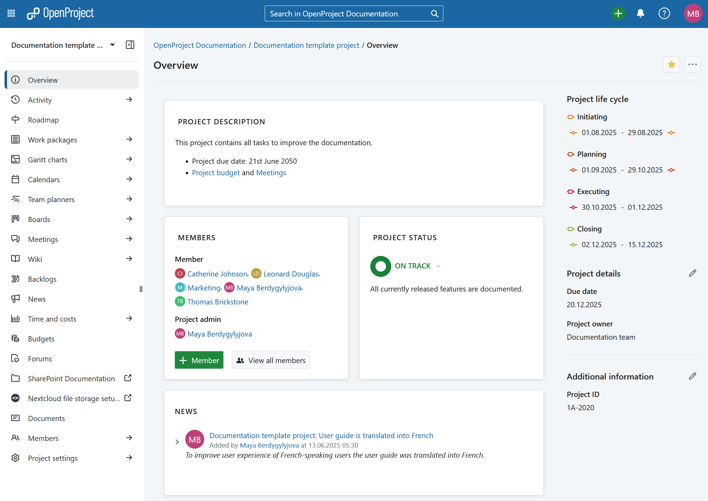
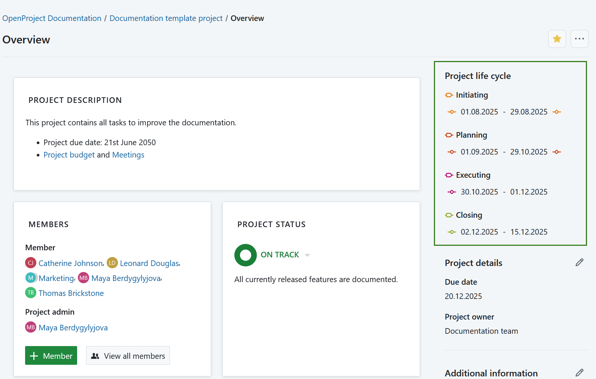
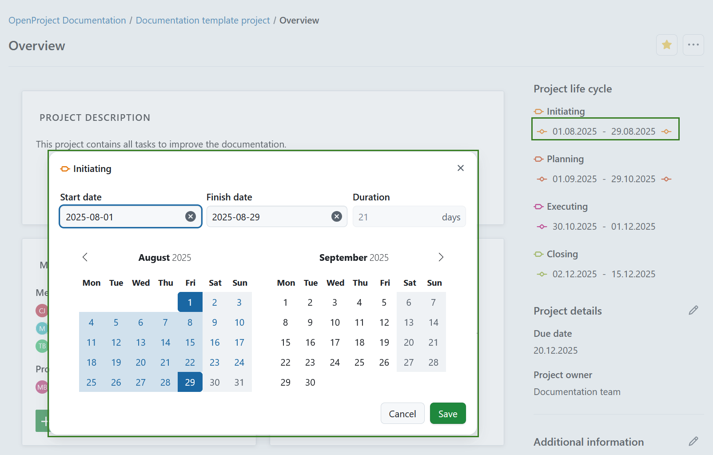
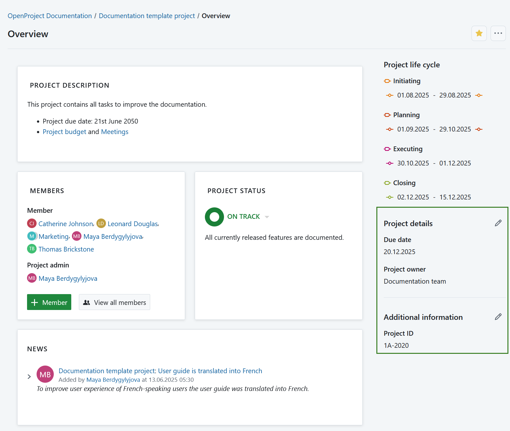
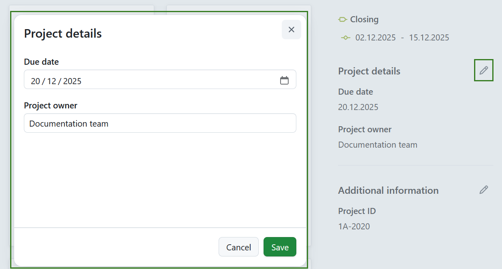
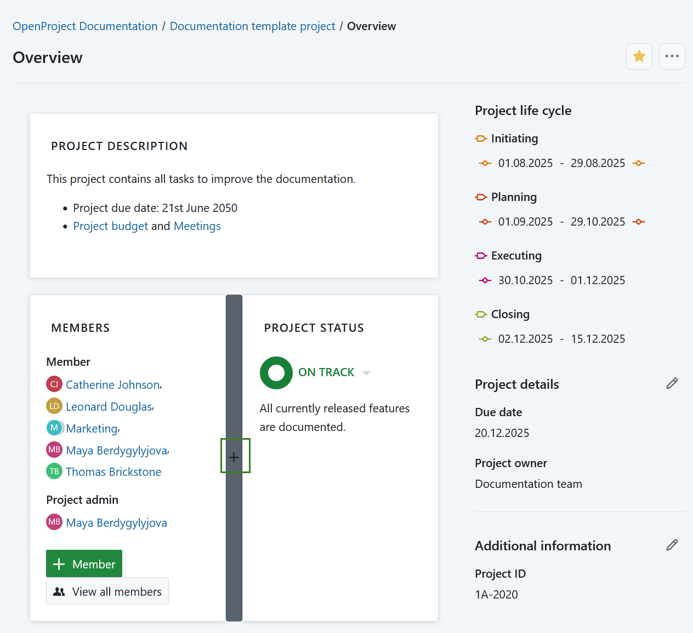
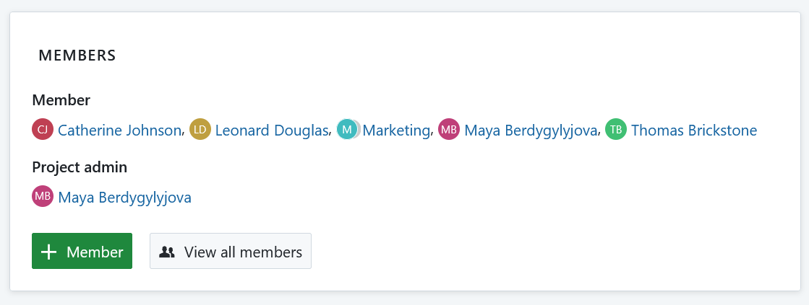

---
sidebar_navigation:
  title: Project overview
  priority: 900
description: Learn how to configure a project overview page
keywords: project overview page
---

# Project overview

The **Project overview** page is a dashboard with important information about your respective project(s). This page displays all relevant information for your team, such as members, news, project description, work package reports, or project status.

| Topic                                                        | Content                                                      |
| ------------------------------------------------------------ | ------------------------------------------------------------ |
| [What is the project overview?](#what-is-the-project-overview) | What can I do with the project overview page?                |
| [Project life cycle](#project-attributes)                    | What is the project life cycle?                              |
| [Project attributes](#project-attributes)                    | What are project attributes and how can I use them?          |
| [Mark project as a favorite](#mark-a-project-as-favorite)    | How can I mark a project as favorite?                        |
| [Archive a project](#archive-a-project)                      | How can I archive a project from the project overview page?  |
| [Widgets](#widgets)                                          | What are widgets, and how can I add them to my project overview page? |
| [Project status](#project-status)                            | Set your project status                                      |
| [Available project overview widgets](#available-project-overview-widgets) | What kind of widgets can I add to the project overview?      |
| [Re-size and re-order widgets](#re-size-and-re-order-widgets) | How can I re-order or re-size the widgets?                   |
| [Remove widgets](#remove-widget-from-project-overview-page)  | How can I remove widgets from the project overview page?     |

## What is the project overview?

The project overview is a single dashboard page where all important information of a selected project can be displayed. The idea is to provide a central repository of information for the whole project team. 

Project information is added to the dashboard as either [project attributes](#project-attributes) or [widgets](#widgets). 

Open the project overview by navigating to **Overview** in the project menu on the left.

## Project life cycle 

**Project life cycle** is an overview of project phases and phase gates, which offers a clear view of where each project stands within its defined timeline. 

Project phases are managed in system administration and can be enabled or disabled under project settings for every project. 

On each project's **overview page**, you can find a section called **project life cycle**. This section appears in the side panel above the **project attributes** and shows the dates configured for each phase and gate of the current project. 

> [!TIP]
>
> If all phases and gates are disabled for a project, the project lifecycle section is hidden from the overview page.

### Schedule project phases

Project phases must follow specific rules for setting and adjusting dates. The system automatically schedules phases based on the input provided, enforcing correct order, preventing overlaps, and preserving durations where possible.

For each of the active project phases, you can defined a date range. To set or manage the date range click on that date range (it will be empty initially)and set the date with a OpenProject date picker. 

> [!NOTE]
>
> Keep in mind that you require certain permissions to to edit the date range for project phases.

Use the guidelines below to understand how phase and gate scheduling behaves.

#### Basic rules

- A phase must have both a start and end date, or neither—partial entries are not allowed.
- The start date must be on or before the end date.
- The minimum duration of a phase is one day (start and end date can be the same).
- There is no maximum duration for a phase.
- Phases cannot overlap with one another.
- Gaps between phases and gates are allowed.

#### Gates and phase sequence constraints

- **Gates** can:
    - Share the same date as the **start or end** of a phase.
    - **Not** be placed **within** the date range of a phase.
    - **Not** share the same date with another gate.
  - **Phases and gates must follow the predefined order** configured in system administration (e.g., *Initiating* must come before *Closing*).
  - **Child projects** are **not restricted** by the lifecycle dates of their parent project.

#### Automatic scheduling behavior

- **Scheduling occurs automatically** and without user confirmation when possible.
- When the **finish date of a phase changes**:
  - The **next active phase’s start date** is updated to the **next working day**.
  - If the next phase has a **duration**, its **finish date is adjusted** to preserve it (based on working days).
  - If the next phase has a **finish date but no prior start date**, the finish date is only adjusted if it falls **before** the new start date.
  - **Scheduling continues down the chain** of phases until no further adjustments are needed.

#### Missing or partial dates

- Scheduling begins **as soon as enough dates are defined**, even if not all phases have dates.
- If a user **removes the finish date** of a phase, the **start date of the successor** phase is preserved to maintain its duration.

#### Constraints and errors

- Scheduling only proceeds **forward in time**.
- Setting a finish date that is **before the start date** results in an **error**. The start date is **not auto-adjusted**, and duration is not preserved in this case.

#### Inactive phases

- **Inactive phases are ignored** during scheduling.
- The next **active** phase is treated as the logical successor.
- When a phase is **deactivated**, its dates remain unchanged, and the scheduling continues from the following active phase.

#### Activating or deactivating phases

- When a phase is **activated**:
    - If it had a **duration**, the system may adjust the finish date to maintain it.
    - This can trigger rescheduling of succeeding phases.
    - If it had **no duration**, a start date may be set, but the finish date may remain unset. This may unset the next phase’s start date.
- When a phase is **deactivated**, its dates are preserved, and scheduling skips it going forward.

#### Other scheduling triggers
 - **Changes to non-working days** (added or removed) will reschedule all affected phases across all projects to **preserve duration**.
 - **Modifications in global phase configuration** (adding, deleting, reordering) do **not** immediately reschedule existing projects.
 - However, the **first user interaction** with a lifecycle after such changes will trigger a rescheduling to preserve phase durations.

## Project attributes

**Project attributes** are a set of project-level custom fields that let you display certain types of information relevant to your project.

You will see a list of all available project attributes in a pane on the right side of of your Project overview page. They may be grouped in sections.

> [!TIP]
> Your view of the project attributes may vary depending on on your  [roles and permissions in OpenProject](../../system-admin-guide/users-permissions/roles-permissions/). 
> The project attributes are visible for users with the **View project attributes** permission enabled. The editing icons are visible for users with the **Edit project attributes** permission.

To edit the value of any visible project attribute, click on the **Edit** (pencil) icon next to the name of the section containing that project attribute. A modal will be displayed with all the attributes in that section.

Edit the values for each project attribute and click on **Save** to confirm and save your changes.

> [!NOTE]
> If you are an instance admin and would like to create, modify or add project attributes, please read our [admin guide to project attributes](../../system-admin-guide/projects/project-attributes).

### Project attribute settings 

To adjust the the project attribute settings for a specific project click the **More** (three dots) icon and select *Manage project attributes*. This will lead you directly to the [project attribute settings](../projects/project-settings/project-attributes/).

> [!NOTE]
> This option is always available to instance and project administrators. It can also be activated for specific roles by enabling the *select_project_attributes* permission for that role via the [Roles and permissions page](../../system-admin-guide/users-permissions/roles-permissions/) in the administrator settings.

## Mark a project as favorite

You can mark the project as a *Favorite* by clicking the **Favorite** (star) icon in the upper right corner. The icon color will change to yellow and the project will be marked as favorite both on the overview page and in the projects list. Read more about [project lists](../projects/project-lists/). 

To remove a project from favorites click the **Favorite** icon again. 

## Archive a project

You can archive a project directly from the project overview page. To do that click the **More** (three dots) icon and select *Archive project*.

> [!NOTE]
> This option is always available to instance and project administrators. It can also be activated for specific roles by enabling the *archive_project* permission for that role via the [Roles and permissions page](../../system-admin-guide/users-permissions/roles-permissions/) in the administrator settings.

You can also archive a project under [project settings](../projects/#archive-a-project) or in a [projects list](../projects/project-lists/). 

## Widgets

**Widgets** are small blocks of information that you can customize to display pertinent project information (such as project description, status, work package lists or graphs). You can add and remove multiple widgets, re-order them and resize them to your liking.

To add a new widget:

1. Choose the place where to add the new widget.

To add a widget to the project overview, hover around the existing widgets. The **+** icon will appear automatically. 

2. Click the **+** icon and choose which kind of widget you want to add.

## Project status

On the project overview page, you can set your project status and give a detailed description. The project status is a widget that you add to your project overview. Find the description [below](#project-status-widget).

## Available project overview widgets

You can add various widgets to your project overview.

### Calendar widget

The calendar widget displays your current work packages in a calendar. It shows work packages that are being worked on at the current date. The maximum number of displayable work packages is 100.

### Custom text widget

Within the custom text widget you can add any project information which you want to share with your team, e.g. links to important project resources or work packages, filters, specifications.

You can also add files to be displayed or attached to your project overview.

### Project members widget

You can add a widget which displays all project members and their corresponding role for this project on the project overview page. This includes both, groups and users (placeholders or registered).

You can [add members to your project](../../getting-started/invite-members/) via the green **+ Member** button in the bottom left corner.

The **View all members** button displays the list of project members that have been added to your project. Members can be individuals as well as entire groups.

### News widget

Display the latest project news in the news widget on the project overview page.

### Project description

The project description widget adds the project description to your project overview.

The description can be added or changed in the [project settings](../projects/project-settings).

### Project status widget

Add your project status as a widget to display at a glance whether your project is on track, off track or at risk.

First, select your project status from the drop-down. You can choose between:

ON TRACK (green)

OFF TRACK (red)

AT RISK (yellow)

NOT SET (grey)

Add a **project status description** and further important information, such as project owner, milestones and other important links or status information.

### Spent time widget

The spent time widget lists the **spent time in this project for the last 7 days**.

Time entries link to the respective work package and can be edited or deleted. To have a detailed view on all spent time and costs, go to the [Cost reporting](../time-and-costs/reporting/) module.

### Subprojects

The subprojects widget lists all subproject of the respective project on the overview. You can directly open a subproject via this link.

The widget only links the first subproject hierarchy and not the children of a subproject.

To edit the project hierarchy, go to the [project settings](../projects/project-settings).

### Work package graph widgets

The work package graph widgets display information about the work packages within a project. They can be displayed in different graph views, such as a bar graph or a pie chart.

**Configure the work package graph**

You can filter the work packages to be displayed in the graph according to the [work packages table configuration](../work-packages/work-package-table-configuration/).

To configure the work package graph, click on the three dots in the top right corner and select **Configure view...**

Select the **Axis criteria** to be displayed on the axis of the graph, e.g. Accountable, Priority, Status, Type.

Next, select the **Chart type** how the work package information shall be displayed, e.g. as a bar graph, a line, a pie chart.

**Filter** the work packages for your chart.

Click on the Filter tab in order to configure the work packages to be displayed, e.g. only work packages with the priority "high".

Click the green **Apply** button to save your changes.

If you want to replicate the widgets shown in the example in the screen-shot above:

- For the "Assignees" graph please choose the widget "work packages overview" and change to "assignees".
- For the Work packages status graph please select "work package graph", click on the three dots in the upper right corner of the widget, choose "configure view", then choose "status" as axis criteria and "pie chart" as chart type.
- For the Work package progress graph please select "work package graph", click on the three dots in the upper right corner of the widget, choose "configure view", then choose "% Complete" as axis criteria and "line" as chart type.

### Work package overview widget

The work package over widget displays all work packages in a project differentiated by a certain criteria.

You can display the graph according to the following criteria:

* Type
* Status
* Priority
* Author
* Assignee

The widget lists all **open** and all **closed** work packages according to this criteria.

### Work package table widget

The work package table widget includes a work package table to the project overview. The work package table can be filtered, grouped, or sorted according to the [work package table configuration](../work-packages/work-package-table-configuration/), e.g. to display only work packages with the priority "High".

## Re-size and re-order widgets

To **re-order** a widget, click on the dots icon on the upper left hand corner and drag the widget with the mouse to the new position.

To **re-size** a widget, click on the grey icon in the lower right hand corner of the widget and drag the corner to the right or left. The widget will re-size accordingly.

## Remove widget from project overview page

To remove a widget from the project overview page, click on the three dots at the top right corner of the widget and select **Remove widget**.

