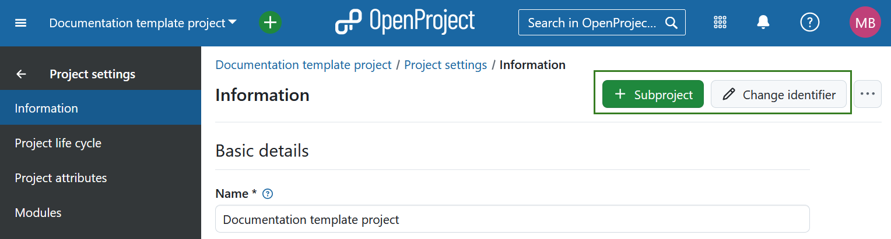

---
sidebar_navigation:
  title: Project information
  priority: 990
description: General project information.
keywords: project information
---
# Manage project information

## Edit project information

To edit your project information in OpenProject select a project from the **Select a project** drop-down menu. Then navigate to *Project settings → Information* in the project menu on the left.

Project settings are grouped into three sections:

1. **Basic details**. Here you can edit: 

    -  **Project name**. The name will be displayed in the project list.
    -  Add a project **description**.

2. **Project status**. Here you can: 

   - Set a **project status**. The project status can be displayed in the [project overview](../../../project-overview). If you want to set additional or different status options you can create and use a [project custom field](../../../../system-admin-guide/custom-fields/custom-fields-projects).
   - Add a **project status description**. The status description will be shown on the [project overview](../../../project-overview) page.

3. **Project relations**, where you can select the **parent project**.

**Save** your changes by clicking the **Update** button at the bottom of each respective section: 

> [!NOTE]
> After 16.0 release, project attributes can be edited directly on the project overview page.

Further, in the top right corner you can [add a subproject](../../#create-a-subproject) and edit the **project identifier**. This is the part of the project name shown in the URL, e.g. /demo-project.

If you click the **three dot** icon, you will see a dropdown menu with the following options: 

- [Copy a project](../../#copy-a-project)
- [Make a project public](../../#set-a-project-to-public)
- [Archive a project](../../#archive-a-project)
- [Set a project as a template](../../project-templates) 
- [Delete a project](../../#delete-a-project)

**To find out more about managing projects in OpenProject**, view the [projects section](../../).
