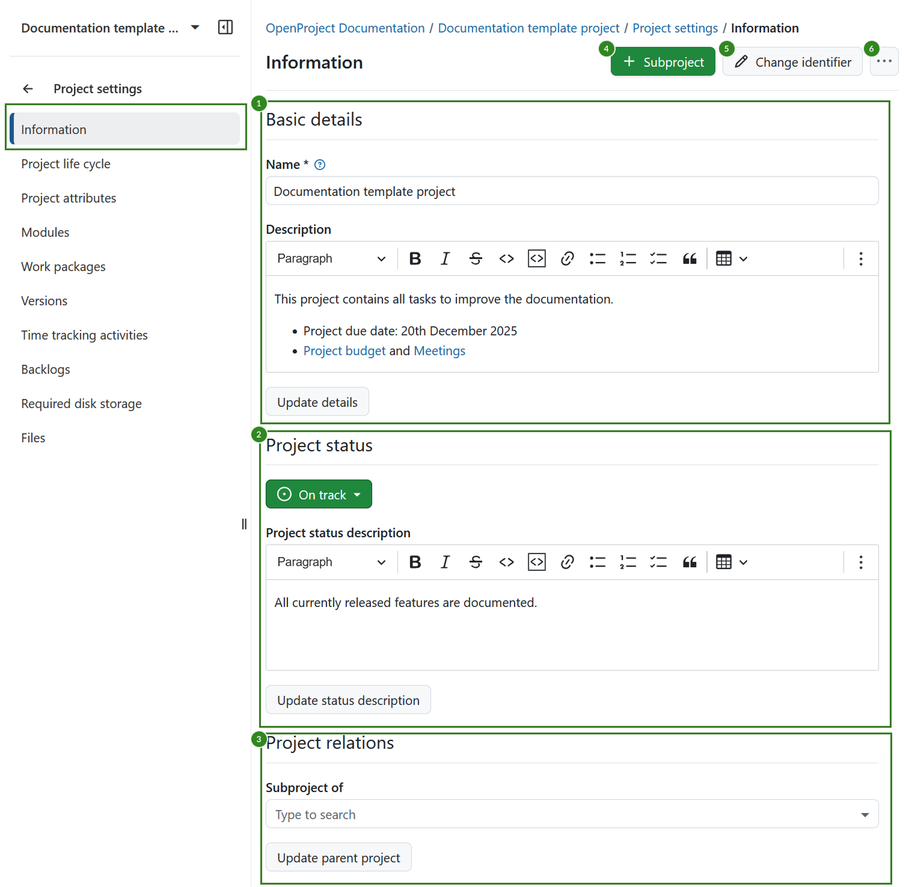

---
sidebar_navigation:
  title: Project information
  priority: 990
description: General project information.
keywords: project information
---
# Manage project information

## Edit project information

To edit your project information in OpenProject select a project from the **Select a project** drop-down menu. Then navigate to *Project settings → Information* in the project menu on the left.

Project settings are grouped into three sections:

1. **Basic details**. Here you can edit: 

    - **Project name**. The name will be displayed in the project list.
    - Add a project **description**.

2. **Project status**. Here you can: 

   - Set a **project status**. The project status can be displayed in the [project overview](../../../project-overview). If you want to set additional or different status options you can create and use a [project custom field](../../../../system-admin-guide/custom-fields/custom-fields-projects).
   - Add a **project status description**. The status description will be shown on the [project overview](../../../project-overview) page.

3. **Project relations**, where you can select the **parent project**.

**Save** your changes by clicking the **Update** button at the bottom of each respective section: 

> [!NOTE]
> After 16.0 release, project attributes can be edited directly on the project overview page.

Further, in the top right corner you can [add a subproject](../../#create-a-subproject) and edit the **project identifier**. This is the part of the project name shown in the URL, e.g. /demo-project.

If you click the **three dot** icon, you will see a dropdown menu with the following options: 

- [Copy a project](#copy-a-project)
- [Make a project public](../../#set-a-project-to-public)
- [Archive a project](../../#archive-a-project)
- [Set a project as a template](../../project-templates) 
- [Delete a project](../../#delete-a-project)

## Create a subproject

Find out how to [create a subproject](/project-settings) in OpenProject. 

To create a subproject for an existing project, navigate to [*Project settings*](#project-settings) -> *Information* and click on the green **+ Subproject** button.

Then follow the instructions to [create a new project](../../getting-started/projects/#create-a-new-project).

## Change project identifier

- The identifier will be shown in the URL.

> [!NOTE]
> Changing the project identifier while the project is already being worked on can have major effects and is therefore not recommended. For example, repositories may not be loaded correctly and deep links may no longer work (since the project URL changes when the project identifier is changed).

## Copy a project

You can copy an existing project by navigating to the [Project settings](project-settings) -> Information. Click the **More** (three dots) menu in the upper right corner and select **Copy**.

Give the new project a name. Under **Copy options** select which modules and settings you want to copy and whether or not you want to notify users via email during copying.
You can copy existing [boards](../agile-boards) (apart from the Subproject board) and the [Project overview](../project-overview/#project-overview) dashboards along with your project, too.

> [!IMPORTANT]
> **Budgets** cannot be copied, so they must be removed from the work package table beforehand. Alternatively, you can delete them in the Budget module and thus delete them from the work packages as well.

For further configuration open the **Advanced settings**. Here you can specify (among other things) the project's URL (identifier), its visibility and status. Furthermore you can set values for custom fields.

Under the **Copy options** section you can select what additional project data and settings, such as versions, work package categories, attachments, project life cycle and project members should be copied as well.

> [!NOTE]
> The File storages options only apply if the template project had a file storage with automatically managed folders activated.

If you select the **File Storages: Project folders** option, both the storage and the storage folders are copied into the new project if automatically managed project folders were selected for the original file storage. For storages with manually managed project folders setup the copied storage will be referencing the same folder as the original project.

If you de-select the **File Storages: Project folders** option, the storage is copied, but no specific folder is set up.

If you de-select the **File Storages** option, no storages are copied to the new project.

Once you are done, click the green **Save** button.

## Make project public

If you want to set a project to be public, you can do so by ticking the box next to "Public" in the [project settings](project-settings) *->Information*.

Setting a project to public will make it accessible to all people within your OpenProject instance.

(Should your instance be [accessible without authentication](../../system-admin-guide/authentication/login-registration-settings/) this option will make the project visible to the general public outside your registered users, too)

## Archive a project

In order to archive a project, navigate to the [project settings](project-settings), and click the **Archive project** button.

> [!NOTE]
> This option is always available to instance and project administrators. It can also be activated for specific roles by enabling the _Archive project_ permission for that role via the [Roles and permissions](../../system-admin-guide/users-permissions/roles-permissions/) page in the administrator settings.

Then, the project cannot be selected from the project selection anymore. It is still available in the **[Project lists](./project-lists)** dashboard if you set the "Active" filter to "off" (move slider to the left). You can un-archive it there, too, using the three dots at the right end of a row.

You can also archive a project directly on the [project overview page.](../project-overview/#archive-a-project) 

## Change the project hierarchy

To change the project's hierarchy, navigate to the [project settings](project-settings) -> *Information* and change the **Subproject of** in *Project relations* section.

## Delete a project

If you want to delete a project, navigate to the [Project settings](project-settings). Click the button **Delete project** on the top right of the page.

You can also delete a project via the [projects overview list](./project-lists/).

> [!NOTE]
> Deleting projects is only available for System administrators.
