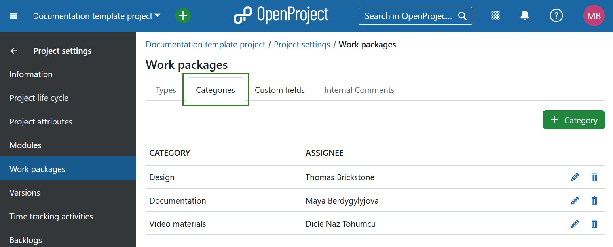
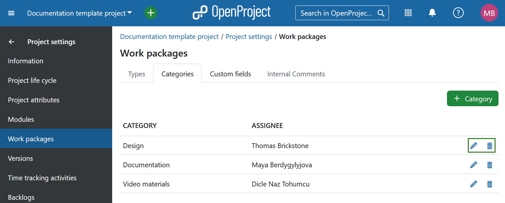
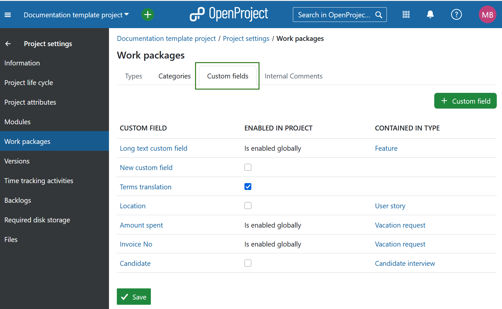
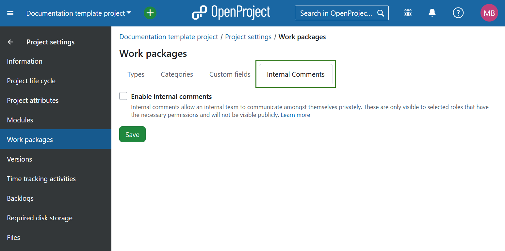

---
sidebar_navigation:
  title: Work packages
  priority: 600
description: Manage work package types, categories and custom fields in OpenProject project settings.
keywords: work package type, work package category, work package custom fields
---
# Work packages 

In OpenProject, you can configure several work package–related settings individually for each project. This includes enabling work package types, assigning categories, and activating custom fields. To do so, go to *Project settings*, select *Work packages*, and open the relevant tab.

## Work package types

You can enable or disable work package types for a specific project by following these steps:

1. Select a project from the drop-down menu in the top-left corner of the header.
2. Navigate to *Project settings → Work packages* in the project menu. By default, you'll see the **Types** tab, which lists all available work package types. 

    The table shows whether each type is:

    - Enabled in the current project

    - Displayed in the roadmap by default

    - Considered a milestone
3. Check the work package types you want to enable and click the **Save** button to apply your changes.

> [!TIP] 
>
> [Work package types can be managed](../../../../system-admin-guide/manage-work-packages/work-package-types) under System *Administration* -> *Work packages* -> *Types*.

## Work package categories

In a work package form, you can use **work package categories** to classify work packages. These categories help you differentiate, filter, and group work packages by specific attributes.

You can manage work package categories specific to a project under *Project settings → Work packages → Categories*.

### Create a new work package category

Press the green **+ Category** button to create a new category for a project.

You can then name the category and choose a default **Assignee** if the work package has this category. Press the **Create** button to add the new category.

### Edit or delete a category

From the list of categories you can choose a category to edit or delete.

Press the **edit** button to make changes to a category. Press the **delete** button to delete a category.

## Work package custom fields

Custom fields for work packages can be enabled or disabled in the Project settings of each project.

 **Custom fields** are additional attribute fields that can be added to extend existing data fields. They can be used in various sections, including work packages, spent time, projects, versions, users, groups, time tracking activities, and work package priorities.

> [!NOTE]
> The instructions in this section apply *only* to custom fields for work packages.

Before enabling a custom field in a project, it must first be created in the [system administration](../../../../system-admin-guide/custom-fields). Once it’s created, open the relevant project and go to *Project settings-> Work packages -> Custom fields*.

Here, you can:

- Manage an existing custom field by clicking on its name.
- Enable or disable the custom field for the project. If a custom field is globally enabled in the system administration, it will appear automatically in all projects.

- View which work package types the custom field is already enabled for. Custom fields will only be active for the work package types displayed under **Contained in type** column. You can add a custom field to additional work package types by [adding them to the respective work package form](../../../../system-admin-guide/manage-work-packages/work-package-types/#work-package-form-configuration-enterprise-add-on).

**Create a new work package custom field** by clicking the **+ Custom field** button in the top right corner.

> [!TIP] 
> Keep in mind that you have to be a system administrator in order to create new custom fields.

Press the **Save** button to apply your changes.

## Work package internal comments (Enterprise add-on)

Under the **Internal comments** tab you can enable internal comments for the project. Simply check the **Enable internal comments** checkbox and **Save** your changes. Once enabled, users with necessary permissions will be able to [add internal comments](../../../activity/#internal-comments-enterprise-add-on/) under work package activity tab.

> [!NOTE]
> Internal comments are an Enterprise add-on and can only be used with [Enterprise cloud](../../enterprise-guide/enterprise-cloud-guide/) or [Enterprise on-premises](../../enterprise-guide/enterprise-cloud-guide/). An upgrade from the free Community edition is easily possible.