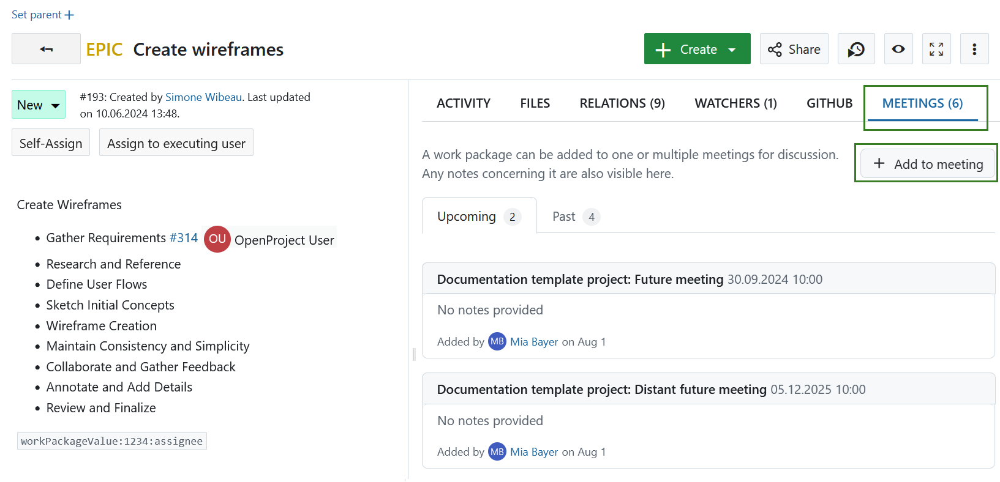

---
sidebar_navigation:
  title: Add work packages to meetings
  priority: 965
description: How to add work packages to meetings agenda.
keywords: meetings, dynamic meetings, meeting agenda
---

# Add work packages to meetings

Starting with OpenProject 13.1, meetings and work packages can be linked to one another. This can be done either from the detailed view of a work package or when editing [a one-time or recurring meetings](../../meetings/one-time-meetings/#add-a-work-package-to-the-agenda).

To add a work package to a meeting, open the detailed view of that work package, select the **Meetings** tab and click the **+Add to meeting** button.

> [!TIP]
> The upcoming meetings are displayed in chronological order, from the nearest meeting to the most distant.
> The past meetings are displayed in reverse chronological order, from the most recent meeting to the oldest.

In the dialog that appears, select a meeting from the list of open upcoming meetings. You can also add any relevant notes (like discussion points, open questions or decision need). Click **Save** to add a new work package to the selected meeting as an agenda item.

The newly-created work package agenda item can be [re-ordered and edited](../../meetings/one-time-meetings/#edit-a-meeting).

## View existing linked meetings

The **Meetings** tab will also list all meetings, past and upcoming, to which the current work package has already been linked to.

Each linked meeting will also also include any notes associated with that work package agenda item. This can be useful to recall specific discussion points, open questions or decisions taken during a meeting that concerns the current work package.
