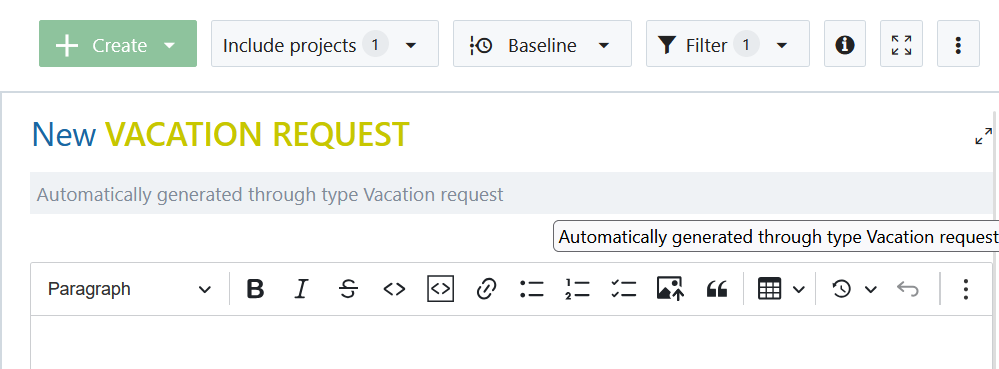
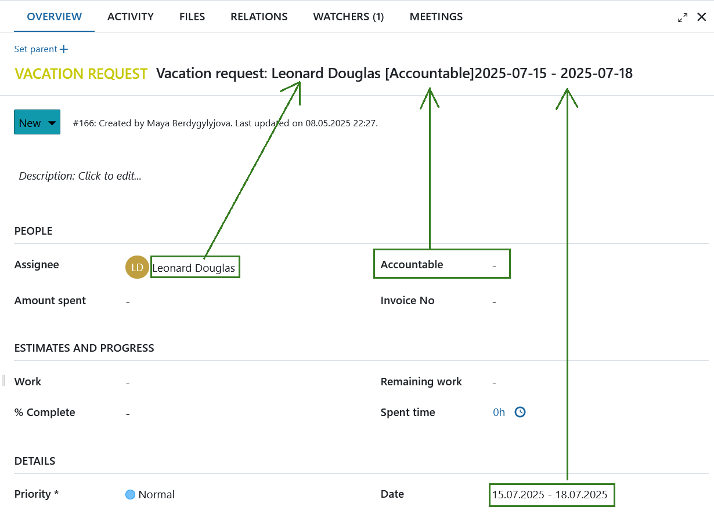

---
sidebar_navigation:
  title: Automatic subjects
  priority: 975
description: Automatic subjects for work packages
keywords: work packages subject, automatic subject, automatic work package subject
---

# Automatic subjects for work packages (Enterprise add-on)

## Introduction

Automatic subjects are predefined, dynamic titles for work packages. They help enforce consistent naming and clarity for repetitive tasks. 

Administrators can enable automatic subjects per work package type by defining a subject pattern that includes static text and references attributes, such as Author, Start date, custom fields, or parent and project details. When creating or editing a work package, its subject is automatically generated and updated according to the defined pattern.

**Examples:**

- Vacation request: `[Author] [Start date] - [Finish date]`
- Candidate interview: `[Custom Field: Candidate] with [Assignee] on [Start date]`
- Supplier invoice: `[Author] Invoice [Creation date] - [Custom Field: Invoice ID]`

A locked subject indicates that your administrator has enforced an automatic subject pattern for that work package type (e.g. vacation requests or invoices).

> [!IMPORTANT]
> If the subject field is locked, it can also indicate that you might lack permission to edit this specific work package.

## How to use automatic subjects

Work packages with automatic subjects function similarly to standard work packages, with two notable differences:

- Creating or editing: Enter all work package details as you normally would, with the exception of the subject field - leave it empty.

- Subject is read-only: The subject is auto-generated and cannot be manually edited.

> [!TIP]
> Any changes to work package attributes trigger an automatic update of the subject, even if the changed attribute isn't referenced in the subject pattern.

## How attributes appear in subjects

Automatic subjects reflect actual values from attributes as configured by your admin:

*   **Dates** (e.g. `[Start date]`, `[Finish date]`)
*   **Users** (e.g. `[Author]`, `[Assignee]`)
*   **Attributes** (e.g. `[Priority]`, `[Category]`, `[Custom Field: X]`)
*   **Project details** (e.g. `[Project name]`, `[Project identifier]`)

If a referenced attribute isn't available, the subject displays **"N/A"** (see [FAQ](https://community.openproject.org/#4-faq)).

If a referenced attribute currently has no value, the subject displays **[Attribute Name]**.

## Automatic subject FAQs

### How is an automatic subject updated automatically?

When attributes referenced in the subject pattern change (e.g. dates or custom fields), the subject updates automatically upon saving. No additional action is required.

### What if the subject pattern references parent or project attributes?

If your subject pattern includes attributes from a **parent work package** or the **project**, changes in those attributes don't immediately affect the child’s subject. The subject refreshes only after updating and saving the child work package. This behavior will be improved in future updates.

### Why does "N/A" appear in my subject?

"N/A" indicates a referenced attribute is unavailable. Common reasons include:

- The pattern references a **parent attribute**, but no parent is assigned.

- A parent exists, but the referenced attribute **isn't** available in the parent's work package type.

- The attribute referenced **isn't activated** in the current project.

Once the attribute becomes available and is populated, updating and saving the work package automatically refreshes the subject.

> **Example**: Pattern: `INVOICE: [Custom Field: Invoice ID] - [Start date]`  
> If "Invoice ID" is unavailable, you’ll see `INVOICE: N/A - 2025-01-23`.

### Why does [Attribute Name] appear in subjects?

[Attribute Name] indicates the referenced attribute hasn't been filled or set:

- The attribute is empty.
- The pattern references a project attribute, but it hasn't been filled yet.