---
sidebar_navigation:
  title: Set and change dates and duration
  priority: 970
description: How to use the date picker to set and update the start date, finish date and duration of a work packages
keywords: date picker start finish dates duration change modify update relations work package
---

# Set and change dates and duration of work packages

OpenProject offers two scheduling modes for work packages: **Manual** and **Automatic**. These modes provide flexibility in project planning while ensuring logical dependencies between tasks. 

> [!NOTE]
> OpenProject 15.4 introduced new automatic scheduling mode alongside the manual scheduling. By default, all new work packages will be set to **manual scheduling**.

| Feature                                                   | Documentation for                                            |
| --------------------------------------------------------- | ------------------------------------------------------------ |
| [Set start and finish dates](#set-start-and-finish-dates) | How to set start and finish dates, and how to change them    |
| [Working days and duration](#working-days-and-duration)   | How to set duration, and how it affects start and finish dates |
| [Manual scheduling mode](#manual-scheduling)              | Enabling manual scheduling and what it does                  |
| [Automatic scheduling mode](#automatic-scheduling)        | Enabling automatic scheduling and what it does               |

## Set start and finish dates

You can change the start and finish dates of a work package by opening the date picker.  You can open the date picker for a work package from a number of different places:

- By clicking on the date field in the work package [details view](../work-package-views/#full-screen-view)
- By clicking the date field in the work package [split screen view](../work-package-views/#split-screen-view) (from any other view, including [notification center](../../notifications), [team planner](../../team-planner/), [boards](../../agile-boards)...)
- By clicking the start date, finish date or duration fields in [table view](../work-package-views/#table-view)

Here is an example of the date picker in OpenProject. This is what you will see:

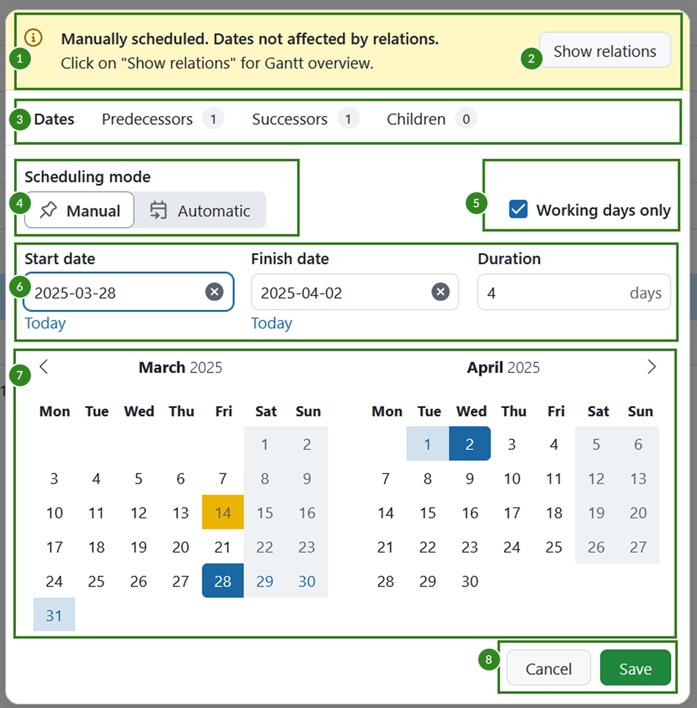

1. The **information banner** on top of date picker will state what scheduling mode is selected and if there are possible date constraints due to existing work package relations. The message will vary depending on the scheduling mode selected and the existing work package relations. This banner is only shown for work packages that have relations
2. The **show relations** button on the banner will open a Gantt chart view showing an overview of all directly-related work packages
3. The **Relation tabs** let you see a list of relevant relations for the current work packages: *predecessors*, *successors* or *children*
4. The **scheduling mode toggle** allows you to switch between [manual](#manual-scheduling) and [automatic](#automatic-scheduling) modes
5. The **Working days only** switch, that lets you switch between counting only working days or all days to the total duration
6. **Start date**, **finish date** and **duration** input fields
7. **Mini calendars** for date range preview
8. **Save** and **cancel** buttons.

## Information and warning banners

Helpful banners on top of the date picker give you important contextual information when changing dates and/or scheduling mode on work packages with relations.

Information banners have a blue or yellow background and display information that is helpful but not critical. Warning banners have an orange background and display information that is critical, with potentially larger consequences to project scheduling.

The information in the banners provides scheduling details, such as:

- When a related work package (predecessor or child) is setting the dates for the current work package in automatic scheduling mode
- If there is a gap between predecessors and the current work package in manual mode
- If there are overlapping dates between predecessors and the current work package in manual mode

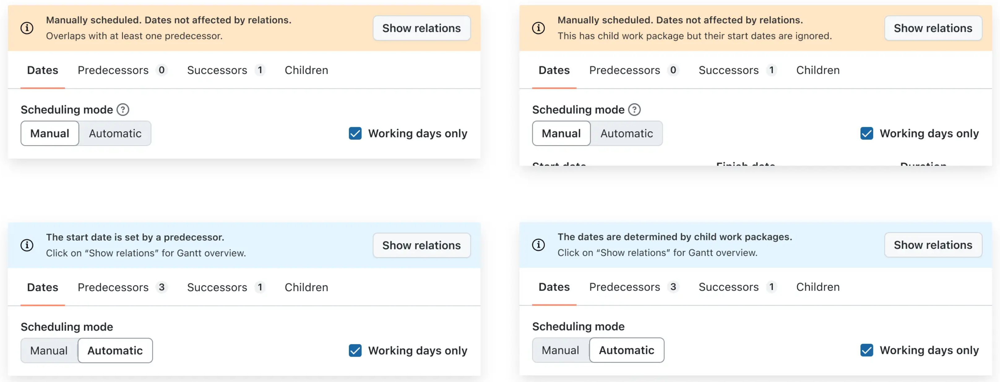

> [!NOTE]
> When both an information and a warning banner are applicable to a work package, only the more important warning banner is displayed.

## Date picker tabs

Apart from the default *Dates* tab, date picker also includes the following relations related tabs:

- **Predecessors** – Displays all predecessor work packages. 
  - *Predecessors* are tasks that must be completed before the current one can begin.
  - In automatic mode, the closest predecessor from which the current work package derives its dates is marked with a **“closest”** label.

- **Successors** – Displays all successor work packages. 
  - *Successors* are tasks that will commence after the current one is finished.
  - In automatic mode, the start dates of successors are affected by the current work package’s finish date.

- **Children** – Displays all child work packages. 
  - *Children* are sub-tasks that fall under the current work package.
  - If a work package has children, it will **default to automatic scheduling mode**.
  - The start and finish dates of the parent work package will cover the dates of all its child work packages.
  

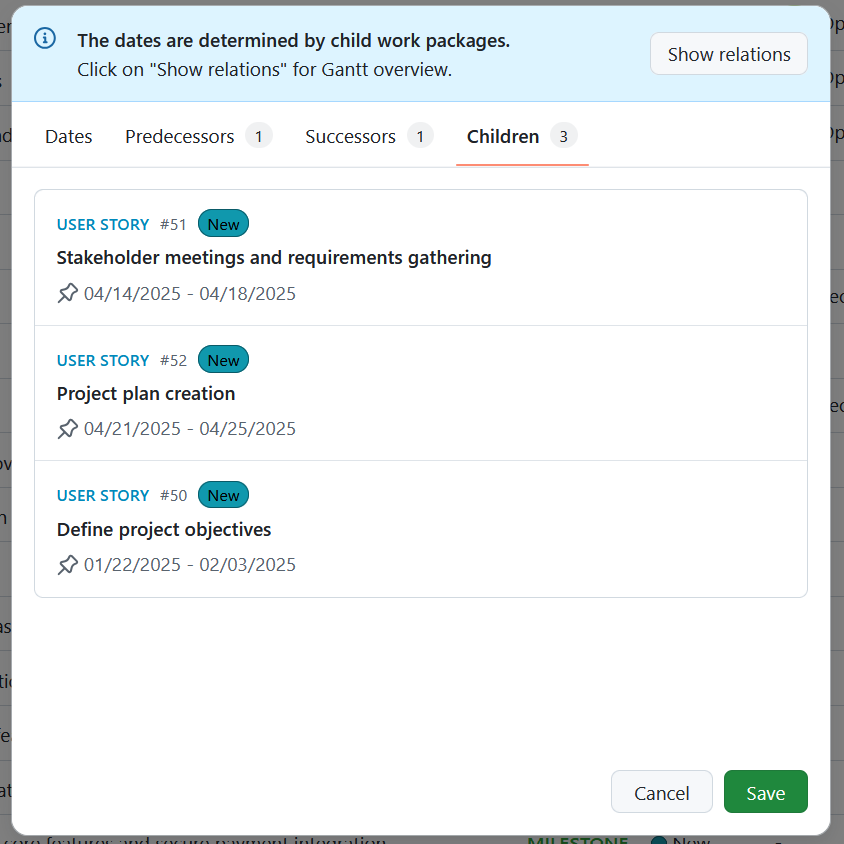

> [!TIP]
> The number of existing related work packages is identified by the number next to the tab name. 

## Scheduling mode

OpenProject offers two scheduling modes: **Manual** and **Automatic**. 

In **Manual scheduling mode**, you can freely set start and finish dates independent of any work package relations. In **automatic scheduling mode**, the dates are automatically derived from predecessors or children.

### Manual scheduling

Manual scheduling is useful when you need fixed dates, such as when dependencies are uncertain or not yet defined.

Enabling **Manual Scheduling** activates [manual scheduling mode](../../gantt-chart/scheduling/#manual-scheduling) for the work package. This mode allows you to set any start and end dates, ignoring dependencies such as **follows/proceeds**  or **children** relationships. To enable the manual scheduling mode, click the **Manual** button in the **Scheduling mode** switch of the date picker. 

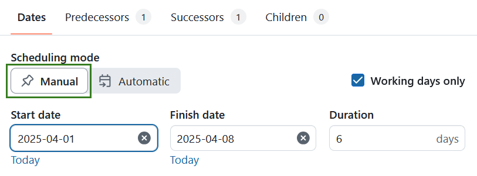

> [!TIP]
> With the introduction of the new automatic mode in OpenProject 15.4, **manual scheduling** mode is the default scheduling mode for newly created work packages. [Read more about it in our blog](https://www.openproject.org/blog/new-automatic-scheduling-mode/).

In manual mode, parent and child work packages are no longer linked for scheduling purposes. Parent dates do not adjust based on child dates and children can be scheduled outside the parent’s range. These relationships remain visible in the **Gantt view** but do not affect scheduling unless you switch back to automatic mode.

When switching from automatic to manual scheduling, a warning banner notifies you that **follows/precedes** and **parent/child** relations are now ignored. This allows unrestricted date selection and prevents the work package from affecting others, despite existing relationships.

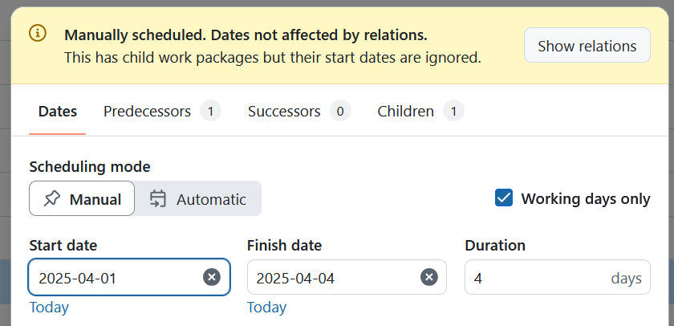

### Automatic scheduling

Automatic scheduling is useful for automatically scheduling work packages with existing dependencies.

A work package can only be in automatic scheduling mode if it has predecessors or children.

An automatically-scheduled work package with predecessors will automatically start one working day after the finish date of the nearest predecessor. However, both the **duration** and **finish date** can now be edited directly.

You can still enter a duration (and effectively change the finish date). 

You can either enter a duration to adjust the finish date or select a finish date manually in the date picker. Note that the dates before the automatically derived start date are inactive, i.e. the finish date must be set on or after the start date. 

This temporal relationship is maintained even if the dates of the predecessor are changed; for example, if the predecessor is moved forwards or backwards in time (either because the finish date or duration changed), the automatically-scheduled work package will also change its start date so it starts the day after the new date. This makes it possible to create a dependable chain of automatically scheduled work packages that automatically adjust to planning changes. 

When switching from manual to automatic scheduling, a warning banner notifies you the dates are now determined by predecessor or child work packages. This allows automatic date setting based on existing relations.

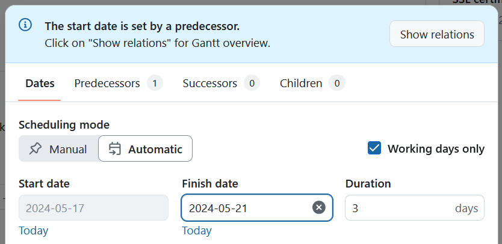

### Date picker in OpenProject

With the introduction of the new automatic mode in OpenProject 15.4, there are two date modes in OpenProject, **single-date** and **range** mode. 

#### Single-date mode

By default, new work packages start in single-date mode, with only the **Finish date** field active. This makes it easy to quickly set a deadline for a task.

If you would also like to add a start date, you can do so by clicking on the **+ Start date** button and choosing a start date. The work package will go into *range mode*  with both Start and Finish dates. You can also remove the Finish date and get the date picker to go back to single-date mode but this time with only the Start date as the sole date.

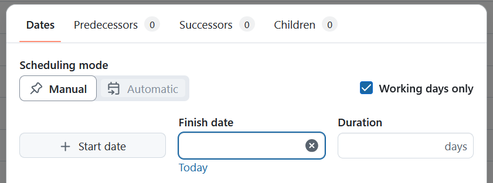

If the [use current date as start date for new work packages](../../../system-admin-guide/manage-work-packages/work-package-settings/) setting is active, the start date will always be set and that date will be the active one. In this case you can add the finish date by clicking the **+ Finish date** button.

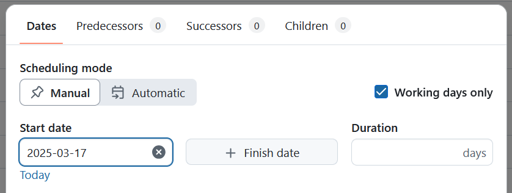

#### One-day events

Work packages with *only* a start date or only a finish date are automatically considered one-day events. If you want the work package (for example a Milestone) to start and finish on the same date, simply click the same date twice.

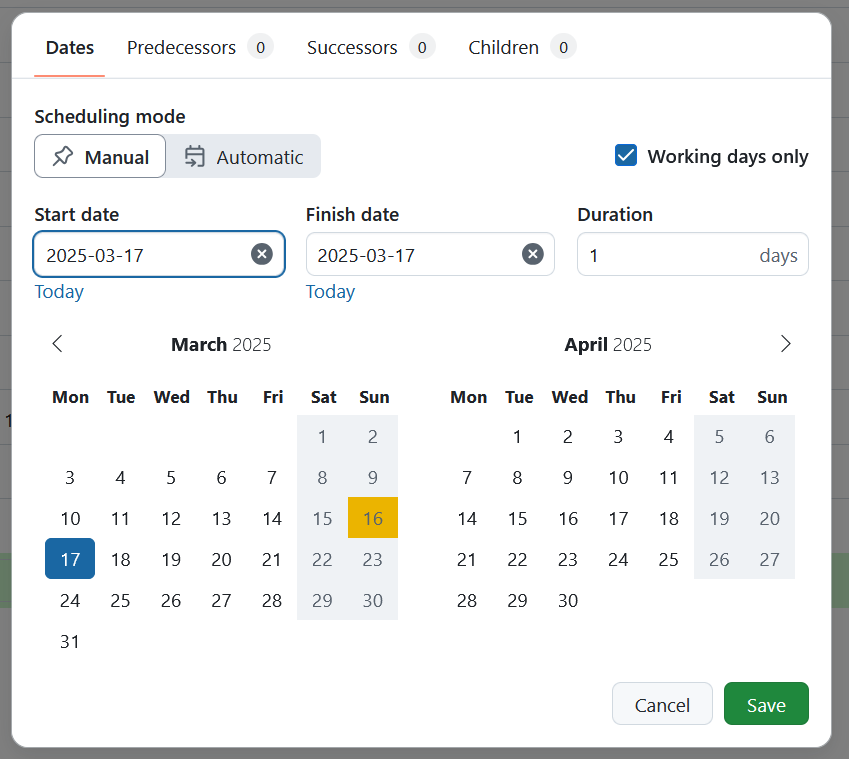

#### Range mode

**Range mode** is the scheduling mode in which a work package has both start and finish dates, and therefore also a duration.

#### Using the date picker

You can enter dates by typing them in into the start and finish date fields.

> [!NOTE]
> Typed dates need to be in the standard ISO 8601 format: **YYYY-MM-DD** (so 12 October 2022 would be 2022-10-12). They will nevertheless be displayed in your desired format (usually depending by your region or language).

To quickly set today’s date, click the **Today** link below the date fields.

You can also set the start and finish dates by using the mini calendars. Two calendar months are displayed for better visibility.

Start by clicking on a start date. This will enter the selected date as the start date, mark it with a dark color on the mini calendar below and move the focus to the finish date field. Hovering on different finish dates will give you a preview of the date range for the work package if you click this second date. Once you have decided on a finish date, click on it. This will enter the finish date in the date field and mark that date with another dark color. The dates in between will be highlighted with a lighter color.

Click **Save** to confirm your selection. A green confirmation message will appear.

To clear a date field, simply click on the **clear icon** ("×") icon in the relevant field.

Date changes are documented in the work package [Activity](../../activity/).

### Advanced functionality

- The date picker allows you to pick start and finish dates in the opposite order. Clicking on a start date and then moving backwards to click on an earlier date will use that first date as the finish date and the second (earlier) date as the start date.

- For a work package that already has a start and finish date, it is possible to adjust just the finish date: click on the finish date field and then click on a new date. As long as this date is after the start date, the finish date updates accordingly. If the date you pick is earlier than the start date, the original start date will then be cleared and a click on a second date will define the other end of the new range.

- It is possible to set only one of the two dates. In range mode, simply clear the *other* date and save the date picker. It will now go into single-date mode.

> [!NOTE]
> The precedes-follows relation can constrain or affect the dates of work packages. For more information, see [Moving related work packages](../work-package-relations-hierarchies/#moving-related-work-packages).

### Show relations button

The information and warning banners also feature a **Show Relations** button. Clicking on this will open a new tab that displays all direct relations to the current work package in [Gantt view](../../gantt-chart), in hierarchy mode.

> [!NOTE]
> This preview is intended to give a quick overview of only _direct_ relations that might affect scheduling options for the current work package. It does not show second-level relations (and above). To get a full overview, please use the project work package [table view](../work-package-views/#table-view) or [Gantt view](../../gantt-chart) with your desired [filter/view configuration](../work-package-table-configuration/).

## Working days and duration

You can manually input a duration for a work package and decide whether this duration should include working days only or all calendar days.

> [!NOTE]
> Working dates are defined by the administrator of your OpenProject instance. By default, they are Monday to Friday, with Saturday and Sunday considered non-working. If you are an administrator, please read our [admin guide on working days](../../../system-admin-guide/calendars-and-dates/#working-days-and-hours).

### Working days

The **Working days only** switch is on by default, and the date picker skips over the weekend (or the days defined as non-working days) when scheduling work packages and deriving duration. In this mode, non-working days are marked with a darker color and are not clickable. Work packages cannot start or finish on non-working days, and these days do not count towards the calculation of duration.

Switching **Working days only** off will turn the previously disabled non-working days into regular working days, and make them available for scheduling. The duration will now take these days into account.

### Duration

Duration is always expressed in days, and is the total number of days between the start and finish dates (inclusive). The **Duration** field is directly related to the start and finish dates, but does not require them. Changing one will change the other.

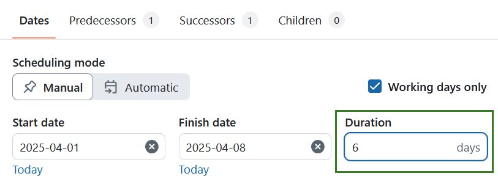

Duration can either be automatically derived from dates or entered manually. When the duration field is in focus, you can enter a number corresponding to days; you do not need to type the word "days" (or the equivalent in your language), it is automatically added.

#### Duration when start and finish dates exist

When you set a start and a finish date, the duration is automatically derived. For example, if the start date is set to *Wednesday, 12 October, 2022* and the finish date to *Friday, 14 October, 2022*, a duration of 3 days is derived.

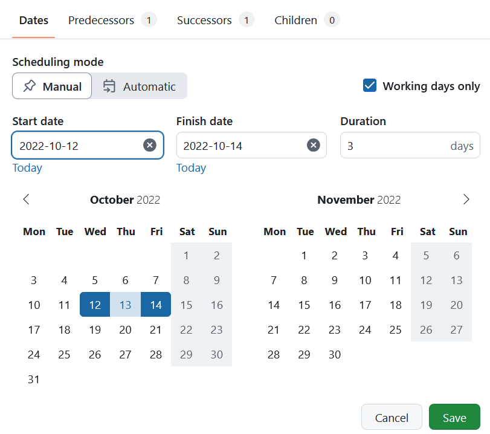

Changing the duration when both start and finish dates are already set will then update the finish date. In our example, if you change the duration to 4 days, one of two things can happen:

- *If the Working days only switch is **on***, the finish date is automatically set to Monday, 17 October, 2022 (since Saturday and Sunday are not working days)
- *If the Working days only switch is **off***, the finish date is automatically set to Saturday, 15 October, 2022 (since all calendar days are included)

#### Duration when only one date exists

A work package cannot have only one date *and* a duration; in range mode, the other date is automatically derived and in single-date mode, the duration field is not available. 

For example, in range mode, if you set the start date to *Wednesday, 12 October* and enter a duration of 3 days, a finish date of Friday, 14 October is automatically derived. Conversely, if you set the finish date *Friday, 14 October* and then set the duration to 3 days, the date picker will count backwards and derive a start date of *Wednesday, 12 October.*

#### Duration without start and finish dates

A work package can have only a duration without any start or finish dates set.

> [!NOTE]
> If you add even one date to a work package with duration, the other date is automatically derived; it is not possible to have just one date (start *or* finish) and duration set. Please note also that if a work package with only duration derives its start date via a relation, the finish date is then also derived.

Setting only duration without start or finish dates is especially useful when you have a general estimation of how long different tasks or phases of a project will take, but do not have exact dates defined quite yet.

> [!TIP]
> This feature makes it possible to automatically derive an estimated start or finish date for entire project.
>
> To do this, create a series of work packages representing the main phases and set the approximate duration for each. Link them all using follow/precedes relationships. Now, when you set a start date on the first work package in the series, the start and end dates for all other work packages will be derived.
