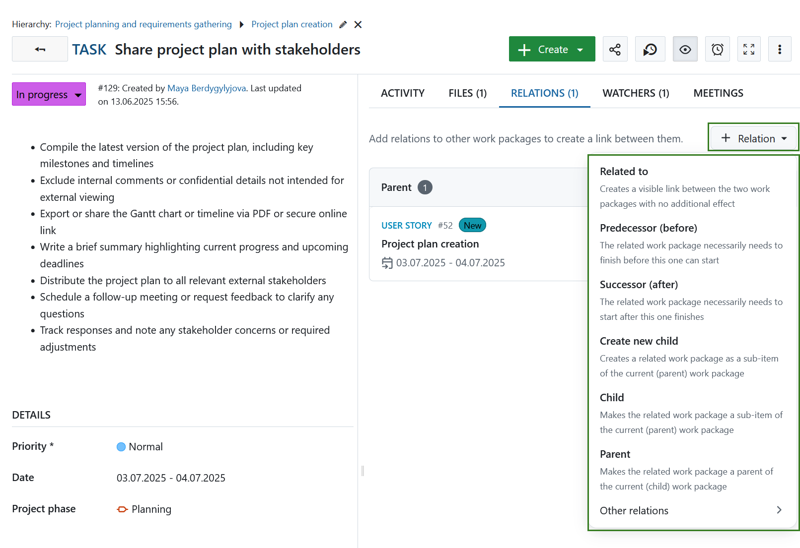
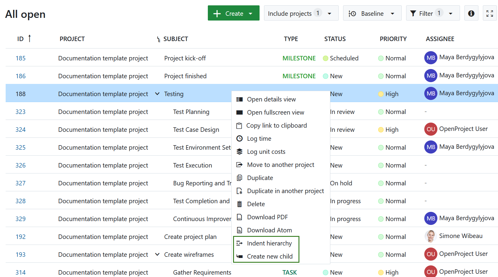
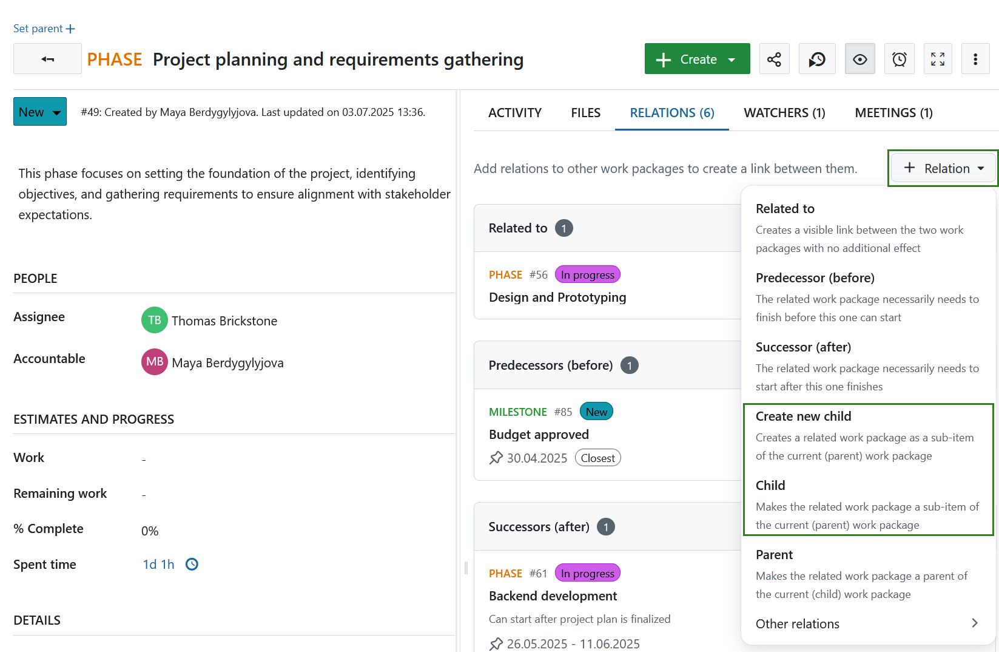
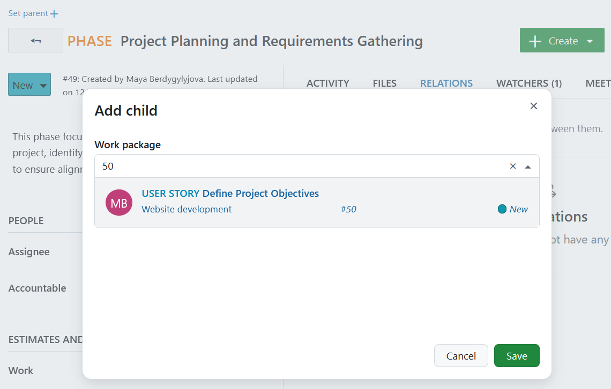
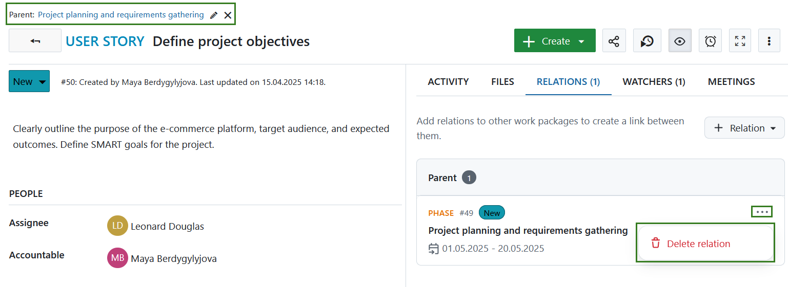
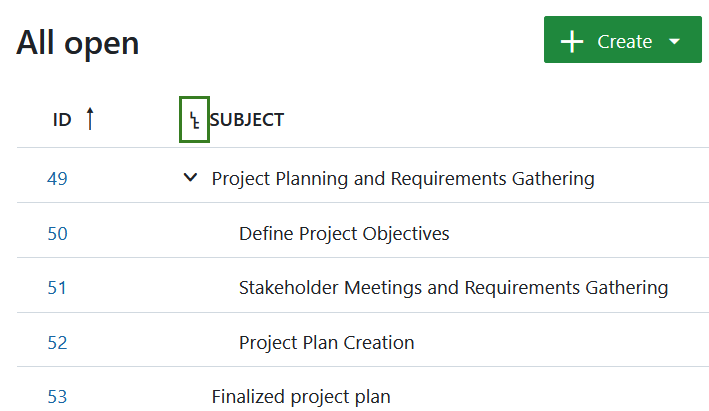

---
sidebar_navigation:
  title: Work package relations and hierarchies
  priority: 940
description: How to add or configure work package relations.
keywords: relations, hierarchies, child, parent, blocked, includes, part of
---

# Work package relations and hierarchies

You can create work package relations and hierarchies.

Relations indicate any functional or timely relation (e.g. follows or proceeds, blocked by, part of, etc.). Hierarchies are a hierarchical relation (parent-child relationship).

| Topic                                                        | Content                                                      |
| ------------------------------------------------------------ | :----------------------------------------------------------- |
| [Work packages relations](#work-package-relations)           | How can I set a relation between two work packages and which relations can I set? |
| [Display relations in work package table](#display-relations-in-a-work-package-table-enterprise-add-on) | How can I display the relations between two work packages in the work package table? |
| [Work package hierarchies](#work-package-hierarchies)        | What are work package hierarchies? Learn about parent and children work packages. |
| [Add a child work package](#add-a-child-work-package)        | What are the possibilities to add children work packages?    |
| [Change the parent work package](#change-the-parent-work-package) | How can I change a work package's parent?                    |
| [Display work package hierarchies](#display-work-package-hierarchies) | Where can I find out about a work package's children and parent? |

## Work package relations

Work package relations indicate that work packages address a similar topic or create status dependencies. To create a relationship between two work packages:

1. Select a work package, click on **Relations** to open the relations tab and click the **+ Relation**  button.
2. Select the type of relationship from the dropdown menu.
3. Enter the ID or name of the work package, to which the relation should be created. The autocomplete will suggest the work package to be added.
4. Enter a description of the relation. It will be visible for both of the related work packages.
5. Press the Enter key and click the **Save** button.

You can select one of the following relations:

- **Related to** - This option adds a link from the work package A to work package B, so that project members can immediately see the connection, even if the work packages are not members of the same hierarchy.

- **Duplicates / Duplicated by** - This option indicates that the work package B duplicates a work package A in one way or another, for example both address the same task. This can be useful if you have the same work package that needs to be a part of a closed and public projects at the same time. The connection in this case is only semantic, the changes you make in work package A will need to be adapted in work package B manually.

> [!NOTE]
> some changes in statuses will be adjusted automatically for the duplicated work package. Specifically, if the status of a work package A is set to be "closed" (or set to any status that is defined to count as "closed" in the  [system settings](../../../system-admin-guide/manage-work-packages/work-package-status/), for example "rejected" often counts as a "closed" status), the status of the work package B will change to "closed". Note that this is direction dependent. Only if the work package A is closed will the work package B be closed as well, not the other way around.

- **Blocks / Blocked by** - This option defines status change restrictions between two work packages. If you set a work package A to be blocking work package B, the status of work package B cannot be set to closed or resolved until the work package A is closed.

- **Predecessor (before)/ Successor (after)** - Defines a chronological relation between two work packages. For example, if you set a work package A to precede a work package B, the start date of B has to be at least a day after the finish date of A.
  Please note: If work package B is in [manual scheduling mode](../../gantt-chart/scheduling/#manual-scheduling-mode), changing the finish date of work package A will have no effect on work package B.

> [!TIP]
> Prior to 15.1, *Predecessor (before)* was called *Precedes*, and *Successor (after)* was called *Follows*.

- **Includes / Part of** - Defines if work package A includes or is part of work package B. This relation type can be used for example when you have a roll-out work package and work packages which should be shown as included without using hierarchical relationships. There is no additional effect.

- **Requires / Required by** - Defines if work package A requires or is required by work package B. There is no additional effect.

- **Child** - Makes the related a work package a sub-item of the current (parent) work package

> [!TIP]
> The selected relation status will be automatically displayed in the work package that you enter. For example if you select "Blocks" in the current work package A and specify work package B, work package B will automatically show that it is "Blocked by" A.

### Moving related work packages

The predecessor/successor relation is the only one that can constrain or affect the dates of work packages.

Work packages in a predecessor/successor relationship do not need to immediately follow one other; there can be a gap. In this case, you can move either forwards or backwards in time without affecting the other as long as the finish date of the predecessor is before the start date of successor.

A successor cannot be moved to start before the finish date of its predecessor. However, a predecessor can indeed be moved to start or finish _after_ the start date of its successor. When this happens, the successor will be pushed into the future such that it starts the day after the new finish date of the predecessor.

## Display relations in a work package table (Enterprise add-on)

As a user of [Enterprise on-premises](https://www.openproject.org/enterprise-edition/) or [Enterprise cloud](https://www.openproject.org/enterprise-edition/#hosting-options) you can display relations as columns in the work package tables.

This is useful if you want to get an overview of certain types of relationships between work packages. You can for example see which work packages are blocking other work packages.

To add relation columns, navigate to the upper right corner of the work package table and click on the icon with the three dots.  Select **Insert columns** and type the name of the relation into the search bar. Then select the relation and click on apply.

The relations column shows the number of relations each work package has for the relation type (e.g. "blocked by").

You can click on the number to display the work packages which have the relation type.

## Work package hierarchies

Work packages can be structured hierarchically, e.g. in order to break down a large work package into several smaller tasks. This means that there's a parent work package that has at least one child work package.

## Add a child work package

There are **four ways to add or create a child work package**:

1. [Adding a child in the *Relations* tab in a work package's details view](#add-a-child-in-the-relations-tab-in-a-work-packages-details-view)

2. Right-clicking on a work package in the work package table and select "Create new child"

3. Right-clicking on a work package in the work package table and select "Indent hierarchy" to add it as the child of the work package above it.

   

4.  You can add a child work package directly under the table of related work packages. To do that you first need to [include a table of related work packages to work package forms (Enterprise add-on)](../../system-admin-guide/manage-work-packages/work-package-types/#add-table-of-related-work-packages-to-a-work-package-form-enterprise-add-on). 

   

### Add a child in the *Relations* tab in a work package's details view

Open a work package and select the tab *Relations*. Click on *+ Relation* button, scroll down the list of options and select *Child*. 

Insert the name of the new work package and save the newly added child work package by clicking *Save* button. 

For more information on the work package creation take a look at the guideline on [creating a work package](../create-work-package).

## Change the parent work package

To edit or remove the parent of a work package open the work package. At the top of the details view of the work package you will see the work package hierarchy. Click on the **edit icon** or **delete icon** to change the work package parent.

## Display work package hierarchies

After adding the parent and child work packages they are listed in the *Relations* tab.
Note that only the children are shown in the relations tab and the parent isn't.

Hierarchies can also be displayed from the work package table view.
To display work package hierarchies make sure the *Subject* column is displayed. You can activate or deactivate the hierarchy by pressing the icon next to the Subject.

You can also add a column with information about parent work packages:

1. Click on the gear wheel in the upper right corner of the work package table to open the work package table configuration.
2. Select "Parent" from the drop down menu and click on apply.
3. Now the column with the information about a parent relation is displayed in the work package table.

